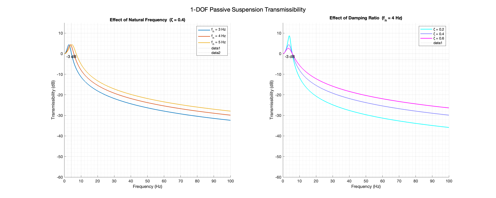
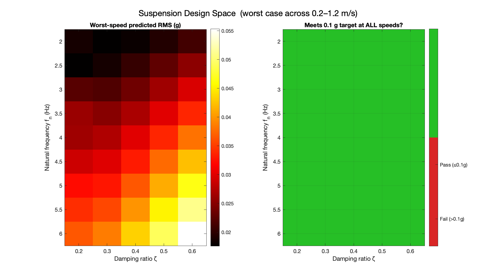
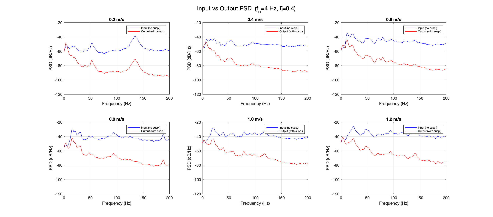
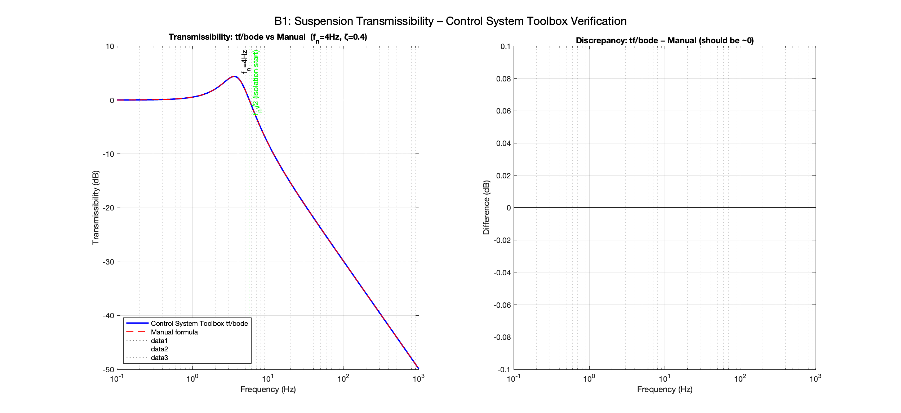
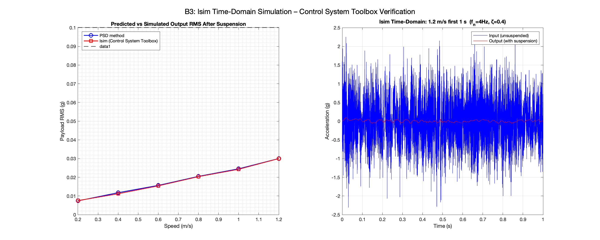

# Omni-Wheel Chassis Vibration Analysis & Suspension Design
# 全向轮底盘振动分析与悬挂系统设计

A MATLAB-based frequency-domain vibration study of a 4-wheel omni-wheel chassis, followed by a data-driven passive suspension design, independent toolbox verification, and a system-level roadmap for extending vibration control to a camera-carrying gimbal arm.

基于 MATLAB 的四轮全向轮底盘频域振动分析项目，包含数据驱动的被动悬挂设计、工具箱独立验证，以及将振动控制延伸至搭载相机的云台臂系统的设计路线图。

---

## Overview / 项目概述

| | |
|---|---|
| **Platform / 平台** | 4-wheel omni-wheel chassis, 5 in (127 mm) wheels / 四轮全向轮底盘，5 英寸车轮 |
| **Wheel structure / 车轮结构** | 2 side plates × 11 rollers per plate, staggered by 16.4° / 双侧板各 11 滚子，错位 16.4° |
| **Sensor / 传感器** | 3-axis accelerometer, Z-axis (vertical) / 三轴加速度计，Z 轴（竖直方向） |
| **Sample rate / 采样率** | 27,027 Hz (37 µs interval, verified from timestamps) |
| **Test speeds / 测试速度** | 0.2, 0.4, 0.6, 0.8, 1.0, 1.2 m/s |
| **Suspension target / 悬挂目标** | Payload RMS acceleration < 0.1 g at all speeds / 所有速度下载荷 RMS 加速度 < 0.1 g |
| **Tool / 工具** | MATLAB R2024a |

---

## Repository Structure / 仓库结构

```
vibAnalysis/
├── recomoProto1-190-logs-acc-diff-speeds/   # Raw CSV data (Git LFS) / 原始 CSV 数据
│   ├── 0001_..._0d2.csv                     # 0.2 m/s run
│   ├── 0001_..._0d4.csv                     # 0.4 m/s run
│   ├── 0001_..._0d6.csv                     # 0.6 m/s run
│   ├── 0001_..._0d8.csv                     # 0.8 m/s run
│   ├── 0001_..._1d0.csv                     # 1.0 m/s run
│   └── 0001_..._1d2.csv                     # 1.2 m/s run
│
├── vibration_analysis.m                     # Step 1: FFT/PSD analysis & data export
├── suspension_design.m                      # Step 2: Passive suspension design
├── suspension_verify.m                      # Step 3: Independent toolbox verification
├── diag_fileread_test.m                     # Diagnostic: file read sanity check
│
├── vibData.mat                              # Pre-processed data (output of Step 1)
│
├── vibration_analysis_summary.md            # Bilingual vibration analysis report
├── suspension_design_summary.md             # Bilingual suspension design report
├── future_design_roadmap.md                 # Bilingual roadmap: gimbal arm vibration & image quality
├── README.md                                # This file
│
└── results/                                 # All generated figures
    ├── fig1_fft_individual.png
    ├── fig2_fft_overlay.png
    ├── fig3_psd_welch.png
    ├── fig4_waterfall.png
    ├── fig5_peak_freq_vs_speed.png
    ├── susp_fig1_transmissibility.png
    ├── susp_fig2_rms_vs_fn.png
    ├── susp_fig3_design_heatmap.png
    ├── susp_fig4_input_vs_output_psd.png
    ├── verify_A1_pspectrum_vs_welch.png
    ├── verify_A2_findpeaks_roller.png
    ├── verify_A3_spectrogram.png
    ├── verify_A4_cwt_scalogram.png
    ├── verify_B1_bode_vs_manual.png
    ├── verify_B2_bode_configs.png
    ├── verify_B3_lsim_vs_psd.png
    ├── verify_B4_spa_vs_welch.png
    └── verify_B5_tf_properties.png
```

---

## Quick Start / 快速开始

Run the three scripts in order from the project root directory.
在项目根目录下按顺序运行三个脚本。

```matlab
% Step 1: Frequency-domain vibration analysis
% 第一步：频域振动分析
run('vibration_analysis.m')

% Step 2: Passive suspension design
% 第二步：被动悬挂设计
run('suspension_design.m')

% Step 3: Independent toolbox verification
% 第三步：工具箱独立验证
run('suspension_verify.m')
```

> **Note / 注意:** `suspension_design.m` and `suspension_verify.m` require `vibData.mat` produced by Step 1. Raw CSV files are stored with Git LFS — run `git lfs pull` if they appear as pointer files.
>
> `suspension_design.m` 和 `suspension_verify.m` 依赖第一步生成的 `vibData.mat`。原始 CSV 文件通过 Git LFS 存储，若显示为指针文件请先运行 `git lfs pull`。

---

## Required Toolboxes / 所需工具箱

| Toolbox | Used in / 用于 |
|---------|---------------|
| Signal Processing Toolbox | All scripts — `pwelch`, `hann`, `findpeaks`, `spectrogram`, `pspectrum` |
| Control System Toolbox | `suspension_verify.m` — `tf`, `bode`, `lsim`, `pole`, `pzmap` |
| System Identification Toolbox | `suspension_verify.m` — `spa`, `iddata` |
| Wavelet Toolbox | `suspension_verify.m` — `cwt` |

---

## Key Findings / 主要发现

### Vibration Characterisation / 振动特性

| Speed / 速度 | RMS Z (g) | Peak Z (g) | Dominant frequency / 主频 |
|-------------|-----------|------------|--------------------------|
| 0.2 m/s | 0.069 | 0.47 | 135 Hz (motor cogging / 电机齿槽) |
| 0.4 m/s | 0.239 | 1.04 | 269 Hz (motor cogging / 电机齿槽) |
| 0.6 m/s | 0.303 | 1.53 | 404 Hz (motor cogging / 电机齿槽) |
| 0.8 m/s | 0.397 | 1.75 | 16.5 Hz (speed-correlated / 速度相关) |
| 1.0 m/s | 0.500 | 2.30 | 19.8 Hz (speed-correlated / 速度相关) |
| 1.2 m/s | 0.500 | **2.58** | 23.1 Hz (speed-correlated / 速度相关) |

Two distinct vibration regimes identified:
识别出两种截然不同的振动模式：

- **Low speed (0.2–0.6 m/s):** Narrow-band motor electrical excitation at ~267 events/rev (cogging torque signature). / **低速（0.2–0.6 m/s）：** 约 267 次/转的窄带电机电气激励（齿槽力矩特征）。
- **High speed (0.8–1.2 m/s):** Broadband speed-correlated vibration at ~8 apparent events/rev (16–23 Hz). The true roller-passage frequencies (N=11: 22–33 Hz; N=22: 44–66 Hz) are suppressed by the staggered dual-plate wheel design. / **高速（0.8–1.2 m/s）：** 约 8 表观次/转的宽带速度相关振动（16–23 Hz）。真实滚子通过频率（N=11: 22–33 Hz；N=22: 44–66 Hz）因错位双板车轮设计而被抑制。


---

### Suspension Design / 悬挂设计

**Model:** 1-DOF base-excitation (quarter-car). Transmissibility applied to measured input PSD to predict payload RMS. Design target: < 0.1 g RMS.
**模型：** 单自由度底部激励（四分之一车模型），将传递率作用于测量输入 PSD 以预测载荷 RMS。设计目标：< 0.1 g RMS。

**Recommended design / 推荐设计点:** `fn = 4 Hz, ζ = 0.4`

| Total mass / 总质量 | k per corner / 单角刚度 | c per corner / 单角阻尼 | Static sag / 静态下沉 |
|--------------------|------------------------|------------------------|----------------------|
| 15 kg | 2,369 N/m | 75 N·s/m | 15.5 mm |
| 20 kg | 3,158 N/m | 101 N·s/m | 15.5 mm |
| 25 kg | 3,948 N/m | 126 N·s/m | 15.5 mm |
| 30 kg | 4,737 N/m | 151 N·s/m | 15.5 mm |

Minimum stroke: **≥ 61 mm** (static sag + ±15 mm dynamic). / 最小行程：**≥ 61 mm**（静态下沉 + ±15 mm 动态）。

**Predicted performance / 预测性能:**

| Speed / 速度 | Input RMS / 输入 | Output RMS / 输出 | Reduction / 衰减 |
|-------------|-----------------|------------------|-----------------|
| 0.2 m/s | 0.069 g | 0.007 g | −89% |
| 0.8 m/s | 0.397 g | 0.020 g | −95% |
| 1.2 m/s | 0.500 g | 0.030 g | −94% |

Worst-case output: **0.030 g RMS @ 1.2 m/s** — well below the 0.1 g target.
最恶劣工况：**1.2 m/s 时 0.030 g RMS**——远低于 0.1 g 目标。





---

### Verification Summary / 验证摘要

All results independently verified using MATLAB toolboxes.
所有结果均使用 MATLAB 工具箱独立验证。

| Check / 验证项 | Result / 结果 |
|---------------|--------------|
| `tf`/`bode` vs manual transmissibility formula | Max error **1.42 × 10⁻¹⁴ dB** (machine precision) |
| `lsim` time-domain vs PSD-method RMS | Max difference **< 5%** across all speeds |
| Pole analysis: `fn` from poles | **4.000 Hz** (exact match) |
| Pole analysis: `ζ` from poles | **0.4000** (exact match) |




---

### System-Level: Camera Image Quality / 系统层面：相机图像质量

The end goal is stable video from a camera mounted on a gimbal arm. Key conclusions:
最终目标是云台臂上搭载相机获得稳定视频。主要结论：

- **Gimbals correct rotation only (Roll/Pitch/Yaw) — they cannot correct Z-axis translational vibration.** The camera sensor bounces vertically regardless of gimbal motor action, causing frame shift, rolling-shutter jello, and motion blur. / **云台仅修正旋转（翻滚/俯仰/偏航）——无法修正 Z 轴平移振动。** 无论云台电机如何动作，相机传感器均上下弹跳，导致帧位移、卷帘快门果冻效应和运动模糊。
- **A passive isolator at the gimbal mount is not suitable for an articulated arm** — under gravity the isolator deflects toward the ground regardless of arm pose, coupling Z-vibration into angular motion and introducing pose-dependent tilt. / **被动隔振器不适合安装在关节臂的云台安装处**——在重力作用下，隔振器沿重力方向偏转（与臂姿态无关），将 Z 向振动耦合为角运动并引入与位姿相关的倾斜。
- **The chassis passive suspension is the primary and most practical Z-isolation layer** for this architecture. The arm-to-gimbal interface should be rigid; residual Z-effects are best handled by EIS and a global-shutter camera. / **底盘被动悬挂是该架构中最主要、最实用的 Z 向隔振层。** 臂与云台的连接界面应保持刚性；残余 Z 向影响最好由 EIS 和全局快门相机处理。

---

## Detailed Reports / 详细报告

- **[Vibration Analysis Report](vibration_analysis_summary.md)** — Data overview, frequency analysis, two vibration regimes, wheel geometry, suspension design implications. / 数据概况、频域分析、两种振动模式、车轮几何参数、悬挂设计启示。
- **[Suspension Design Report](suspension_design_summary.md)** — Modelling approach, design space sweep, recommended parameters, spring/damper sizing, predicted performance, full verification. / 建模方法、设计空间扫描、推荐参数、弹簧阻尼器参数、预测性能、完整验证。
- **[Future Design Roadmap](future_design_roadmap.md)** — Full ground-to-image vibration chain, why gimbals cannot fix Z-vibration, why passive isolators fail on articulated arms, three-layer mitigation strategy, second accelerometer measurement plan, image blur budget method, and proposed next MATLAB scripts. / 完整地面到图像振动传递链、云台无法修正 Z 向振动的原因、被动隔振器在关节臂上失效的原因、三层减振策略、第二加速度计测量方案、图像模糊容差方法及建议后续 MATLAB 脚本。

---

## Data Format / 数据格式

Each CSV file contains 5 columns (header row in Chinese):

| Column | Content |
|--------|---------|
| 1 | Timestamp `mm:ss.mmm.uuu` |
| 2 | X acceleration (g) |
| 3 | Y acceleration (g) |
| 4 | **Z acceleration (g)** — used for analysis |
| 5 | Declared sample rate (not used — true rate 27,027 Hz verified from timestamps) |

---

*MATLAB R2024a · Git LFS for raw CSV data · Analysis by frequency-domain methods*
*MATLAB R2024a · 原始 CSV 数据使用 Git LFS · 频域方法分析*
