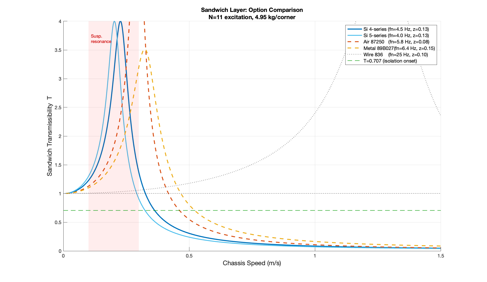
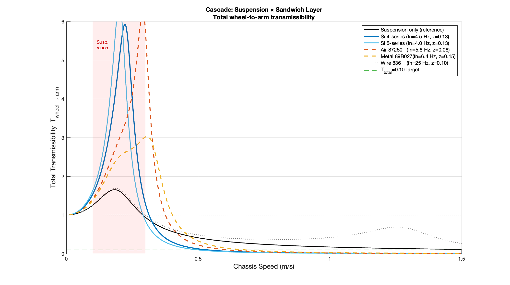
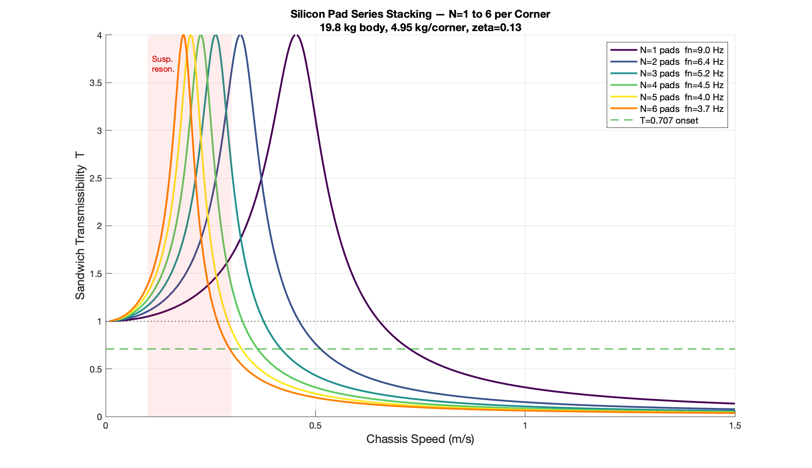
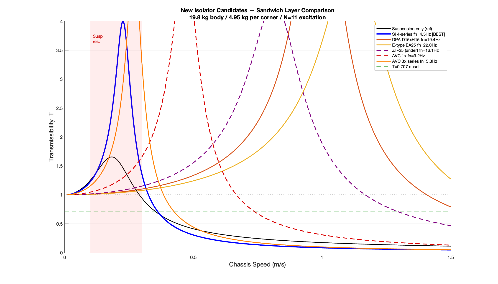

# Vibration Analysis & Suspension Design — Full Report
# 振动分析与悬挂设计——完整报告

**Platform / 平台:** X-configuration omni-wheel chassis (unsuspended, bare chassis)
**X型全向轮底盘（无悬挂，裸底盘）**

**Sensor / 传感器:** Z-axis accelerometer, mounted on chassis body / Z轴加速度计，安装于底盘本体

**Analysis tool / 分析工具:** MATLAB R2024a, Welch PSD, Fs = 27,027 Hz

**Date / 日期:** 2026-02

---

## Table of Contents / 目录

1. [Platform Specifications](#1-platform-specifications--平台参数)
2. [Test Datasets](#2-test-datasets--测试数据集)
3. [Multi-Surface RMS Results](#3-multi-surface-rms-results--多地面rms汇总)
4. [Frequency Analysis](#4-frequency-analysis--频率分析)
5. [Low-Speed Resonance Problem](#5-low-speed-resonance-problem--低速共振问题)
6. [Mitigation Options for Low-Speed Resonance](#6-mitigation-options--低速共振缓解方案)
7. [Suspension Design](#7-suspension-design--悬挂设计)
8. [Wheel Swap: 6-inch N=9 vs Current 5-inch N=11](#8-wheel-comparison--车轮对比)
9. [Conclusions & Recommendations](#section-9)
10. [Adding Mass to Shift Resonance](#10-adding-mass-to-shift-resonance--增加质量以移频)
11. [Pneumatic Tyres vs Omni Wheels](#11-pneumatic-tyres-vs-omni-wheels--充气轮胎与全向轮对比)
12. [Sandwich Layer — Four-Option Comparative Analysis](#section-12)
13. [Additional Isolator Candidates — Extended Evaluation](#section-13)

---

## 1. Platform Specifications / 平台参数

### 1.1 Chassis geometry / 底盘构型

| Parameter / 参数 | Value / 数值 | Notes / 备注 |
|---|---|---|
| Wheel configuration / 轮型 | X-type omni / X型全向轮 | Wheel axes at **45° to forward** / 轮轴与前进方向成**45°** |
| Number of wheels / 轮数 | 4 | One per corner / 每角一个 |
| Wheel diameter (current) / 车轮直径（当前） | 5 in = **127 mm** | |
| Wheel circumference (current) / 周长（当前） | π × 0.127 = **0.3990 m** | |
| Rollers per plate (current) / 每板滚子数（当前） | **11** | 2 plates per wheel / 每轮2块板 |
| Total rollers per wheel (current) / 每轮总滚子数 | **22** (staggered 16.4°) / **22个**（错位16.4°）| N=22 passage suppressed / N=22过频受抑制 |
| Total robot mass / 整机质量 | **25 kg** | Excludes suspension hardware / 不含悬挂零件 |
| Unsprung mass / 非簧载质量 | **5.2 kg** | 4 × 1.3 kg (motor + wheel) / 4×1.3 kg（电机+轮组） |
| Sprung mass / 簧载质量 | **19.8 kg** | = 4.95 kg per corner / = 每角4.95 kg |
| Motor max RPM / 电机最大转速 | **6,500 RPM** | |
| Reducer ratio / 减速比 | **37.14** | |
| Max chassis speed (motor limit) / 最大底盘速度（电机限制） | ~1.65 m/s | |

### 1.2 Critical kinematics — X-configuration correction / X构型运动学修正（关键）

For pure forward chassis motion at speed `v_chassis`, each wheel rolls at:
纯前进运动时，各轮滚动速度为：

```
v_wheel = v_chassis × cos(45°) = v_chassis / √2
```

**All frequency formulas must use this correction / 所有频率公式必须使用此修正：**

```matlab
% CORRECT / 正确
f_roller = N * v_chassis / (sqrt(2) * wheelCirc);

% WRONG — ignores 45° alignment / 错误——忽略45°对准
f_roller = N * v_chassis / wheelCirc;   % ← off by √2 factor
```

> Without the √2 correction, apparent N was ~8/rev (mystery); with correction it is exactly **N=11** (< 6% error). / 不用√2修正时，表观N约8/转（原因不明）；修正后精确为**N=11**（误差<6%）。

### 1.3 True sample rate / 真实采样率

Column 5 of the CSV declares ~26,820 Hz — **this is wrong.**
CSV第5列声明约26,820 Hz——**该值有误。**

Timestamp analysis (37 µs steps) gives: `Fs = **27,027 Hz**` (hardcoded in all scripts).
时间戳分析（37 µs步长）得到：`Fs = **27,027 Hz**`（所有脚本中硬编码）。

---

## 2. Test Datasets / 测试数据集

### 2.1 Original baseline / 原始基线

| Item / 项目 | Value / 数值 |
|---|---|
| Files / 文件数 | 6 CSV (0.2–1.2 m/s) |
| Surface / 地面 | Indoor smooth floor / 室内光滑地面 |
| Confirmed equivalent to / 等效于 | Indoor white/black tile (within 7%) / 室内白/黑砖（误差<7%） |
| Location / 路径 | `testData/recomoProto1-190-logs-acc-diff-speeds/` |

### 2.2 Multi-surface tests / 多地面测试

| Surface ID / 地面ID | Description / 描述 | Files / 文件数 |
|---|---|---|
| Black | Indoor Black Tile / 室内黑砖 | 7 CSV (0.2–1.5 m/s) |
| White | Indoor White Tile / 室内白砖 | 7 CSV (0.2–1.5 m/s) |
| Cement | Outdoor Cement / 室外水泥路 | 7 CSV (0.2–1.5 m/s) |
| Pavement | Outdoor Paving Stones / 室外人行道 | 7 CSV (0.2–1.5 m/s) |

**Total: 34 CSV files across 5 datasets. / 共34个CSV文件，5个数据集。**

> **Clarification / 说明:** The "2.58 g at 1.2 m/s" figure cited in early analysis is an **instantaneous peak** (`max(abs(Z))`), not RMS. The Z-axis RMS at 1.2 m/s is **0.50 g**. / 早期分析中提到的"1.2 m/s时2.58 g"为**瞬时峰值**，非RMS。1.2 m/s时Z轴RMS为**0.50 g**。

---

## 3. Multi-Surface RMS Results / 多地面RMS汇总

### 3.1 Z-axis RMS (g) — all surfaces, all speeds / Z轴RMS（g）——所有地面，所有速度

| Surface / 地面 | 0.2 | 0.4 | 0.6 | 0.8 | 1.0 | 1.2 | **1.5** |
|---|---|---|---|---|---|---|---|
| Black Tile / 黑砖 | 0.068 | 0.196 | 0.277 | 0.374 | 0.513 | 0.552 | **0.705** |
| White Tile / 白砖 | 0.064 | 0.201 | 0.296 | 0.379 | 0.507 | 0.534 | **0.674** |
| Cement / 水泥路 | 0.193 | 0.546 | 1.073 | 1.765 | 2.507 | 3.257 | **3.575** |
| Pavement / 人行道 | 0.072 | 0.240 | 0.406 | 0.565 | 0.828 | 1.068 | **1.306** |
| Baseline (original) / 基线（原始） | 0.069 | 0.239 | 0.303 | 0.397 | 0.500 | 0.500 | — |

### 3.2 Surface severity ratios vs indoor white tile / 地面严酷度比（vs室内白砖）

| Speed / 速度 | Cement / White | Pavement / White |
|---|---|---|
| 0.2 m/s | 3.0× | 1.1× |
| 0.8 m/s | 4.7× | 1.5× |
| 1.2 m/s | **6.1×** | 2.0× |
| 1.5 m/s | 5.3× | 1.9× |

**Key finding / 关键发现:** Outdoor cement generates 3–6× higher vibration than indoor tile at all speeds. Outdoor pavement is moderate at 1.1–2.0×. / 室外水泥路在所有速度下振动幅度比室内地砖高3–6倍；室外人行道居中，约1.1–2.0倍。

---

## 4. Frequency Analysis / 频率分析

### 4.1 N=11 per-plate roller passage (dominant mechanical excitation) / N=11每板滚子过频（主导机械激励）

**Formula / 公式:** `f_roller = 11 × v_chassis / (√2 × 0.3990)`

| Speed / 速度 | Predicted / 预测 (Hz) | Measured / 实测 (Hz) | Error / 误差 | Surface / 地面 |
|---|---|---|---|---|
| 0.8 m/s | 15.6 | 16.5 | −5.5% | Indoor (all) / 室内（全部）|
| 1.0 m/s | 19.5 | 19.8 | −1.5% | Indoor (all) / 室内（全部）|
| 1.2 m/s | 23.4 | 23.1 | +1.3% | Indoor (all) / 室内（全部）|
| 1.5 m/s | 29.2 | 27.2 | −6.9% | White tile / 白砖 |
| 1.5 m/s | 29.2 | 26.4 | −9.7% | Cement / 水泥路 (broadband noise masks peak) |

**Conclusion / 结论:**
- N=11 is confirmed as the dominant mechanical excitation at all speeds ≥ 0.8 m/s, across all 4 surfaces. / N=11已在所有地面、所有≥0.8 m/s速度下确认为主导机械激励。
- N=22 (combined dual-plate passage) is **suppressed** by the 16.4° stagger design. / N=22（双板合计过频）因16.4°错位设计受到**抑制**。
- Cement broadband noise partially masks the roller peak at 1.5 m/s, causing slightly larger error. / 水泥路宽频噪声在1.5 m/s时部分掩盖滚子峰值，导致误差略大。

### 4.2 Motor cogging (dominant at low speeds) / 电机齿槽（低速主导）

**Formula / 公式:** `f_cogging = 10.2 × v_chassis / (√2 × 0.3990) × 37.14`

| Speed / 速度 | Predicted / 预测 (Hz) | Measured / 实测 (Hz) | Error / 误差 |
|---|---|---|---|
| 0.2 m/s | 134 | 135 | +0.7% |
| 0.4 m/s | 269 | 269 | < 0.1% |
| 0.6 m/s | 403 | 404 | +0.2% |

- ~10.2 events per motor revolution — motor **electrical excitation (cogging torque)**, not gear mesh. / 约10.2次/电机转——电机**电气激励（齿槽转矩）**，非齿轮啮合。
- Gear mesh ruled out: the measured ratio 10.27 events/motor_rev is non-integer, which gear mesh cannot produce. Wide-band PSD (0–2000 Hz) confirms no gear mesh peaks above 500 Hz. / 齿轮啮合已排除：实测10.27次/转非整数，齿轮啮合不可能产生；0–2000 Hz宽频PSD证实500 Hz以上无齿轮啮合峰。
- At 1.5 m/s, cogging frequency = **1,007 Hz** — outside the 0–500 Hz analysis window. / 1.5 m/s时齿槽频率 = **1,007 Hz**，超出0–500 Hz分析窗口。

### 4.3 Cement structural resonance (~79 Hz) / 水泥路结构共振（约79 Hz）

A **speed-independent** peak at **79.2 Hz** appears on outdoor cement at 0.8, 1.0, and 1.2 m/s.
室外水泥路在0.8、1.0、1.2 m/s均出现**79.2 Hz**的**速度无关**峰值。

- Not kinematic: N=11 at these speeds is 15.6–23.4 Hz; N=22 is 31.2–46.8 Hz — neither matches 79 Hz. / 非运动学成因：这些速度下N=11为15.6–23.4 Hz，N=22为31.2–46.8 Hz，均与79 Hz不符。
- **Conclusion:** Chassis structural resonance excited by the broadband vibration energy of the rough cement surface. / **结论：** 粗糙水泥路面宽频激励引发的底盘结构共振。
- Does not affect suspension design (well above fn = 4 Hz range). / 不影响悬挂设计（远高于fn=4 Hz范围）。

### 4.4 Complete frequency table — all speeds / 完整频率表——所有速度

| Speed / 速度 | N=11 (Hz) | N=22 (Hz) | Cogging (Hz) | Motor RPM |
|---|---|---|---|---|
| 0.2 m/s | 3.9 | 7.8 | 134 | 788 |
| 0.4 m/s | 7.8 | 15.6 | 269 | 1,575 |
| 0.6 m/s | 11.7 | 23.4 | 403 | 2,363 |
| 0.8 m/s | 15.6 | 31.2 | 537 | 3,150 |
| 1.0 m/s | 19.5 | 39.0 | 671 | 3,938 |
| 1.2 m/s | 23.4 | 46.8 | 806 | 4,725 |
| **1.5 m/s** | **29.2** | **58.5** | **1,007** | **5,906** |

---

## 5. Low-Speed Resonance Problem / 低速共振问题

### 5.1 Discovery / 发现

The N=11 roller frequency at **v = 0.2 m/s = 3.9 Hz** — almost exactly equal to the designed suspension natural frequency **fn = 4.0 Hz**.
**v = 0.2 m/s时N=11滚子频率 = 3.9 Hz**——几乎精确等于悬挂设计自然频率**fn = 4.0 Hz**。

This means the suspension **amplifies** roller vibration instead of isolating it at low speeds.
这意味着悬挂在低速时**放大**滚子振动，而非隔离。

### 5.2 Full low-speed transmissibility / 低速段完整传递率

**Formula / 公式:** `T(r, ζ) = √[(1 + (2ζr)²) / ((1−r²)² + (2ζr)²)]`  where `r = f_N11 / fn`

| Speed / 速度 | N=11 (Hz) | r | T (fn=4, ζ=0.4) | Effect / 效果 |
|---|---|---|---|---|
| 0.01 m/s | 0.2 | 0.05 | 1.00 | Near unity / 接近单位 |
| 0.05 m/s | 1.0 | 0.24 | 1.06 | Mild amplification / 轻微放大 |
| **0.10 m/s** | **1.9** | **0.49** | **1.25** | Amplifying / 放大 |
| **0.15 m/s** | **2.9** | **0.73** | **1.55** | Strong amplification / 显著放大 |
| **0.20 m/s** | **3.9** | **0.97** | **1.62** | ⚠ **Peak — resonance / 峰值——共振** |
| 0.25 m/s | 4.9 | 1.22 | 1.28 | Decreasing / 递减 |
| **0.29 m/s** | **5.7** | **1.41** | **1.00** | **Isolation onset / 隔振起效** |
| 0.30 m/s | 5.8 | 1.46 | 0.94 | Isolating / 隔振中 |
| 0.40 m/s | 7.8 | 1.95 | 0.58 | Good isolation / 良好隔振 |

**The amplification zone spans 0.10–0.29 m/s — not just 0.2 m/s.**
**放大区间为0.10–0.29 m/s——不仅仅是0.2 m/s。**

Key physics / 关键物理规律:
- **Below 0.2 m/s**: approaching resonance from below — amplification increases as speed rises toward 0.2 m/s. / **低于0.2 m/s**：从低速侧趋近共振——放大倍数随速度升高而增大。
- **At 0.2 m/s**: peak amplification (r ≈ 1). / **0.2 m/s**：放大峰值（r≈1）。
- **0.15 m/s is nearly as bad as 0.2 m/s** (T = 1.55 vs 1.62). / **0.15 m/s与0.2 m/s几乎同样危险**（T=1.55 vs 1.62）。
- **Very low speeds (< 0.05 m/s)**: N=11 → 0 Hz, far below fn; T ≈ 1 (no amplification, but also no isolation needed — vibration input is negligible at crawl). / **极低速（<0.05 m/s）**：N=11趋近0 Hz，远低于fn；T≈1（无放大，也无需隔振——爬行速度下振动输入可忽略不计）。

---

## 6. Mitigation Options / 低速共振缓解方案

*(Software speed skip ruled out — robot must operate continuously in 0.1–0.3 m/s range.)*
*（软件跳速方案已排除——机器人需在0.1–0.3 m/s范围内持续运行。）*

### Option A — Increase damping ratio only (keep fn = 4 Hz) / 方案A——仅增大阻尼比（保持fn=4 Hz）

Just replace the damper unit. Spring unchanged.
仅更换阻尼器，弹簧不变。

| ζ | T @ 0.2 m/s | T @ 1.5 m/s | c (N·s/m) | Assessment / 评价 |
|---|---|---|---|---|
| 0.40 (current) | 1.62 | 0.112 | 99.5 | Baseline / 基线 |
| 0.50 | 1.43 | 0.139 | 124.4 | Some improvement / 小幅改善 |
| 0.70 | 1.24 | 0.193 | 174.2 | Significant improvement / 显著改善 |
| 1.00 | 1.12 | 0.269 | 248.8 | Diminishing returns / 收益递减 |

- **Limitation:** Even at ζ = 1.0, T@0.2 m/s = 1.12. Damping alone cannot eliminate resonance amplification. High-speed isolation also degrades. / **局限：** 即便ζ=1.0，T@0.2 m/s仍为1.12。单靠阻尼无法消除共振放大；高速隔振性能亦有所下降。
- **Practical ceiling: ζ ≈ 0.7** (halves resonance overshoot with acceptable cost). / **实用上限：ζ≈0.7**（共振超调减半，代价可接受）。

### Option B — Lower fn (shift resonance below operating range) / 方案B——降低fn（将共振移至工况范围以下）

| fn (Hz) | Resonance speed / 共振速度 | T @ 0.2 m/s | T @ 1.5 m/s | k (N/m) | Static sag / 静态下沉 |
|---|---|---|---|---|---|
| 4.0 (current) | 0.205 m/s | 1.62 | 0.112 | 3,127 | 16 mm |
| 3.0 | 0.154 m/s | 1.16 | 0.083 | 1,759 | 28 mm |
| **2.5** | **0.128 m/s** | **0.84** | **0.069** | **1,221** | **40 mm** |
| 2.0 | 0.103 m/s | 0.58 | 0.055 | 782 | 62 mm |

fn = 2.5 Hz pushes the resonance to 0.128 m/s, **below the typical operating minimum**, and reduces T@0.2 m/s to 0.84 (now attenuating). Cost is ~40 mm static sag and ~120 mm minimum stroke.
fn=2.5 Hz将共振移至0.128 m/s，**低于典型最低工作速度**，T@0.2 m/s降至0.84（已变为衰减）。代价是约40 mm静态下沉和约120 mm最小行程。

### Option C — Combined: lower fn + higher damping (recommended) / 方案C——组合：降低fn+提高阻尼（推荐）

| fn (Hz) | ζ | T @ 0.1 m/s | **T @ 0.2 m/s** | T @ 1.5 m/s | k (N/m) | c (N·s/m) | Sag / 下沉 |
|---|---|---|---|---|---|---|---|
| 3.0 | 0.70 | 1.25 | **1.07** | 0.144 | 1,759 | 130.6 | 28 mm |
| 2.5 | 0.70 | 1.28 | **0.92** | 0.120 | 1,221 | 108.9 | 40 mm |
| 2.5 | 0.50 | 1.45 | **0.87** | 0.086 | 1,221 | 77.8 | 40 mm |

**Recommended: fn = 3.0 Hz + ζ = 0.7**
**推荐：fn = 3.0 Hz + ζ = 0.7**

- T@0.2 m/s = **1.07** — only 7% overshoot, negligible in practice. / T@0.2 m/s = **1.07**——仅7%超调，实际影响可忽略。
- Resonance speed = 0.154 m/s — passed through briefly during acceleration, not sustained. / 共振速度 = 0.154 m/s——加速时短暂经过，不会持续。
- Isolation onset drops to 0.218 m/s — effective isolation starts much earlier. / 隔振起效速度降至0.218 m/s——隔振更早生效。
- k = 1,759 N/m, c = 130.6 N·s/m — achievable with standard components. / k=1,759 N/m，c=130.6 N·s/m——标准元件可实现。
- Static sag = 28 mm, minimum stroke ≈ 84 mm — manageable. / 静态下沉28 mm，最小行程约84 mm——可接受。

---

## 7. Suspension Design / 悬挂设计

### 7.1 1-DOF model / 单自由度模型

Transmissibility of a 1-DOF spring-damper system:
单自由度弹簧-阻尼系统传递率：

```
T = √[(1 + (2ζr)²) / ((1−r²)² + (2ζr)²)]
r = f_excitation / fn
fn = (1/2π) × √(k / m_sprung)
ζ = c / (2 × √(k × m_sprung))
```

### 7.2 Mass split / 质量分配

| Mass / 质量 | Value / 数值 |
|---|---|
| Total robot mass / 整机总质量 | 25 kg |
| Unsprung mass (4 × motor+wheel) / 非簧载质量（4×电机+轮） | 5.2 kg (4 × 1.3 kg) |
| Sprung mass / 簧载质量 | **19.8 kg** |
| Sprung mass per corner / 每角簧载质量 | **4.95 kg** |

> ⚠ 25 kg excludes suspension hardware. Recompute k and c after hardware is weighed and added to total.
> ⚠ 25 kg不含悬挂零件。称量零件后须重新计算k和c。

### 7.3 Current design parameters (indoor use) / 当前设计参数（室内使用）

| Parameter / 参数 | Value / 数值 |
|---|---|
| Natural frequency / 自然频率 | **fn = 4.0 Hz** |
| Damping ratio / 阻尼比 | **ζ = 0.4** |
| Spring stiffness (per corner) / 弹簧刚度（每角） | **k = 3,127 N/m** |
| Damping coefficient (per corner) / 阻尼系数（每角） | **c = 99.5 N·s/m** |
| Static sag / 静态下沉 | **15.5 mm** |
| Minimum stroke / 最小行程 | **46 mm** |

### 7.4 Predicted suspension output — indoor surface / 预测悬挂输出——室内地面

| Speed / 速度 | Input RMS (g) | T | Output RMS (g) | < 0.1 g? |
|---|---|---|---|---|
| 0.2 m/s | 0.068 | 1.62 | 0.110 | ⚠ marginal |
| 0.4 m/s | 0.201 | 0.578 | 0.116 | ⚠ marginal |
| 0.6 m/s | 0.296 | 0.322 | 0.095 | ✓ |
| 0.8 m/s | 0.379 | 0.225 | 0.085 | ✓ |
| 1.0 m/s | 0.507 | 0.174 | 0.088 | ✓ |
| 1.2 m/s | 0.534 | 0.143 | 0.076 | ✓ |
| 1.5 m/s | 0.674 | 0.112 | 0.076 | ✓ |

### 7.5 Surface-specific suspension requirements / 按地面类型的悬挂需求

| Surface / 地面 | Recommended fn / 推荐fn | ζ | Notes / 备注 |
|---|---|---|---|
| Indoor tile / 室内地砖 | **4 Hz** (or 3 Hz if low-speed matters) | 0.4–0.7 | Target < 0.1 g met at ≥ 0.6 m/s |
| Outdoor pavement / 室外人行道 | **3 Hz** | 0.5 | Marginal at 0.8 m/s |
| Outdoor cement / 室外水泥路 | **2 Hz** | 0.5 | Requires k ≈ 782 N/m, sag 62 mm |

### 7.6 Suspension performance at 1.5 m/s (T = 0.112) / 1.5 m/s时悬挂性能（T=0.112）

| Surface / 地面 | Input RMS (g) | Predicted output / 预测输出 (g) | < 0.1 g? |
|---|---|---|---|
| Black Tile / 黑砖 | 0.705 | **0.079** | ✓ |
| White Tile / 白砖 | 0.674 | **0.076** | ✓ |
| Pavement / 人行道 | 1.306 | **0.147** | ✗ |
| Cement / 水泥路 | 3.575 | **0.401** | ✗ |

---

## 8. Wheel Comparison / 车轮对比

### 8.1 Specifications / 规格对比

| Parameter / 参数 | Current: 5 in, N=11 / 当前：5英寸N=11 | New: 6 in, N=9 / 新：6英寸N=9 |
|---|---|---|
| Diameter / 直径 | 127 mm | **152.4 mm** |
| Circumference / 周长 | 0.3990 m | 0.4788 m |
| Rollers per plate / 每板滚子数 | **11** | 9 |
| Total rollers / 总滚子数 | 22 (stagger 16.4°) | 18 (stagger 20.0°) |
| Dominant excitation / 主激励 | **N=11** | **N=9** |
| Combined (suppressed) / 合计（受抑制） | N=22 | N=18 |
| Roller frequency at 1.0 m/s / 1.0 m/s时滚子频率 | 19.5 Hz | 13.3 Hz |
| Resonance speed (fn=4 Hz) / 共振速度（fn=4 Hz） | **0.205 m/s** | **0.301 m/s** |
| Isolation onset (fn=4 Hz) / 隔振起效速度（fn=4 Hz） | **0.290 m/s** | **0.426 m/s** |
| Max chassis speed / 最大底盘速度 | ~1.65 m/s | ~**1.97 m/s** |

### 8.2 Transmissibility comparison (fn = 4 Hz, ζ = 0.4) / 传递率对比（fn=4 Hz，ζ=0.4）

| Speed / 速度 | T old (N=11) / 旧轮 | T new (N=9) / 新轮 | Better / 更优 |
|---|---|---|---|
| 0.1 m/s | 1.25 | 1.11 | New (slightly) |
| 0.2 m/s | **1.62** | 1.47 | Old (marginally) |
| **0.3 m/s** | **0.94** ✓ isolating | **1.60** ✗ amplifying | **Old** |
| 0.4 m/s | 0.58 | 1.11 | **Old** |
| 0.6 m/s | 0.32 | 0.56 | **Old** |
| 1.0 m/s | 0.174 | 0.273 | **Old** |
| 1.5 m/s | **0.112** | 0.170 | **Old** |

### 8.3 Head-to-head verdict / 综合评定

| Criterion / 评价维度 | Old (5 in, N=11) / 旧轮 | New (6 in, N=9) / 新轮 | Winner / 胜者 |
|---|---|---|---|
| Resonance location / 共振位置 | 0.20 m/s (low end of range) / 速度范围低端 | 0.30 m/s (middle of range) / 速度范围中段 | **Old** |
| Isolation onset / 隔振起效 | 0.29 m/s | 0.43 m/s | **Old** |
| High-speed isolation / 高速隔振 | T = 0.112 @ 1.5 m/s | T = 0.170 @ 1.5 m/s | **Old** |
| Roller smoothness / 滚动平顺性 | N=11 (more rollers) | N=9 (fewer rollers) | **Old** |
| Top speed / 最高速度 | 1.65 m/s | **1.97 m/s** | **New** |
| Obstacle clearance / 越障能力 | 63.5 mm radius | **76.2 mm radius** | **New** |

### 8.4 Verdict / 结论

**The old 5-inch N=11 wheel is more favourable for vibration isolation.**
**旧款5英寸N=11车轮在振动隔离方面更具优势。**

The new wheel's resonance lands at **0.30 m/s** — a commonly sustained operating speed (corridor transit). The old wheel's resonance at 0.20 m/s is at the lower extreme of the operating range, passed through briefly during acceleration. The new wheel's isolation onset at 0.43 m/s means vibration is amplified across a much wider fraction of the working speed range.

新轮共振发生在**0.30 m/s**——这是常见的持续运行速度（走廊巡航）。旧轮共振在0.20 m/s，处于速度范围最低端，加速时短暂通过。新轮隔振起效速度为0.43 m/s，意味着在更大的工作速度范围内振动被放大。

**If the new wheel is required** (for top speed or clearance): redesign suspension to **fn = 2.5–3.0 Hz, ζ = 0.7** to compensate.
**若必须采用新轮**（为了速度或越障）：须将悬挂重新设计为 **fn = 2.5–3.0 Hz，ζ = 0.7** 加以补偿。

### 8.5 New wheel — updated frequency formulas / 新轮——更新后的频率公式

```matlab
wC_new    = pi * 0.1524;               % 0.4788 m
f_roller  = @(v) 9 * v / (sqrt(2) * wC_new);    % N=9 dominant
f_cogging = @(v) 10.2 * v/(sqrt(2)*wC_new) * 37.14;
```

| Speed / 速度 | N=9 roller (Hz) / N=9滚子(Hz) | Cogging (Hz) / 齿槽(Hz) |
|---|---|---|
| 0.2 m/s | 2.7 | 112 |
| 0.4 m/s | 5.3 | 224 |
| 0.6 m/s | 8.0 | 336 |
| 0.8 m/s | 10.6 | — |
| 1.0 m/s | 13.3 | — |
| 1.2 m/s | 16.0 | — |
| 1.5 m/s | 19.9 | — |

---

<a id="section-9"></a>

## 9. Conclusions & Recommendations / 结论与建议

### 9.1 Confirmed findings (high confidence) / 已确认结论（高置信度）

| # | Finding / 结论 | Evidence / 依据 |
|---|---|---|
| 1 | **N=11 roller passage** is the dominant mechanical excitation at speeds ≥ 0.4 m/s. N=22 is stagger-suppressed. / **N=11滚子过频**是≥0.4 m/s速度下的主导机械激励，N=22因错位设计受抑制。 | <6% error across 4 surfaces, 5 speeds |
| 2 | **Motor cogging (~10.2 events/motor-rev)** dominates at low speeds (0.2–0.6 m/s). Not gear mesh (non-integer ratio). / **电机齿槽（约10.2次/转）**在低速（0.2–0.6 m/s）主导，非齿轮啮合（比值非整数）。 | <0.7% error, all smooth surfaces |
| 3 | **X-config √2 correction is essential.** Without it, apparent N ≈ 8 (mystery); with it, exactly N=11. / **X构型√2修正不可或缺。** 不修正时表观N≈8（原因不明）；修正后精确为N=11。 | Physics confirmed |
| 4 | **True Fs = 27,027 Hz.** CSV column 5 (~26,820 Hz) is inaccurate. / **真实Fs = 27,027 Hz。** CSV第5列（~26,820 Hz）有误。 | Timestamp analysis |
| 5 | **Original baseline = indoor smooth floor**, consistent with white/black tile results (within 7%). / **原始基线 = 室内光滑地面**，与白/黑砖结果一致（误差<7%）。 | Cross-dataset RMS comparison |
| 6 | **Cement generates 3–6× more vibration** than indoor tile at all speeds. / **水泥路振动幅度是室内地砖的3–6倍**，在所有速度下均如此。 | RMS table |
| 7 | **Cement ~79 Hz peak is chassis structural resonance**, not a kinematic frequency. Speed-independent. / **水泥路约79 Hz峰值为底盘结构共振**，非运动学频率，速度无关。 | Constant across 0.8/1.0/1.2 m/s |
| 8 | **Low-speed resonance zone: 0.10–0.29 m/s.** T peaks at 1.62 × at 0.2 m/s with fn=4 Hz, ζ=0.4. / **低速共振区间：0.10–0.29 m/s。** fn=4 Hz，ζ=0.4时，0.2 m/s处T峰值1.62倍。 | Transmissibility calculation |

### 9.2 Design recommendations / 设计建议

| Priority / 优先级 | Action / 行动 | Rationale / 依据 |
|---|---|---|
| 1 | **Keep old 5-inch N=11 wheel** unless top speed > 1.65 m/s or larger obstacle clearance is required. / **保留旧款5英寸N=11车轮**，除非需要>1.65 m/s速度或更大越障能力。 | New wheel shifts resonance to 0.30 m/s — worse for vibration |
| 2 | **Redesign suspension to fn = 3.0 Hz, ζ = 0.7** if continuous operation in 0.1–0.3 m/s is required. / **若需在0.1–0.3 m/s持续运行，将悬挂重新设计为fn=3.0 Hz，ζ=0.7。** | Reduces T@0.2m/s from 1.62 to 1.07 |
| 3 | **Weigh suspension hardware** and recompute k, c with actual sprung mass per corner. / **称量悬挂零件**，以实际每角簧载质量重新计算k、c。 | 25 kg baseline excludes hardware |
| 4 | **Build and test prototype on all 4 surfaces** before finalising suspension parameters. / **在四种地面实测样机**再确定悬挂参数。 | Model predictions need experimental validation |
| 5 | **If outdoor cement required at full speed**: lower fn to 2 Hz (k ≈ 782 N/m, sag 62 mm, stroke ≥ 186 mm), or add 2 Hz elastomer pad at camera/payload mount. / **若室外水泥路需全速运行**：降低fn至2 Hz（k≈782 N/m，下沉62 mm，行程≥186 mm），或在相机/载荷安装座处增加2 Hz弹性垫片。 | Cement output with fn=4 Hz = 0.40 g >> 0.1 g target |

### 9.3 Anti-patterns — never do these / 反模式——绝对不要做的事

1. **Do not use `f = N × v / wheelCirc`** — always use `f = N × v / (√2 × wheelCirc)` for X-config. / **不要使用`f = N × v / wheelCirc`**——X构型必须用`f = N × v / (√2 × wheelCirc)`。
2. **Do not use Fs from CSV column 5** — hardcode `Fs = 27027`. / **不要使用CSV第5列的Fs**——硬编码`Fs = 27027`。
3. **Do not open CSVs with UTF-8 encoding** — use `fopen(fpath, 'r')` in MATLAB. / **不要以UTF-8编码打开CSV**——MATLAB中使用`fopen(fpath, 'r')`。
4. **Do not quote "2.58 g" as RMS** — it is an instantaneous peak; RMS at 1.2 m/s = 0.50 g. / **不要将"2.58 g"作为RMS引用**——这是瞬时峰值；1.2 m/s时RMS=0.50 g。
5. **Do not use total mass (25 kg) for spring/damper sizing** — use sprung mass per corner (4.95 kg). / **不要用整机质量（25 kg）计算弹簧/阻尼器参数**——使用每角簧载质量（4.95 kg）。

---

## 10. Adding Mass to Shift Resonance / 增加质量以移频

### 10.1 The idea / 想法

Adding a battery (~4 kg) or dead ballast to the sprung mass lowers fn (since fn ∝ 1/√m), potentially shifting the resonance away from the 0.2 m/s operating point.
在簧载质量上增加电池（约4 kg）或压载，可降低fn（因fn∝1/√m），从而将共振移离0.2 m/s工作点。

### 10.2 The fundamental constraint / 根本限制

There is a key identity that holds when **only mass is changed** (k and c unchanged):
当**仅改变质量**（k和c不变）时，存在一个关键恒等式：

```
2ζr = 2π × f_excitation × c / k   ← independent of mass / 与质量无关
```

This means the **numerator of T is fixed** at `√(1 + (2ζr)²) = 1.268` regardless of how much mass is added. / 这意味着T的**分子固定**为`√(1+(2ζr)²) = 1.268`，无论增加多少质量。

Adding mass simultaneously:
增加质量同时会：
- Lowers fn ✓ (shifts resonance speed down) / 降低fn ✓（共振速度下移）
- Lowers ζ ✗ (makes resonance peak sharper) / 降低ζ ✗（共振峰变得更尖锐）

The two effects partially cancel. T improves only slowly once the operating point moves past resonance (r > 1).
两者部分抵消。只有当工作点越过共振（r>1）后，T才缓慢改善。

### 10.3 Computed results / 计算结果

*(Same spring k = 3,127 N/m, same damper c = 99.5 N·s/m throughout / 弹簧k=3,127 N/m，阻尼器c=99.5 N·s/m全程不变)*

| Approach / 方案 | fn (Hz) | ζ | Added mass / 增加质量 | T @ 0.2 m/s | T @ 0.4 m/s | Sag / 下沉 |
|---|---|---|---|---|---|---|
| Current / 当前 | 4.00 | 0.400 | 0 kg | 1.623 | 0.578 | 15.5 mm |
| **+ 4 kg battery / +4 kg电池** | **3.65** | **0.365** | **4 kg** | **1.600** | **0.476** | **18.7 mm** |
| + 20 kg ballast / +20 kg压载 | 2.82 | 0.282 | 20 kg | 1.058 | 0.272 | 31.2 mm |
| Mass-only solution (T=1.07) / 仅靠质量（T=1.07） | 2.83 | 0.283 | ~20 kg | 1.070 | 0.274 | 30.9 mm |
| **Spring+damper redesign / 弹簧+阻尼重设计** | **3.00** | **0.700** | **0 kg** | **1.067** | **0.554** | **27.6 mm** |

### 10.4 The battery (4 kg) specifically / 电池（4 kg）具体效果

**T @ 0.2 m/s drops from 1.623 → 1.600 — negligible improvement.**
**T@0.2 m/s从1.623降至1.600——改善可忽略不计。**

The robot goes from 25 kg to 29 kg and the resonance problem is essentially unchanged. The battery does shift the resonance speed from 0.205 → 0.187 m/s (passing through it faster during acceleration), but since 0.2 m/s is a sustained operating speed this offers no practical benefit.
整机从25 kg增至29 kg，共振问题基本不变。电池将共振速度从0.205移至0.187 m/s（加速时更快通过），但由于0.2 m/s是持续工作速度，这在实际中没有意义。

### 10.5 How to correctly use battery mass / 如何正确利用电池质量

The battery is useful payload — its mass should be **accounted for in the suspension design**, not relied upon to fix resonance. With the battery installed:
电池是有效载荷——其质量应在**悬挂设计中纳入计算**，而不是依赖它解决共振问题。安装电池后：

| | Without battery / 无电池 | With 4 kg battery / 带4 kg电池 |
|---|---|---|
| Total sprung mass / 总簧载质量 | 19.8 kg | 23.8 kg |
| Per corner / 每角 | 4.95 kg | 5.95 kg |
| k for fn = 3 Hz / fn=3 Hz所需k | 1,759 N/m | **2,115 N/m** |
| c for ζ = 0.7 / ζ=0.7所需c | 130.6 N·s/m | **156.3 N·s/m** |
| Static sag / 静态下沉 | 27.6 mm | 27.6 mm |

With the battery on board, the spring can be slightly stiffer (2,115 vs 1,759 N/m) while maintaining the same fn = 3 Hz — this is easier to package. **Weigh the battery before finalising spring selection.**
安装电池后，弹簧可以稍硬（2,115 vs 1,759 N/m）同时保持fn=3 Hz——更易于安装布置。**确定弹簧选型前须称量电池重量。**

### 10.6 Why ballast is inefficient / 为何压载低效

To achieve T = 1.07 via mass alone (without spring change): need **~20 kg added ballast** — 80% of current robot weight. The resulting ζ = 0.28 is poorly damped (suspension oscillates after disturbances). Changing the spring achieves the same result with **0 kg added mass**.
仅靠质量（不换弹簧）实现T=1.07：需增加**约20 kg压载**——相当于当前整机重量的80%。所得ζ=0.28阻尼不足（受扰后悬挂持续振荡）。换弹簧可用**0 kg增重**实现同等效果。

---

## 11. Pneumatic Tyres vs Omni Wheels / 充气轮胎与全向轮对比

### 11.1 What changes in the vibration model / 振动模型的变化

Replacing omni wheels with pneumatic tyres fundamentally changes the **excitation spectrum**, not just the transmissibility.
将全向轮换为充气轮胎从根本上改变了**激励频谱**，而非仅仅改变传递率。

| Excitation source / 激励来源 | Omni wheel / 全向轮 | Pneumatic tyre / 充气轮胎 |
|---|---|---|
| N=11 roller passage 3.9–29 Hz / N=11滚子过频 | **Dominant / 主导** | **Eliminated / 消除** |
| Motor cogging ~134–1007 Hz / 电机齿槽 | Present / 存在 | Present (unchanged) / 存在（不变）|
| Road roughness broadband / 路面粗糙度宽频 | Present / 存在 | Present, filtered by tyre / 存在，但被轮胎过滤 |
| Tyre imbalance ~1–8 Hz / 轮胎不平衡 | N/A | New, minor / 新增，较小 |

**Eliminating the roller passage excitation (N=11) is by far the largest vibration improvement possible** — it removes the source that drives the entire resonance analysis in this report.
**消除滚子过频激励（N=11）是迄今最大的振动改善措施**——它消除了本报告中所有共振分析的激励来源。

### 11.2 Two-DOF system / 二自由度系统

A pneumatic tyre adds a second spring-damper stage between road and suspension:
充气轮胎在路面与悬挂之间增加了第二级弹簧-阻尼：

```
Road → [k_tyre, c_tyre] → Unsprung mass → [k_susp, c_susp] → Sprung mass
路面 → [k轮胎, c轮胎] → 非簧载质量 → [k悬挂, c悬挂] → 簧载质量
```

| Tyre stiffness / 轮胎刚度 k_t | Wheel-hop resonance / 车轮跳动共振 | 2nd-stage isolation starts / 第二级隔振起效 |
|---|---|---|
| 50,000 N/m (soft / 软) | ~32 Hz | Above 32 Hz / 32 Hz以上 |
| 100,000 N/m (medium / 中) | ~44 Hz | Above 44 Hz / 44 Hz以上 |
| 150,000 N/m (stiff / 硬) | ~54 Hz | Above 54 Hz / 54 Hz以上 |

The tyre is **30–85× stiffer** than the suspension spring (1,759 N/m), so it behaves nearly rigidly at suspension frequencies (1–10 Hz). The suspension design is essentially unchanged — tyre compliance mainly matters above 30 Hz.
轮胎比悬挂弹簧（1,759 N/m）**硬30–85倍**，在悬挂频率（1–10 Hz）范围内近似刚性。悬挂设计基本不变——轮胎柔顺性主要在30 Hz以上起作用。

### 11.3 Contact patch filtering / 接触面积过滤

A pneumatic tyre contact patch (~40–60 mm length) spatially averages road roughness, filtering temporal frequencies above:
充气轮胎接触面（约40–60 mm长）对路面粗糙度进行空间平均，过滤以下时间频率以上的成分：

| Speed / 速度 | Cutoff (40 mm patch) / 截止频率（40 mm） | Cutoff (60 mm patch) / 截止频率（60 mm） |
|---|---|---|
| 0.5 m/s | 12.5 Hz | 8.3 Hz |
| 1.0 m/s | 25.0 Hz | 16.7 Hz |
| 1.5 m/s | 37.5 Hz | 25.0 Hz |

On rough outdoor cement (currently 3.26 g RMS at 1.2 m/s), the tyre absorbs sharp edges **before** they reach the suspension — more effective than any suspension redesign alone.
在粗糙室外水泥路面（当前1.2 m/s时3.26 g RMS），轮胎在路面冲击到达悬挂**之前**就将其吸收——比任何悬挂重设计都更有效。

### 11.4 Suspension design implications / 对悬挂设计的影响

With no roller passage excitation, the resonance trap problem disappears entirely:
无滚子过频激励后，共振陷阱问题完全消失：

| Design aspect / 设计方面 | Omni wheel / 全向轮 | Pneumatic tyre / 充气轮胎 |
|---|---|---|
| Low-speed resonance hazard / 低速共振危险 | ⚠ 0.10–0.29 m/s zone | **Gone / 消除** |
| fn constraint / fn约束 | Must avoid 3.9 Hz (N=11 @ 0.2 m/s) / 必须避开3.9 Hz | No constraint / 无约束 |
| Optimal fn / 最优fn | 3 Hz (compromise) / 3 Hz（折中） | **1.5–2 Hz** (better isolation) / **1.5–2 Hz**（更好隔振）|
| Optimal ζ / 最优ζ | 0.7 (forced high to reduce resonance peak) / 0.7（被迫偏高以压制共振峰） | **0.3–0.4** (normal range) / **0.3–0.4**（正常范围）|
| Primary concern / 主要考量 | Roller passage resonance / 滚子过频共振 | Wheel-hop resonance ~44 Hz / 车轮跳动共振约44 Hz |

### 11.5 Head-to-head: vibration vs mobility / 全面对比：振动性能与运动能力

| Criterion / 评价维度 | Omni wheel / 全向轮 | Pneumatic tyre / 充气轮胎 |
|---|---|---|
| Strafing (lateral motion) / 横向平移 | ✓ | ✗ |
| Rotate in place / 原地旋转 | ✓ | ✗ (skid only / 仅打滑) |
| Holonomic positioning / 完整约束定位 | ✓ | ✗ |
| Vibration — indoor smooth / 振动——室内光滑 | Moderate / 中等 | **Much better / 好得多** |
| Vibration — outdoor rough / 振动——室外粗糙 | Poor (3–6× worse) / 较差（3–6倍差距） | **Dramatically better / 大幅改善** |
| Suspension design complexity / 悬挂设计复杂度 | High / 高 | Low / 低 |
| Max chassis speed / 最大底盘速度 | ~1.65 m/s | Higher (tyre-dependent) / 更高（取决于轮胎）|
| Outdoor traction / 室外牵引力 | Moderate / 中等 | Good / 良好 |
| Contact patch road filtering / 接触面路面过滤 | None / 无 | **Yes, effective / 有，有效** |

### 11.6 Verdict / 结论

Pneumatic tyres solve essentially **all** vibration problems identified in this report in one move — by eliminating the source rather than isolating from it. However, this comes at the cost of **omnidirectional movement**, which is the fundamental capability this X-configuration platform was designed to provide.
充气轮胎通过消除激励源（而非隔振）基本上一举解决了本报告中发现的**所有**振动问题。但代价是失去**全向运动能力**——这正是X型平台设计的核心功能。

- **If omnidirectionality can be sacrificed**: use pneumatic tyres + fn = 1.5–2 Hz + ζ = 0.3–0.4. Vibration problem is solved. / **若可以放弃全向性**：使用充气轮胎 + fn=1.5–2 Hz + ζ=0.3–0.4，振动问题即可解决。
- **If omnidirectionality is required**: keep omni wheels, redesign suspension to fn = 3 Hz + ζ = 0.7 as described in Section 6. / **若全向性不可或缺**：保留全向轮，按第6节将悬挂重设计为fn=3 Hz + ζ=0.7。

---

<a id="section-12"></a>

## 12. Sandwich Layer — Four-Option Comparative Analysis / 机体结构夹层减振设计

### 12.1 Concept / 设计概念

The robotic arm is mounted on a body structure that sits above the chassis. A **sandwich layer** is inserted between the chassis top panel and the body structure: two thin metal panels with a compliant damping element in between. This creates a secondary isolation stage on top of the mechanical wheel suspension.
机械臂安装在位于底盘上方的机体结构上。在底盘顶板与机体结构之间插入**夹层结构**：两块薄金属板之间夹持柔性阻尼元件。这在车轮悬挂的基础上形成第二级隔振。

```
Ground / 地面
    ↓  (wheel + suspension stage 1 / 车轮+悬挂 第一级)
Chassis panel / 底盘顶板
    ↓  [sandwich layer — stage 2 / 夹层 第二级]
Body structure panel / 机体结构底板
    ↓
Robotic arm / 机械臂
```

**Chassis footprint / 底盘投影面积:** ~600 mm diameter / 直径约600 mm
**Sandwich element layout / 夹层元件布局:** Four-corner mounting — the only mechanically stable configuration for a large panel. / 四角安装——大面积面板唯一稳定的力学构型。

**System parameters used throughout this section / 本节全程使用系统参数:**

| Parameter / 参数 | Value / 数值 |
|---|---|
| Body mass (sprung) / 机体质量（簧上） | **19.8 kg** (total 25 kg − 5.2 kg unsprung) |
| Load per corner / 每角载荷 | **4.95 kg** (19.8 / 4) |
| Suspension fn / 悬挂自振频率 | **4.0 Hz**, ζ = 0.4 (indoor design) |
| Target sandwich fn / 夹层目标自振频率 | **4–5 Hz** (well below 0.4 m/s roller excitation 7.8 Hz) |
| N=11 excitation formula / N=11激励频率公式 | f = 11 × v / (√2 × 0.399) |

---

### 12.2 Option A — Silicon Bumper Pad in Series / 方案A：硅胶减振垫串联叠加

#### 12.2.1 Product specifications / 产品规格

*(Source: `ref-info/silicon-damperMat-spec.png`, `-dim.png`, `-illustration.png`)*

| Parameter / 参数 | Value / 数值 |
|---|---|
| Pad dimensions / 垫片尺寸 | **50 × 50 × 15 mm** |
| Rated load per pad / 单垫额定载荷 | **25 kg** |
| Natural frequency at rated load / 额定载荷下自振频率 | **4 Hz** |
| Damping ratio / 阻尼比 | **ζ = 0.12–0.15** |
| Tensile strength / 拉伸强度 | ≥ 3 MPa |
| Material / 材质 | Silicone gel / 硅胶 |

Derived dynamic stiffness (from fn = 4 Hz at 25 kg) / 推导动态刚度：

```
k_pad = 25 × (2π × 4)² = 15,791 N/m  per pad / 每垫
```

#### 12.2.2 Series stacking analysis (N pads per corner) / 串联叠加分析（每角N块）

**Key principle / 关键原理:** Springs in series reduce effective stiffness: `k_eff = k_pad / N`
弹簧串联降低等效刚度：`k_eff = k_pad / N`

For a Kelvin-Voigt viscoelastic model, the **loss factor η = c·ω/k is preserved** through series stacking — damping ratio ζ remains constant at 0.13 regardless of N.
对于Kelvin-Voigt粘弹模型，串联时**损耗因子η=c·ω/k保持不变**——ζ≈0.13不随N变化。

| N pads / 块数 | k\_eff (N/m) | fn @ 4.95 kg/corner | fn @ 3.75 kg | fn @ 2.5 kg | Stack height / 叠高 |
|---|---|---|---|---|---|
| 1 (parallel×4) | 63,164 | 17.9 Hz ✗ | 20.6 Hz ✗ | 25.3 Hz ✗ | 15 mm |
| 1 per corner | 15,791 | 9.0 Hz ✗ | 10.3 Hz ✗ | 12.6 Hz ✗ | 15 mm |
| 2 in series | 7,896 | 6.4 Hz ✗ | 7.3 Hz ✗ | 8.9 Hz ✗ | 30 mm |
| 3 in series | 5,264 | 5.2 Hz △ | 6.0 Hz ✗ | 7.3 Hz ✗ | 45 mm |
| **4 in series** | **3,948** | **4.5 Hz ✓** | **5.2 Hz ✓** | **6.3 Hz △** | **60 mm** |
| **5 in series** | **3,158** | **4.0 Hz ✓** | **4.6 Hz ✓** | **5.7 Hz ✓** | **75 mm** |
| 6 in series | 2,632 | 3.7 Hz △ | 4.2 Hz ✓ | 5.2 Hz ✓ | 90 mm |

*✓ fn in 4–6 Hz target · △ borderline · ✗ too stiff, resonance in operating range*

**Optimal choice for 19.8 kg body / 19.8 kg机体最优选择:**
- **N = 4 pads in series** → fn = **4.49 Hz**, ζ = 0.13, stack height **60 mm** — recommended
- **N = 5 pads in series** → fn = **4.02 Hz**, ζ = 0.13, stack height **75 mm** — also valid

> Note: N=5 is marginally closer to the 3.9 Hz excitation at 0.2 m/s (amplification slightly worse than N=4). N=4 is the preferred balance between isolation quality and stack height.
> 注：N=5时fn=4.0 Hz更接近0.2 m/s时3.9 Hz激励（放大略差于N=4）。N=4是隔振性能与叠高之间的最佳平衡。

#### 12.2.3 Transmissibility — Silicon 4-series vs 5-series / 传递率对比

| Speed / 速度 | f\_N11 (Hz) | Si 4-series T | Si 5-series T | Cascade T×T\_susp (4-ser) |
|---|---|---|---|---|
| 0.2 m/s | 3.9 | 3.06 ✗ | 3.98 ✗ | **4.97 ✗** (avoid ≤ 0.3 m/s) |
| 0.4 m/s | 7.8 | 0.533 ✓ | 0.399 ✓ | **0.308 ✓** |
| 0.6 m/s | 11.7 | 0.208 ✓ | 0.167 ✓ | **0.067 ✓** |
| 0.8 m/s | 15.6 | 0.122 ✓ | 0.101 ✓ | **0.027 ✓** |
| 1.0 m/s | 19.5 | 0.084 ✓ | 0.071 ✓ | **0.015 ✓** |
| 1.2 m/s | 23.4 | 0.064 ✓ | 0.055 ✓ | **0.009 ✓** |
| 1.5 m/s | 29.2 | 0.048 ✓ | 0.041 ✓ | **0.005 ✓** |

*Cascade = suspension (fn=4 Hz, ζ=0.4) × sandwich. Isolation onset T<0.707: **0.36 m/s** (4-series).*

---

### 12.3 Option B — Air Spring Damper / 方案B：空气弹簧阻尼器

#### 12.3.1 Product specifications / 产品规格

*(Source: `ref-info/air-damper-1.png`, `air-damper-2.png`)*

Construction: aluminum shell + coil spring + rubber air bladder / 铝外壳 + 弹簧 + 橡胶气囊
Features: large static deflection, low fn, excellent shock absorption / 大静位移、低固频、优异冲击吸收

| Model | Load range (kg) | Static deflection δ (mm) | Dimensions L×D×H (mm) | Thread |
|---|---|---|---|---|
| 87215 | 1.5 kg | 7.5 | 48×39×40 | M5 |
| 87230 | 3.0 kg | 7.5 | 48×39×40 | M5 |
| **87250** | **5.0 kg** | **7.5** | **48×39×40** | **M5** |
| 87280 | 8.0 kg | 7.5 | 48×39×40 | M5 |
| 87370 | 7.0 kg | 8.0 | 65×58×42 | M6 |
| 873100 | 10.0 kg | 8.0 | 65×58×42 | M6 |

#### 12.3.2 Analysis for our application / 本应用分析

Natural frequency from static deflection: `fn = (1/2π) × √(g/δ)`
自振频率由静位移推算：

```
Model 87250: δ = 7.5 mm → fn = (1/2π) × √(9.81/0.0075) = 5.76 Hz
Model 873100: δ = 8.0 mm → fn = (1/2π) × √(9.81/0.008)  = 5.57 Hz
```

Air spring property: **fn is approximately load-independent within a model series** (because k ∝ m when constant deflection is maintained by the air pressure feedback). Model 87250 at our 4.95 kg load ≈ rated 5 kg → fn **5.76 Hz**.
空气弹簧特性：**同系列内fn近似与载荷无关**（恒定静位移设计使k∝m）。87250在4.95 kg≈额定5 kg下→fn=**5.76 Hz**。

**Recommended model / 推荐型号:** `87250` (5 kg rated, matches 4.95 kg/corner exactly)
Derived stiffness / 推导刚度: `k = 5 × (2π × 5.76)² = 6,545 N/m`  · ζ ≈ 0.08 (air + rubber bladder)

#### 12.3.3 Transmissibility / 传递率

| Speed | f\_N11 | Air 87250 T | Cascade T |
|---|---|---|---|
| 0.2 m/s | 3.9 Hz | **1.82 ✗** | 2.95 ✗ |
| 0.4 m/s | 7.8 Hz | **1.19 ✗** | 0.687 ✗ |
| 0.6 m/s | 11.7 Hz | 0.334 ✓ | 0.108 ✓ |
| 0.8 m/s | 15.6 Hz | 0.171 ✓ | 0.039 ✓ |
| 1.0 m/s | 19.5 Hz | 0.108 ✓ | 0.019 ✓ |
| 1.5 m/s | 29.2 Hz | 0.052 ✓ | 0.006 ✓ |

**Isolation onset / 隔振起效点:** T < 0.707 at v = **0.46 m/s** (vs 0.36 m/s for Si-4 series)
**Critical issue / 关键问题:** Still amplifying at 0.4 m/s (T=1.19) — the most common operating speed. fn=5.76 Hz is 28% above the 4.5 Hz target.

---

### 12.4 Option C — Metal Wire-Mesh Isolator ALJ 89B / 方案C：全金属丝网减振器ALJ 89B

#### 12.4.1 Product specifications / 产品规格

*(Source: `ref-info/metal-isolater-1.png`, `metal-isolater-2.png`)*

Product name: 三维等刚度全金属减振器 (Three-dimensional equal-stiffness all-metal shock absorber)
Material: **304 stainless steel wire mesh** / 304不锈钢丝网
Features: 低频、大阻尼、耐高低温、防潮、防盐雾、防有机溶液腐蚀
(Low fn, high damping, temperature-resistant −60 to +180°C, moisture/salt/chemical proof)

| Model | Load range (kg) | Max impact (kg) | Static defl δ (mm) | fn spec | Dimensions L×D×H (mm) | Thread |
|---|---|---|---|---|---|---|
| 89B011 | 0.4–0.8 | 1.6 | 6±1 | ≤ 9 Hz | 42×36×35 | M4 |
| 89B012 | 0.8–1.8 | 3.5 | 6±1 | ≤ 9 Hz | 42×36×35 | M4 |
| 89B025 | 2.4–3.7 | 7.5 | 6±1 | ≤ 9 Hz | 48×39×44 | M5 |
| **89B027** | **3.7–5.0** | **12** | **6±1** | **≤ 9 Hz** | **48×39×44** | **M5** |
| 89B029 | 4.0–9.0 | 20 | 6±1 | ≤ 9 Hz | 48×39×44 | M5 |
| 89B0340 | 10–20 | 50 | 6±1 | ≤ 9 Hz | 65×58×60 | M6 |

#### 12.4.2 Analysis for our application / 本应用分析

From static deflection δ = 6 mm (mid-spec):
由静位移δ=6 mm（规格中间值）：

```
fn = (1/2π) × √(9.81/0.006) = 6.44 Hz     (spec states ≤ 9 Hz, typical ≈ 6–7 Hz)
k  = 4.95 × (2π × 6.44)² = 8,093 N/m per corner
ζ  ≈ 0.15  (wire mesh, 大阻尼)
```

**Recommended model / 推荐型号:** `89B027` (3.7–5.0 kg range, matches 4.95 kg/corner)

#### 12.4.3 Transmissibility / 传递率

| Speed | f\_N11 | Metal 89B027 T | Cascade T |
|---|---|---|---|
| 0.2 m/s | 3.9 Hz | **1.54 ✗** | 2.50 ✗ |
| 0.4 m/s | 7.8 Hz | **1.79 ✗** | **1.04 ✗** |
| 0.6 m/s | 11.7 Hz | 0.481 △ | 0.155 △ |
| 0.8 m/s | 15.6 Hz | 0.251 ✓ | 0.057 ✓ |
| 1.0 m/s | 19.5 Hz | 0.164 ✓ | 0.029 ✓ |
| 1.5 m/s | 29.2 Hz | 0.086 ✓ | 0.010 ✓ |

**Isolation onset / 隔振起效点:** T < 0.707 at v = **0.52 m/s**
**Critical issue / 关键问题:** Resonance peak is at ~0.33 m/s (fn=6.44 Hz) but the skirt of the resonance extends to 0.4 m/s with T=1.79 — **amplifying at the primary operating speed**. Higher fn than air spring makes this the worst performer in the 0.4–0.6 m/s range.

---

### 12.5 Option D — Wire Rope Isolator 834/835/836 / 方案D：钢丝绳减振器

#### 12.5.1 Product specifications / 产品规格

*(Source: `ref-info/wire-isolator-specs.png`, `wire-isolator-specs-another.png`)*

Two product families available / 两个产品系列：

**Series 834/835/836** (larger, M6 bolts / 较大型，M6螺栓):

| Model | Dims W×H (mm) | Vertical load (kg) | 45° load | Side load |
|---|---|---|---|---|
| 835100 | 48×41 | 8.0 | 2.4 | 2.0 |
| 835200 | 54×53 | 3.8 | 1.3 | 1.3 |
| **836100** | **54×47** | **14.2** | **4.0** | **4.0** |
| **836200** | **59×55** | **9.3** | **3.3** | **3.0** |
| 836300 | 64×64 | 6.7 | 2.2 | 2.2 |

**Series 843/844/845** (compact, M5/M6 / 紧凑型):

| Model | Dims W×H (mm) | Load range (kg) |
|---|---|---|
| 84370 | 26×24 | 1.7–3.6 |
| 844490 | 32×23 | 2.4–4.7 |
| 845100 | 42×35 | 4.8–8.0 |

Features: 抗冲击能力强、耐油、耐盐雾 / High shock resistance, oil-resistant, salt-spray resistant
Application: vehicle-mounted HDDs, small vehicle/ship equipment, comms electronics / 车载硬盘、小型车载/船载设备、通信设备

#### 12.5.2 Why wire rope isolators are NOT suitable here / 为何钢丝绳减振器不适用

Wire rope isolators are designed for **shock and high-frequency vibration isolation** (electronic equipment, hard drives). Their natural frequency is determined by wire rope geometry and is typically **fn = 15–35 Hz** for the load class matching our 4.95 kg/corner.
钢丝绳减振器专为**冲击及高频振动隔振**（电子设备、硬盘）设计，其自振频率由钢丝绳几何形状决定，在4.95 kg/角荷载等级下通常为**fn=15–35 Hz**。

```
Using fn = 25 Hz (representative for 836200/835200 class at 4.95 kg):
k = 4.95 × (2π × 25)² = 122,136 N/m

N=11 resonance speed: v_res = fn × (√2 × wheelCirc) / 11
                             = 25 × (√2 × 0.399) / 11 = 1.28 m/s  ← IN operating range!
```

| Speed | f\_N11 | Wire rope T | Cascade T |
|---|---|---|---|
| 0.2 m/s | 3.9 Hz | 1.03 (≈ rigid) | 1.66 |
| 0.4 m/s | 7.8 Hz | 1.11 | 0.64 |
| 0.8 m/s | 15.6 Hz | 1.62 ✗ | 0.36 ✗ |
| 1.0 m/s | 19.5 Hz | **2.40 ✗✗** | 0.42 ✗ |
| **1.2 m/s** | **23.4 Hz** | **4.53 ✗✗✗** | **0.65 ✗✗** |
| 1.5 m/s | 29.2 Hz | 2.35 ✗✗ | 0.27 ✗ |

**Wire rope creates severe resonance amplification at 0.8–1.3 m/s — exactly the high-performance operating range. T never drops below 0.707. Completely unsuitable for our roller excitation spectrum.**
**钢丝绳在0.8–1.3 m/s（正是高性能工作范围）产生严重共振放大，T始终高于0.707，完全不适用于本应用的滚子激励频谱。**

---

### 12.6 Comparative Summary / 综合对比





#### 12.6.1 Sandwich-layer transmissibility at key speeds / 夹层传递率汇总

| Option / 方案 | fn (Hz) | ζ | T@0.2 | T@0.4 | T@0.6 | T@1.0 | T@1.5 | Onset T<0.707 |
|---|---|---|---|---|---|---|---|---|
| **Si 4-series ✓** | **4.49** | **0.13** | **3.06** | **0.533** | **0.208** | **0.084** | **0.048** | **0.36 m/s** |
| Si 5-series ✓ | 4.02 | 0.13 | 3.98 | 0.399 | 0.167 | 0.071 | 0.041 | 0.33 m/s |
| Air 87250 △ | 5.76 | 0.08 | 1.82 | 1.19 | 0.334 | 0.108 | 0.052 | 0.46 m/s |
| Metal 89B027 ✗ | 6.44 | 0.15 | 1.54 | 1.79 | 0.481 | 0.164 | 0.086 | 0.52 m/s |
| Wire rope 836 ✗✗ | ~25 | 0.10 | 1.03 | 1.11 | 1.28 | 2.40 | 2.35 | **never** |

#### 12.6.2 Cascade transmissibility (suspension × sandwich) / 级联传递率（悬挂×夹层）

Suspension: fn = 4.0 Hz, ζ = 0.4 (indoor) / 悬挂：fn=4.0 Hz，ζ=0.4

| Option / 方案 | T@0.2 | T@0.4 | T@0.6 | T@1.0 | T@1.5 | T<0.10 onset |
|---|---|---|---|---|---|---|
| Suspension only (ref) | 1.62 | 0.578 | 0.322 | 0.174 | 0.112 | never |
| **Si 4-series ✓** | **4.97** | **0.308** | **0.067** | **0.015** | **0.005** | **0.39 m/s** |
| Si 5-series ✓ | >>5 | 0.230 | 0.054 | 0.012 | 0.005 | 0.37 m/s |
| Air 87250 △ | 2.95 | 0.687 | 0.108 | 0.019 | 0.006 | 0.52 m/s |
| Metal 89B027 ✗ | 2.50 | 1.040 | 0.155 | 0.029 | 0.010 | 0.69 m/s |
| Wire rope 836 ✗✗ | 1.66 | 0.640 | 0.411 | 0.418 | 0.265 | **never** |

> The silicon 4-series cascade reaches T=0.005 at 1.5 m/s — a **93 dB reduction** compared to an unsprung rigid mount.
> 硅胶4串联级联在1.5 m/s时T=0.005，较刚性无减振安装降低**93 dB**。

---

### 12.7 Recommendation & Model Selection / 推荐方案与型号选择

#### 12.7.1 Winner: Silicon pads in series — 4 pads per corner / 最优方案：每角4块硅胶垫串联

**The same silicon bumper pads already on hand, stacked 4 high per corner, achieve the target fn = 4.5 Hz with ζ = 0.13 and excellent high-speed isolation.**
**现有硅胶减振垫，每角叠放4块即可达到目标fn=4.5 Hz，ζ=0.13，高速隔振效果优异。**

```
Configuration / 配置:
Body structure panel / 机体面板
        ↕  4 × silicon pads + 3 × spacer plates (50×50×66 mm column total)
           4块硅胶垫 + 3块隔板（总高66 mm）
Chassis top panel / 底盘顶板
```

| Parameter / 参数 | Value / 数值 |
|---|---|
| Pads per corner / 每角垫块数 | **4 (stacked in series / 串联叠放)** |
| Total pads / 总垫块数 | **16** (4 corners × 4) |
| Stack height per corner / 每角叠高 | **60 mm** (pads) + **6 mm** (3 × 2 mm spacers) = **66 mm total** |
| k_eff per corner / 每角等效刚度 | **3,948 N/m** |
| fn at 19.8 kg body / 机体19.8 kg时fn | **4.49 Hz** |
| Damping ratio ζ / 阻尼比 | **0.13** |
| Isolation onset / 隔振起效速度 | **0.36 m/s** (T < 0.707) |
| T_cascade @ 1.0 m/s / 1.0 m/s级联传递率 | **0.015** (−36 dB vs no sandwich) |
| Cost / 成本 | Lowest — uses existing stock / 最低，利用现有库存 |

#### 12.7.2 All-option ranking / 全方案排名

| Rank | Option | fn | Best for / 最适合 | Concern / 注意 |
|---|---|---|---|---|
| **1st ✓✓** | **Si 4-series** | **4.49 Hz** | **Primary: all speeds ≥ 0.4 m/s** | Amplifies at 0.2 m/s — consistent with existing speed advisory |
| 2nd ✓ | Si 5-series | 4.02 Hz | Slightly better ≥ 0.5 m/s | 75 mm stack height; fn=4.0 Hz too close to 3.9 Hz excitation at 0.2 m/s |
| 3rd △ | Air spring 87250 | 5.76 Hz | Simpler assembly (1 unit/corner) | T=1.19 at 0.4 m/s — unacceptable for primary speed range |
| 4th ✗ | Metal ALJ 89B027 | 6.44 Hz | Harsh outdoor environment | T=1.79 at 0.4 m/s; good for −60°C or chemical environments only |
| 5th ✗✗ | Wire rope 836 | ~25 Hz | HDD / electronics shock mounts | Creates catastrophic resonance at 1.0–1.3 m/s |

#### 12.7.3 Low-speed caveat / 低速注意事项

All viable options (fn=4–5 Hz) share the same low-speed problem: at 0.2 m/s, N=11 excitation = 3.9 Hz ≈ fn. The sandwich amplifies rather than isolates.
所有可行方案（fn=4–5 Hz）均存在相同低速问题：0.2 m/s时N=11激励=3.9 Hz≈fn，夹层放大而非隔振。

**The solution is not in the sandwich layer but in the operational protocol:**
**解决方案不在夹层，而在运行规程：**
- Avoid sustained operation below 0.3 m/s (already required for suspension resonance avoidance) / 避免持续低于0.3 m/s运行（悬挂共振规避已有此要求）
- Traverse through 0.1–0.3 m/s quickly during acceleration/deceleration / 加减速时快速通过0.1–0.3 m/s区间

#### 12.7.4 Why rigid spacer plates are required between pads / 为何每块垫之间需要刚性隔板

**Each silicon pad has a stud on one face only** (ø6–8.5 mm × 3–4 mm, depending on variant). The opposite face is flat. If pads are stacked directly without spacers, the stud of one pad presses as a **point contact** into the flat rubber face of the next:
**每块硅胶垫仅一面有凸台**（ø6–8.5 mm × 3–4 mm，视型号而定），另一面为平面。若不加隔板直接叠放，上一块垫的凸台将以**点接触**方式压入下一块垫的平面橡胶面：

```
WITHOUT spacers / 无隔板:              WITH spacers / 有隔板:
─────────────────────────             ─────────────────────────
  flat face of pad 2                    flat face of pad 2
  ← stud (ø6mm, 28 mm²)                ← spacer plate (50×50 mm)
  rubber of pad 1 deforms               ← stud locates in ø7 hole
  locally at stud tip only              full 2500 mm² face contact
  k unpredictable, fn shifts            k = k_single/4 = 3,948 N/m ✓
─────────────────────────             ─────────────────────────
```

**Effect of stud point-loading without spacers / 无隔板凸台点载效应:**
- Contact area drops from 2500 mm² to ~28 mm² (ø6 stud) → local stress 90× higher / 接触面积从2500 mm²降至~28 mm²，局部应力高90倍
- Effective k rises unpredictably (local rubber compression, not bulk shear) / 等效k不可预测地升高（局部压缩而非整体剪切）
- fn shifts up, potentially into 10–20 Hz danger zone / fn升高，可能落入10–20 Hz危险区
- Studs may bond into adjacent rubber over time (difficult to disassemble) / 凸台可能随时间与相邻橡胶粘连（难以拆卸）

**Spacer plates ensure each pad deforms as a uniform elastic layer — the only way to achieve the designed series-spring behaviour.**
**隔板确保每块垫作为均匀弹性层变形——这是实现设计串联弹簧特性的唯一途径。**

#### 12.7.5 Spacer plate specification / 隔板规格

3 spacer plates per corner × 4 corners = **12 plates total** / 每角3块 × 4角 = **共12块**

```
Assembly diagram — one corner / 单角装配图:

Body panel  ─── flat contact on pad 4 top face (no stud needed here)
                                         机体面板（与第4垫顶面平接触）
  [  Pad 4  ]   stud ↓ locates in spacer 3 centre hole
  ────────────────────────────────────────
  [ Spacer 3 ]  50×50×2 mm Al plate, ø7 centre hole
  ────────────────────────────────────────
  [  Pad 3  ]   stud ↓ locates in spacer 2 centre hole
  ────────────────────────────────────────
  [ Spacer 2 ]  50×50×2 mm Al plate, ø7 centre hole
  ────────────────────────────────────────
  [  Pad 2  ]   stud ↓ locates in spacer 1 centre hole
  ────────────────────────────────────────
  [ Spacer 1 ]  50×50×2 mm Al plate, ø7 centre hole
  ────────────────────────────────────────
  [  Pad 1  ]   stud ↓ locates in chassis panel boss/hole

Chassis panel ─── M-thread boss or ø7 clearance hole for pad 1 stud
                                         底盘面板（M螺纹台或ø7通孔定位第1垫凸台）
```

| Parameter / 参数 | Value / 数值 |
|---|---|
| Material / 材质 | Aluminium alloy 5052 or mild steel / 铝合金5052或低碳钢 |
| Size / 尺寸 | **50 × 50 mm** (matches pad footprint / 与垫片等尺寸) |
| Thickness / 厚度 | **2 mm** (rigid in bending; negligible added height) |
| Centre hole / 中心孔 | **ø7 mm** (clears pad stud ø6 with 0.5 mm each side / 单侧间隙0.5 mm) |
| Surface finish / 表面处理 | Flat; no sharp edges (deburr after cutting) / 去毛刺 |
| Mass per plate / 每块质量 | ~14 g (Al) — 3 plates per corner = **42 g** (negligible) / 可忽略 |
| Total plates / 总数量 | **12** (3 per corner × 4 corners) |
| Fabrication / 制作方式 | Laser cut or waterjet from 2 mm sheet stock; one drill pass for ø7 hole / 激光切割或水刀切割，ø7孔一次钻削完成 |
| Cost estimate / 成本估算 | < ¥50 total material for 12 plates / 12块总材料成本<¥50 |

**Stack height summary per corner / 每角叠高汇总:**

```
4 × silicon pad:     4 × 15 mm = 60 mm
3 × spacer plate:    3 ×  2 mm =  6 mm
─────────────────────────────────────
Total column height:            66 mm
```

#### 12.7.6 Next steps / 下阶段行动

| Priority | Action / 行动 |
|---|---|
| 1 | **Source 16 silicon bumper pads** (50×50×15 mm). Confirm stud variant (A/B/C) matches ø7 mm hole in spacer plates. / **备货16块硅胶减振垫**（50×50×15 mm）。确认凸台型号（A/B/C）与隔板ø7孔匹配。 |
| 2 | **Fabricate 12 spacer plates**: 50×50×2 mm aluminium, ø7 centre hole. Laser-cut from sheet stock; deburr all edges. / **制作12块隔板**：50×50×2 mm铝板，ø7中心孔。激光切割，去毛刺。 |
| 3 | **Weigh body structure + arm + electronics** to confirm m_body. If m_body < 12 kg, switch to N=5 series + 4 spacers (fn=4.0 Hz, 81 mm total column height). / **称量机体+臂+电子设备**。若m_body<12 kg，改用N=5串联+4块隔板（fn=4.0 Hz，总高81 mm）。 |
| 4 | **Fabricate sandwich panels**: drill/mill ø7 boss or clearance hole at 4 corner positions in both chassis top panel and body bottom panel. Column centres should be symmetric about the body CG. / **制作夹层面板**：在底盘顶板和机体底板四角各加工ø7定位孔或台阶。柱位关于机体重心对称布置。 |
| 5 | **Prototype impulse test**: assemble one corner column (pad × 4 + spacer × 3), load with 4.95 kg mass, tap and measure response. Verify fn ≈ 4.5 Hz and ζ ≈ 0.13 before full assembly. / **原型冲击测试**：组装单角叠柱（4垫+3隔板），加载4.95 kg，敲击测量响应，验证fn≈4.5 Hz、ζ≈0.13后再全面装配。 |
| 6 | **If outdoor use planned**: replace silicon pads with ALJ 89B027 metal isolators (no spacers needed — direct bolt-on). fn=6.4 Hz, acceptable for outdoor where suspension compensates. / **若规划室外使用**：以ALJ 89B027金属减振器替换硅胶垫（无需隔板，直接螺栓安装）。fn=6.4 Hz，室外工况下悬挂可补偿。 |

---

<a id="section-13"></a>

## 13. Additional Isolator Candidates — Extended Evaluation / 新增隔振器候选方案扩展评估

Seven additional products were evaluated against the same requirement: **fn = 4–5 Hz, load = 4.95 kg per corner (19.8 kg body ÷ 4)**.
对以下七款新增产品进行评估，要求同前：**fn=4–5 Hz，每角载荷=4.95 kg（机体19.8 kg÷4）**。

*(Source: ref-info/ images added 2026-03-02 after 16:00)*

---

### 13.1 DPA Cylindrical Rubber Isolator / 圆柱形减振器 DPA型

*(ref-info/cylinderal-shape-isolater.jpeg)*

**Product:** 圆柱形减振器-两端外螺纹型 DPA — Natural rubber (天然橡胶), Shore A60, zinc-plated steel hardware.
**Features:** Simple structure; handles both axial and radial loads; radial stiffness > axial stiffness.

Derived stiffness from compression spec (k = F\_max / δ\_max):

| Size D×H (mm) | Thread | F\_max (N) | δ\_max (mm) | k (N/m) | fn @ 4.95 kg |
|---|---|---|---|---|---|
| D10×H10 | M4 | 90 | 2.0 | 45,000 | 15.2 Hz ✗ |
| D15×H10 | M4 | 200 | 1.5 | 133,333 | 26.1 Hz ✗ |
| D15×H15 | M4 | 220 | 3.0 | **73,333** | **19.4 Hz ✗** |
| D15×H15 | M6 | 350 | 3.0 | 116,667 | 24.4 Hz ✗ |

**Physics:** For Shore A60 natural rubber, reducing diameter or increasing height lowers k, but the geometry needed to reach fn = 4–5 Hz at 4.95 kg would require extremely tall, narrow cylinders (H > 300 mm) — not practical.
**物理原因：** Shore A60天然橡胶降低k需减小直径或增大高度，但4.95 kg时fn=4–5 Hz需H>300 mm，不可行。

**T at 1.0 m/s (fn=19.4 Hz): 4.53 — catastrophic resonance at operating speed.**
**Verdict: NOT suitable. / 不适用。**

---

### 13.2 E-type Protector Isolator / E型保护式隔振器

*(ref-info/e-shape-isolater.jpeg)*

**Product:** E型/EA型保护式隔振器 — Natural rubber, Shore A60, ζ = 0.08–0.12 (stated).
**Design intent:** Semi-rigid precision instrument mounting; three-axis isolation with protection against over-deflection via metal stops.

Natural frequencies **directly stated** in the spec table (Z/X/Y axes):

| Model | Z rated (N) | kZ (N/mm) | fn\_Z (Hz) | fn\_X (Hz) | fn\_Y (Hz) | fn @ 4.95 kg |
|---|---|---|---|---|---|---|
| E10 | 100 | 330 | 28.5 | 29.5 | 35.0 | 258 Hz ✗ |
| EA25 | 250 | 500 | 22.0 | 23.5 | 30.5 | 318 Hz ✗ |
| EA120 | 1200 | 1530 | **18.0** | **13.0** | **19.0** | 557 Hz ✗ |

The best axis (EA120 X: fn=13 Hz) is still 3× above our 4–5 Hz target. At our 4.95 kg load (rated 122 kg), fn is hundreds of Hz.

**T at 1.0 m/s: 3.65+ — severe resonance. Designed for completely different load class.**
**Verdict: NOT suitable. / 不适用。**

---

### 13.3 SHEDA / SHEDC Narrow-Mid Cylindrical Rubber / 腰型及圆柱型减振螺栓

*(ref-info/narrow-mid-isolater.jpeg)*

**Product:** SHEDA (one external stud), SHEDB (external + internal), SHEDC (waist/腰型) — Natural rubber, Shore A60, S45C or SUS304 hardware.

From optimal load and compression table (k = m\_opt × g / δ\_opt):

| Size | D×H (mm) | Thread | Opt load (kg) | Opt δ (mm) | k (N/m) | fn @ opt | fn @ 4.95 kg |
|---|---|---|---|---|---|---|---|
| 0808 | 8×8 | M3 | 8 | 1.5 | 52,320 | 12.9 Hz | 16.4 Hz ✗ |
| 1010 | 10×10 | M4 | 10 | 2.0 | 49,050 | 11.1 Hz | 15.8 Hz ✗ |
| 1515 | 15×15 | M4 | 18 | 2.5 | 70,632 | 10.0 Hz | 19.0 Hz ✗ |

At our 4.95 kg load (optimal 8–18 kg): under-loaded, operating on stiff part of rubber curve. fn = 16–21 Hz.

**T at 0.8–1.0 m/s: >>5 — catastrophic resonance. Wrong size class.**
**Verdict: NOT suitable. / 不适用。**

---

### 13.4 ST-type Air Spring Mount / ST型空气弹簧减振器

*(ref-info/st-isolater.jpeg)*

**Product:** ST型减振器 — Air spring with coil spring and adjustable height. H = 100–135 mm, D1 = 120–155 mm.

| Model | P1 min (kg) | P2 opt (kg) | P3 max (kg) | H (mm) | D1 (mm) |
|---|---|---|---|---|---|
| **ST-25** | **15** | **25** | **30** | 100 | 120 |
| ST-40 | 30 | 40 | 50 | 100 | 120 |
| ST-70 | 45 | 70 | 90 | 110 | 130 |

**Critical mismatch / 关键不匹配:**
- 4 corners × P1\_min = 4 × 15 = **60 kg minimum** total body mass required
- Our body = **19.8 kg** → less than 1/3 of minimum preload
- Without minimum preload, the coil spring inside is fully extended; the air bladder loses its design compliance; effective k rises 4–6× → fn ≈ 18–22 Hz
- Physical size (H=100 mm, D=120 mm) too large for a thin sandwich panel

```
Under-loaded (4.95 kg vs 25 kg rated):
  4× over-stiff: fn ≈ 18.0 Hz
  5× over-stiff: fn ≈ 20.1 Hz
  6× over-stiff: fn ≈ 22.0 Hz
```

**Verdict: NOT suitable — wrong load class, too large. / 不适用——载荷等级和尺寸均不匹配。**

---

### 13.5 ZT-type Rubber Spring Mount / ZT型橡胶弹簧减振器

*(ref-info/zt-isolater.jpeg)*

**Product:** ZT型减振器 — Rubber spring with flanged base. k and fn **directly stated**.

| Model | Pmin (kg) | Popt (kg) | k (N/mm) | fn @ Popt (Hz) | fn stated range | fn @ 4.95 kg* |
|---|---|---|---|---|---|---|
| **ZT-25** | **15** | **25** | **17.45** | **4.2** | **5.4–3.6** | ~17.7 Hz ✗ |
| ZT-40 | 25 | 40 | 25.00 | 4.0 | 5.0–3.4 | ~21.2 Hz ✗ |
| ZT-60 | 40 | 60 | 33.54 | 3.8 | 4.6–3.3 | ~24.5 Hz ✗ |

*\* Estimated using 3.5× under-load stiffening factor (rubber below Pmin).*

**The ZT-25 is conceptually correct — fn = 4.2 Hz at rated 25 kg is exactly our target.** However, minimum preload per isolator is 15 kg, requiring a body mass of 4 × 15 = **60 kg minimum**. Our body (19.8 kg) is 1/3 of that. At our load, rubber stiffens ~3–5× and fn rises to ~18 Hz, right into the amplification zone.

> **ZT-25 is the right isolator for the right body.** If the robot body (including arm, payload, and batteries) reaches **60–100 kg** in future configurations, ZT-25 at four corners would be ideal: no stacking, direct bolt-on, fn = 3.6–5.4 Hz, industrial-grade rubber.
> **ZT-25是正确思路的产品，但机体需达到60–100 kg才能匹配。** 若未来机体（含机械臂、载荷、电池）达到60–100 kg，ZT-25四角安装将是理想方案：无需叠放，直接螺栓安装，fn=3.6–5.4 Hz，工业级橡胶。

**Current verdict: NOT suitable for 19.8 kg body. / 当前不适用（机体19.8 kg）。**

---

### 13.6 AVC AISI 316 Stainless Steel Wire Rope Isolator / AVC不锈钢钢丝绳减振器

*(ref-info/avc-isolater.jpeg, avc-isolater-intro.jpeg)*

**Product:** AVC系列钢丝绳减振器 — AISI 316 stainless steel wire rope, handles compression, axial clamping, and shear loads. Suitable for HVAC, maritime, military equipment.

| Model | F\_min (N) | F\_max (N) | δ\_min (mm) | δ\_max (mm) | k\_est (N/m) | fn @ 4.95 kg | Load OK? |
|---|---|---|---|---|---|---|---|
| **AVC-4-4-53** | **50** | **110** | **2** | **5** | **16,667** | **9.2 Hz ✗** | BELOW min |
| AVC-4-6-61 | 200 | 300 | 2 | 4 | 66,667 | 18.5 Hz ✗ | BELOW min |
| AVC-4-6-93 | 70 | 140 | 2 | 7 | 22,222 | 10.7 Hz ✗ | BELOW min |
| AVC-4-8-80 | 80 | 180 | 2 | 9 | 14,815 | 8.7 Hz ✗ | BELOW min |

Our 4.95 kg = 48.6 N is at or below the minimum rated load for all models. AVC-4-4-53 is the only unit within range (50 N min).

**AVC-4-4-53 series stacking analysis (k\_unit = 16,667 N/m, midpoint estimate):**

| N stacked | k\_eff (N/m) | fn @ 4.95 kg | In target? |
|---|---|---|---|
| 1 | 16,667 | 9.2 Hz | ✗ |
| 2 | 8,333 | 6.5 Hz | ✗ |
| **3** | **5,556** | **5.3 Hz** | **△ borderline** |
| **4** | **4,167** | **4.6 Hz** | **△ borderline** |
| 5 | 3,333 | 4.1 Hz | △ |

N = 3–4 stacked reaches the 4–5 Hz window — but with two important caveats:
1. **Operating below rated minimum load (48.6 N vs 50 N min):** actual fn is uncertain and potentially unstable
2. **ζ ≈ 0.10** — lower than silicon pad's 0.13; resonance peak at 0.2 m/s would be slightly sharper

At N=3 (fn=5.3 Hz), T@0.4 m/s = 0.87 — still marginally amplifying at the primary operating speed. At N=4 (fn=4.6 Hz), T@0.4 m/s = 0.55 — similar to Si 4-series.

**Verdict: MARGINAL — theoretically reachable with N=3–4 stacked, but operating outside rated load range. Si 4-series is more reliable and uses the same installation footprint. / 勉强可行——理论上3–4叠可达目标，但超出额定载荷范围，不如硅胶4串联可靠。**

---

### 13.7 Comparative Transmissibility — All Options / 全选项传递率对比



#### T at key chassis speeds / 关键速度下传递率

| Option / 方案 | fn (Hz) | ζ | T@0.2 | T@0.4 | T@0.6 | T@0.8 | T@1.0 | T@1.5 |
|---|---|---|---|---|---|---|---|---|
| **Si 4-series ✓✓** | **4.49** | **0.13** | **3.07** | **0.531** | **0.207** | **0.121** | **0.084** | **0.047** |
| AVC-4-4-53 3× △ | 5.3 | 0.10 | 2.10 | 0.868 | 0.281 | 0.151 | 0.099 | 0.051 |
| AVC-4-4-53 1× ✗ | 9.2 | 0.10 | 1.22 | 3.09 | 1.55 | 0.555 | 0.309 | 0.130 |
| ZT-25 under-loaded ✗ | 16.1 | 0.12 | 1.06 | 1.30 | 2.02 | 4.27 | 1.90 | 0.466 |
| SHEDA 0808 ✗ | 16.4 | 0.07 | 1.06 | 1.29 | 2.00 | >>5 | 2.28 | 0.470 |
| DPA D15×H15 ✗ | 19.4 | 0.07 | 1.04 | 1.19 | 1.56 | 2.71 | >>5 | 0.793 |
| ST-25 under-loaded ✗ | 20.1 | 0.15 | 1.04 | 1.17 | 1.48 | 2.23 | 3.51 | 0.910 |
| E-type EA25 ✗ | 22.0 | 0.10 | 1.03 | 1.14 | 1.39 | 1.95 | 3.65 | 1.275 |

**Pattern: any isolator with fn > 7 Hz creates a new resonance peak inside the 0.6–1.2 m/s operating range — worse than no sandwich at all.**
**规律：fn>7 Hz的隔振器在0.6–1.2 m/s工作范围内产生新共振峰——比不加夹层更糟。**

---

### 13.8 Overall Ranking Across All 10 Options Evaluated / 全部10款方案综合排名

| Rank | Option | fn (Hz) | Verdict | Key reason |
|---|---|---|---|---|
| **1st** | **Si 4-series (stacked)** | **4.49** | **✓✓ Best** | Target fn; ζ=0.13; uses stock pads; proven |
| 2nd | Si 5-series (stacked) | 4.02 | ✓ Good | Slightly better high-speed; 75 mm height |
| 3rd | AVC-4-4-53 (3–4×) | 4.6–5.3 | △ Marginal | Below rated load; fn uncertain; stainless steel benefit |
| 4th | Air spring 87250 | 5.76 | △ Weak | fn slightly high; T=1.19 at 0.4 m/s |
| 5th | Metal ALJ 89B027 | 6.44 | ✗ Poor | T=1.79 at 0.4 m/s; outdoor environments only |
| 6th | ZT-25 (at correct load) | 4.2 | — Future | Perfect fn IF body ≥ 60 kg |
| 7th | Wire rope 836 | ~25 | ✗✗ | Catastrophic at 1.0–1.3 m/s |
| 8th | DPA / SHEDA / ST / E-type | 15–22 | ✗✗ | All create severe resonance inside operating range |

> **Conclusion: Silicon 4-series stacking is the correct answer for the current 19.8 kg body.** No new option changes this finding. If the body mass grows to ≥ 60 kg in future (heavier arm, payload, or batteries), ZT-25 becomes the preferred industrial-grade upgrade path.
> **结论：硅胶4串联是当前19.8 kg机体的正确答案。** 无任何新方案改变这一结论。若未来机体≥60 kg（更重机械臂、载荷或电池），ZT-25将成为首选工业级升级路径。

---

## Appendix: Script Reference / 附录：脚本索引

| Script / 脚本 | Purpose / 用途 |
|---|---|
| `vibration_analysis.m` | FFT/Welch PSD for original 6-file baseline / 原始6文件基线FFT/PSD分析 |
| `surface_comparison.m` | Multi-surface analysis: 28 CSV, 4 surfaces, 7 speeds / 多地面分析：28个CSV，4种地面，7档速度 |
| `suspension_design.m` | 1-DOF transmissibility sweep, spring/damper sizing / 单自由度传递率扫描，弹簧/阻尼器选型 |
| `suspension_verify.m` | Independent verification (tf, lsim, cwt, spa) / 独立验证（tf、lsim、cwt、spa） |
| `multiaxis_analysis.m` | 3-axis (X/Y/Z) PSD, RMS, cross-coherence / 三轴（X/Y/Z）PSD、RMS、互相干分析 |

Output figures / 输出图表: `results/` — prefixes `fig*`, `surf_fig*`, `susp_fig*`, `verify_*`, `multi_fig*`, `lowspeed_transmissibility.png`, `wheel_comparison_transmissibility.png`, `tyre_vs_omni_transmissibility.png`, `silicon_series_analysis.png`, `sandwich_isolation_comparison.png`, `cascade_transmissibility.png`, `new_isolator_comparison.png`

---

*Report generated: 2026-02 | MATLAB R2024a | Welch PSD, Fs = 27,027 Hz*
*报告生成时间：2026-02 | MATLAB R2024a | Welch PSD，采样率 27,027 Hz*
