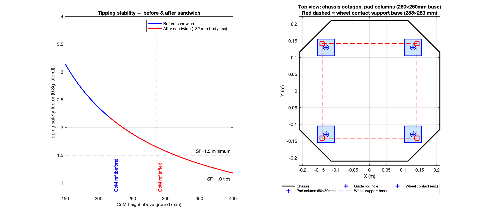

# Vibration Analysis & Suspension Design — Full Report
# 振动分析与悬挂设计——完整报告

**Platform / 平台:** X-configuration omni-wheel chassis (unsuspended, bare chassis)
**X型全向轮底盘（无悬挂，裸底盘）**

**Sensor / 传感器:** Z-axis accelerometer, mounted on chassis body / Z轴加速度计，安装于底盘本体

**Analysis tool / 分析工具:** MATLAB R2024a, Welch PSD, Fs = 27,027 Hz

**Date / 日期:** 2026-02

---

## Table of Contents / 目录

1. [Platform Specifications](#1-platform-specifications--平台参数)
2. [Test Datasets](#2-test-datasets--测试数据集)
3. [Multi-Surface RMS Results](#3-multi-surface-rms-results--多地面rms汇总)
4. [Frequency Analysis](#4-frequency-analysis--频率分析)
5. [Low-Speed Resonance Problem](#5-low-speed-resonance-problem--低速共振问题)
6. [Mitigation Options for Low-Speed Resonance](#6-mitigation-options--低速共振缓解方案)
7. [Suspension Design](#7-suspension-design--悬挂设计)
8. [Wheel Swap: 6-inch N=9 vs Current 5-inch N=11](#8-wheel-comparison--车轮对比)
9. [Conclusions & Recommendations](#9-conclusions--recommendations--结论与建议)
10. [Adding Mass to Shift Resonance](#10-adding-mass-to-shift-resonance--增加质量以移频)
11. [Pneumatic Tyres vs Omni Wheels](#11-pneumatic-tyres-vs-omni-wheels--充气轮胎与全向轮对比)
12. [Sandwich Layer — Four-Option Comparative Analysis](#12-sandwich-layer--four-option-comparative-analysis--机体结构夹层减振设计)
    - [§12.9 Mass Audit & Updated Suspension](#129-mass-audit--updated-suspension--with-sandwich-hardware--质量审计与悬挂更新含夹层硬件)
    - [§12.10 Mating Interface & Assembly Specification](#1210-mating-interface--assembly-specification--安装接口与装配规范)
13. [Additional Isolator Candidates — Extended Evaluation](#13-additional-isolator-candidates--extended-evaluation--新增隔振器候选方案扩展评估)
14. [Dual-Accelerometer Results — Chassis vs End-Effector](#14-dual-accelerometer-results----chassis-vs-end-effector--双加速度计对比底盘与末端执行器)
    - [§14.7 Per-axis (X/Y/Z) RMS — 3D dual-sensor breakdown](#147-per-axis-xyz-rms--chassis-vs-end-effector--各轴xyz-rms底盘与末端执行器)
    - [§14.8 Arm structural resonance frequencies](#148-arm-structural-resonance-frequencies-identified--机械臂结构共振频率识别)
    - [§14.9 Three-axis summary & engineering implications](#149-three-axis-summary-and-engineering-implications--三轴分析总结与工程建议)
15. [RC Coil-Over Shock — Candidate Evaluation & Action Items](#15-rc-coil-over-shock--candidate-evaluation--action-items--rc同轴减震器候选评估与待办事项)
16. [Suspension Mechanical Design — Geometry Recommendation](#16-suspension-mechanical-design--geometry-recommendation--悬挂机械结构设计推荐)

---

## 1. Platform Specifications / 平台参数

### 1.1 Chassis geometry / 底盘构型

| Parameter / 参数 | Value / 数值 | Notes / 备注 |
|---|---|---|
| Wheel configuration / 轮型 | X-type omni / X型全向轮 | Wheel axes at **45° to forward** / 轮轴与前进方向成**45°** |
| Number of wheels / 轮数 | 4 | One per corner / 每角一个 |
| Wheel diameter (current) / 车轮直径（当前） | 5 in = **127 mm** | |
| Wheel circumference (current) / 周长（当前） | π × 0.127 = **0.3990 m** | |
| Rollers per plate (current) / 每板滚子数（当前） | **11** | 2 plates per wheel / 每轮2块板 |
| Total rollers per wheel (current) / 每轮总滚子数 | **22** (staggered 16.4°) / **22个**（错位16.4°）| N=22 passage suppressed / N=22过频受抑制 |
| Total robot mass / 整机质量 | **25 kg** | Excludes suspension hardware / 不含悬挂零件 |
| Unsprung mass / 非簧载质量 | **5.2 kg** | 4 × 1.3 kg (motor + wheel) / 4×1.3 kg（电机+轮组） |
| Sprung mass / 簧载质量 | **19.8 kg** | = 4.95 kg per corner / = 每角4.95 kg |
| Motor max RPM / 电机最大转速 | **6,500 RPM** | |
| Reducer ratio / 减速比 | **37.14** | |
| Max chassis speed (motor limit) / 最大底盘速度（电机限制） | ~1.65 m/s | |

### 1.2 Critical kinematics — X-configuration correction / X构型运动学修正（关键）

For pure forward chassis motion at speed `v_chassis`, each wheel rolls at:
纯前进运动时，各轮滚动速度为：

```
v_wheel = v_chassis × cos(45°) = v_chassis / √2
```

**All frequency formulas must use this correction / 所有频率公式必须使用此修正：**

```matlab
% CORRECT / 正确
f_roller = N * v_chassis / (sqrt(2) * wheelCirc);

% WRONG — ignores 45° alignment / 错误——忽略45°对准
f_roller = N * v_chassis / wheelCirc;   % ← off by √2 factor
```

> Without the √2 correction, apparent N was ~8/rev (mystery); with correction it is exactly **N=11** (< 6% error). / 不用√2修正时，表观N约8/转（原因不明）；修正后精确为**N=11**（误差<6%）。

### 1.3 True sample rate / 真实采样率

Column 5 of the CSV declares ~26,820 Hz — **this is wrong.**
CSV第5列声明约26,820 Hz——**该值有误。**

Timestamp analysis (37 µs steps) gives: `Fs = **27,027 Hz**` (hardcoded in all scripts).
时间戳分析（37 µs步长）得到：`Fs = **27,027 Hz**`（所有脚本中硬编码）。

---

## 2. Test Datasets / 测试数据集

### 2.1 Original baseline / 原始基线

| Item / 项目 | Value / 数值 |
|---|---|
| Files / 文件数 | 6 CSV (0.2–1.2 m/s) |
| Surface / 地面 | Indoor smooth floor / 室内光滑地面 |
| Confirmed equivalent to / 等效于 | Indoor white/black tile (within 7%) / 室内白/黑砖（误差<7%） |
| Location / 路径 | `testData/recomoProto1-190-logs-acc-diff-speeds/` |

### 2.2 Multi-surface tests / 多地面测试

| Surface ID / 地面ID | Description / 描述 | Files / 文件数 |
|---|---|---|
| Black | Indoor Black Tile / 室内黑砖 | 7 CSV (0.2–1.5 m/s) |
| White | Indoor White Tile / 室内白砖 | 7 CSV (0.2–1.5 m/s) |
| Cement | Outdoor Cement / 室外水泥路 | 7 CSV (0.2–1.5 m/s) |
| Pavement | Outdoor Paving Stones / 室外人行道 | 7 CSV (0.2–1.5 m/s) |

**Total: 34 CSV files across 5 datasets. / 共34个CSV文件，5个数据集。**

> **Clarification / 说明:** The "2.58 g at 1.2 m/s" figure cited in early analysis is an **instantaneous peak** (`max(abs(Z))`), not RMS. The Z-axis RMS at 1.2 m/s is **0.50 g**. / 早期分析中提到的"1.2 m/s时2.58 g"为**瞬时峰值**，非RMS。1.2 m/s时Z轴RMS为**0.50 g**。

---

## 3. Multi-Surface RMS Results / 多地面RMS汇总

### 3.1 Z-axis RMS (g) — all surfaces, all speeds / Z轴RMS（g）——所有地面，所有速度

| Surface / 地面 | 0.2 | 0.4 | 0.6 | 0.8 | 1.0 | 1.2 | **1.5** |
|---|---|---|---|---|---|---|---|
| Black Tile / 黑砖 | 0.068 | 0.196 | 0.277 | 0.374 | 0.513 | 0.552 | **0.705** |
| White Tile / 白砖 | 0.064 | 0.201 | 0.296 | 0.379 | 0.507 | 0.534 | **0.674** |
| Cement / 水泥路 | 0.193 | 0.546 | 1.073 | 1.765 | 2.507 | 3.257 | **3.575** |
| Pavement / 人行道 | 0.072 | 0.240 | 0.406 | 0.565 | 0.828 | 1.068 | **1.306** |
| Baseline (original) / 基线（原始） | 0.069 | 0.239 | 0.303 | 0.397 | 0.500 | 0.500 | — |

### 3.2 Surface severity ratios vs indoor white tile / 地面严酷度比（vs室内白砖）

| Speed / 速度 | Cement / White | Pavement / White |
|---|---|---|
| 0.2 m/s | 3.0× | 1.1× |
| 0.8 m/s | 4.7× | 1.5× |
| 1.2 m/s | **6.1×** | 2.0× |
| 1.5 m/s | 5.3× | 1.9× |

**Key finding / 关键发现:** Outdoor cement generates 3–6× higher vibration than indoor tile at all speeds. Outdoor pavement is moderate at 1.1–2.0×. / 室外水泥路在所有速度下振动幅度比室内地砖高3–6倍；室外人行道居中，约1.1–2.0倍。

---

## 4. Frequency Analysis / 频率分析

### 4.1 N=11 per-plate roller passage (dominant mechanical excitation) / N=11每板滚子过频（主导机械激励）

**Formula / 公式:** `f_roller = 11 × v_chassis / (√2 × 0.3990)`

| Speed / 速度 | Predicted / 预测 (Hz) | Measured / 实测 (Hz) | Error / 误差 | Surface / 地面 |
|---|---|---|---|---|
| 0.8 m/s | 15.6 | 16.5 | −5.5% | Indoor (all) / 室内（全部）|
| 1.0 m/s | 19.5 | 19.8 | −1.5% | Indoor (all) / 室内（全部）|
| 1.2 m/s | 23.4 | 23.1 | +1.3% | Indoor (all) / 室内（全部）|
| 1.5 m/s | 29.2 | 27.2 | −6.9% | White tile / 白砖 |
| 1.5 m/s | 29.2 | 26.4 | −9.7% | Cement / 水泥路 (broadband noise masks peak) |

**Conclusion / 结论:**
- N=11 is confirmed as the dominant mechanical excitation at all speeds ≥ 0.8 m/s, across all 4 surfaces. / N=11已在所有地面、所有≥0.8 m/s速度下确认为主导机械激励。
- N=22 (combined dual-plate passage) is **suppressed** by the 16.4° stagger design. / N=22（双板合计过频）因16.4°错位设计受到**抑制**。
- Cement broadband noise partially masks the roller peak at 1.5 m/s, causing slightly larger error. / 水泥路宽频噪声在1.5 m/s时部分掩盖滚子峰值，导致误差略大。

### 4.2 Motor cogging (dominant at low speeds) / 电机齿槽（低速主导）

**Formula / 公式:** `f_cogging = 10.2 × v_chassis / (√2 × 0.3990) × 37.14`

| Speed / 速度 | Predicted / 预测 (Hz) | Measured / 实测 (Hz) | Error / 误差 |
|---|---|---|---|
| 0.2 m/s | 134 | 135 | +0.7% |
| 0.4 m/s | 269 | 269 | < 0.1% |
| 0.6 m/s | 403 | 404 | +0.2% |

- ~10.2 events per motor revolution — motor **electrical excitation (cogging torque)**, not gear mesh. / 约10.2次/电机转——电机**电气激励（齿槽转矩）**，非齿轮啮合。
- Gear mesh ruled out: the measured ratio 10.27 events/motor_rev is non-integer, which gear mesh cannot produce. Wide-band PSD (0–2000 Hz) confirms no gear mesh peaks above 500 Hz. / 齿轮啮合已排除：实测10.27次/转非整数，齿轮啮合不可能产生；0–2000 Hz宽频PSD证实500 Hz以上无齿轮啮合峰。
- At 1.5 m/s, cogging frequency = **1,007 Hz** — outside the 0–500 Hz analysis window. / 1.5 m/s时齿槽频率 = **1,007 Hz**，超出0–500 Hz分析窗口。

### 4.3 Cement structural resonance (~79 Hz) / 水泥路结构共振（约79 Hz）

A **speed-independent** peak at **79.2 Hz** appears on outdoor cement at 0.8, 1.0, and 1.2 m/s.
室外水泥路在0.8、1.0、1.2 m/s均出现**79.2 Hz**的**速度无关**峰值。

- Not kinematic: N=11 at these speeds is 15.6–23.4 Hz; N=22 is 31.2–46.8 Hz — neither matches 79 Hz. / 非运动学成因：这些速度下N=11为15.6–23.4 Hz，N=22为31.2–46.8 Hz，均与79 Hz不符。
- **Conclusion:** Chassis structural resonance excited by the broadband vibration energy of the rough cement surface. / **结论：** 粗糙水泥路面宽频激励引发的底盘结构共振。
- Does not affect suspension design (well above fn = 4 Hz range). / 不影响悬挂设计（远高于fn=4 Hz范围）。

### 4.4 Complete frequency table — all speeds / 完整频率表——所有速度

| Speed / 速度 | N=11 (Hz) | N=22 (Hz) | Cogging (Hz) | Motor RPM |
|---|---|---|---|---|
| 0.2 m/s | 3.9 | 7.8 | 134 | 788 |
| 0.4 m/s | 7.8 | 15.6 | 269 | 1,575 |
| 0.6 m/s | 11.7 | 23.4 | 403 | 2,363 |
| 0.8 m/s | 15.6 | 31.2 | 537 | 3,150 |
| 1.0 m/s | 19.5 | 39.0 | 671 | 3,938 |
| 1.2 m/s | 23.4 | 46.8 | 806 | 4,725 |
| **1.5 m/s** | **29.2** | **58.5** | **1,007** | **5,906** |

---

## 5. Low-Speed Resonance Problem / 低速共振问题

### 5.1 Discovery / 发现

The N=11 roller frequency at **v = 0.2 m/s = 3.9 Hz** — almost exactly equal to the designed suspension natural frequency **fn = 4.0 Hz**.
**v = 0.2 m/s时N=11滚子频率 = 3.9 Hz**——几乎精确等于悬挂设计自然频率**fn = 4.0 Hz**。

This means the suspension **amplifies** roller vibration instead of isolating it at low speeds.
这意味着悬挂在低速时**放大**滚子振动，而非隔离。

### 5.2 Full low-speed transmissibility / 低速段完整传递率

**Formula / 公式:** `T(r, ζ) = √[(1 + (2ζr)²) / ((1−r²)² + (2ζr)²)]`  where `r = f_N11 / fn`

| Speed / 速度 | N=11 (Hz) | r | T (fn=4, ζ=0.4) | Effect / 效果 |
|---|---|---|---|---|
| 0.01 m/s | 0.2 | 0.05 | 1.00 | Near unity / 接近单位 |
| 0.05 m/s | 1.0 | 0.24 | 1.06 | Mild amplification / 轻微放大 |
| **0.10 m/s** | **1.9** | **0.49** | **1.25** | Amplifying / 放大 |
| **0.15 m/s** | **2.9** | **0.73** | **1.55** | Strong amplification / 显著放大 |
| **0.20 m/s** | **3.9** | **0.97** | **1.62** | ⚠ **Peak — resonance / 峰值——共振** |
| 0.25 m/s | 4.9 | 1.22 | 1.28 | Decreasing / 递减 |
| **0.29 m/s** | **5.7** | **1.41** | **1.00** | **Isolation onset / 隔振起效** |
| 0.30 m/s | 5.8 | 1.46 | 0.94 | Isolating / 隔振中 |
| 0.40 m/s | 7.8 | 1.95 | 0.58 | Good isolation / 良好隔振 |

**The amplification zone spans 0.10–0.29 m/s — not just 0.2 m/s.**
**放大区间为0.10–0.29 m/s——不仅仅是0.2 m/s。**

Key physics / 关键物理规律:
- **Below 0.2 m/s**: approaching resonance from below — amplification increases as speed rises toward 0.2 m/s. / **低于0.2 m/s**：从低速侧趋近共振——放大倍数随速度升高而增大。
- **At 0.2 m/s**: peak amplification (r ≈ 1). / **0.2 m/s**：放大峰值（r≈1）。
- **0.15 m/s is nearly as bad as 0.2 m/s** (T = 1.55 vs 1.62). / **0.15 m/s与0.2 m/s几乎同样危险**（T=1.55 vs 1.62）。
- **Very low speeds (< 0.05 m/s)**: N=11 → 0 Hz, far below fn; T ≈ 1 (no amplification, but also no isolation needed — vibration input is negligible at crawl). / **极低速（<0.05 m/s）**：N=11趋近0 Hz，远低于fn；T≈1（无放大，也无需隔振——爬行速度下振动输入可忽略不计）。

---

## 6. Mitigation Options / 低速共振缓解方案

*(Software speed skip ruled out — robot must operate continuously in 0.1–0.3 m/s range.)*
*（软件跳速方案已排除——机器人需在0.1–0.3 m/s范围内持续运行。）*

### Option A — Increase damping ratio only (keep fn = 4 Hz) / 方案A——仅增大阻尼比（保持fn=4 Hz）

Just replace the damper unit. Spring unchanged.
仅更换阻尼器，弹簧不变。

| ζ | T @ 0.2 m/s | T @ 1.5 m/s | c (N·s/m) | Assessment / 评价 |
|---|---|---|---|---|
| 0.40 (current) | 1.62 | 0.112 | 99.5 | Baseline / 基线 |
| 0.50 | 1.43 | 0.139 | 124.4 | Some improvement / 小幅改善 |
| 0.70 | 1.24 | 0.193 | 174.2 | Significant improvement / 显著改善 |
| 1.00 | 1.12 | 0.269 | 248.8 | Diminishing returns / 收益递减 |

- **Limitation:** Even at ζ = 1.0, T@0.2 m/s = 1.12. Damping alone cannot eliminate resonance amplification. High-speed isolation also degrades. / **局限：** 即便ζ=1.0，T@0.2 m/s仍为1.12。单靠阻尼无法消除共振放大；高速隔振性能亦有所下降。
- **Practical ceiling: ζ ≈ 0.7** (halves resonance overshoot with acceptable cost). / **实用上限：ζ≈0.7**（共振超调减半，代价可接受）。

### Option B — Lower fn (shift resonance below operating range) / 方案B——降低fn（将共振移至工况范围以下）

| fn (Hz) | Resonance speed / 共振速度 | T @ 0.2 m/s | T @ 1.5 m/s | k (N/m) | Static sag / 静态下沉 |
|---|---|---|---|---|---|
| 4.0 (current) | 0.205 m/s | 1.62 | 0.112 | 3,127 | 16 mm |
| 3.0 | 0.154 m/s | 1.16 | 0.083 | 1,759 | 28 mm |
| **2.5** | **0.128 m/s** | **0.84** | **0.069** | **1,221** | **40 mm** |
| 2.0 | 0.103 m/s | 0.58 | 0.055 | 782 | 62 mm |

fn = 2.5 Hz pushes the resonance to 0.128 m/s, **below the typical operating minimum**, and reduces T@0.2 m/s to 0.84 (now attenuating). Cost is ~40 mm static sag and ~120 mm minimum stroke.
fn=2.5 Hz将共振移至0.128 m/s，**低于典型最低工作速度**，T@0.2 m/s降至0.84（已变为衰减）。代价是约40 mm静态下沉和约120 mm最小行程。

### Option C — Combined: lower fn + higher damping (recommended) / 方案C——组合：降低fn+提高阻尼（推荐）

| fn (Hz) | ζ | T @ 0.1 m/s | **T @ 0.2 m/s** | T @ 1.5 m/s | k (N/m) | c (N·s/m) | Sag / 下沉 |
|---|---|---|---|---|---|---|---|
| 3.0 | 0.70 | 1.25 | **1.07** | 0.144 | 1,759 | 130.6 | 28 mm |
| 2.5 | 0.70 | 1.28 | **0.92** | 0.120 | 1,221 | 108.9 | 40 mm |
| 2.5 | 0.50 | 1.45 | **0.87** | 0.086 | 1,221 | 77.8 | 40 mm |

**Recommended: fn = 3.0 Hz + ζ = 0.7**
**推荐：fn = 3.0 Hz + ζ = 0.7**

- T@0.2 m/s = **1.07** — only 7% overshoot, negligible in practice. / T@0.2 m/s = **1.07**——仅7%超调，实际影响可忽略。
- Resonance speed = 0.154 m/s — passed through briefly during acceleration, not sustained. / 共振速度 = 0.154 m/s——加速时短暂经过，不会持续。
- Isolation onset drops to 0.218 m/s — effective isolation starts much earlier. / 隔振起效速度降至0.218 m/s——隔振更早生效。
- k = 1,759 N/m, c = 130.6 N·s/m — achievable with standard components. / k=1,759 N/m，c=130.6 N·s/m——标准元件可实现。
- Static sag = 28 mm, minimum stroke ≈ 84 mm — manageable. / 静态下沉28 mm，最小行程约84 mm——可接受。

---

## 7. Suspension Design / 悬挂设计

### 7.1 1-DOF model / 单自由度模型

Transmissibility of a 1-DOF spring-damper system:
单自由度弹簧-阻尼系统传递率：

```
T = √[(1 + (2ζr)²) / ((1−r²)² + (2ζr)²)]
r = f_excitation / fn
fn = (1/2π) × √(k / m_sprung)
ζ = c / (2 × √(k × m_sprung))
```

### 7.2 Mass split / 质量分配

| Mass / 质量 | Value / 数值 |
|---|---|
| Total robot mass / 整机总质量 | 25 kg |
| Unsprung mass (4 × motor+wheel) / 非簧载质量（4×电机+轮） | 5.2 kg (4 × 1.3 kg) |
| Sprung mass / 簧载质量 | **19.8 kg** |
| Sprung mass per corner / 每角簧载质量 | **4.95 kg** |

> ⚠ **These values are superseded once sandwich hardware and second battery are added.**
> See [§12.9.3](#129-mass-audit--updated-suspension----with-sandwich-hardware--质量审计与悬挂更新含夹层硬件) for updated values: **total 36.6 kg, sprung 31.4 kg (7.85 kg/corner)**.
> ⚠ **加装夹层硬件和第二块电池后，以上数值已更新。**
> 更新值见§12.9.3：**整机36.6 kg，簧载31.4 kg（每角7.85 kg）**。

### 7.3 Current design parameters (indoor use) / 当前设计参数（室内使用）

> ⚠ **Parameters below are for the original 25 kg configuration (4.95 kg/corner).**
> After adding sandwich hardware + second battery (7.85 kg/corner), see §12.9.3 for revised values: **k = 4,958 N/m, c = 157.8 N·s/m**.
> ⚠ **以下参数适用于原始25 kg构型（每角4.95 kg）。**
> 增加夹层硬件+第二块电池后（每角7.85 kg），更新值见§12.9.3：**k=4,958 N/m，c=157.8 N·s/m**。

| Parameter / 参数 | Value / 数值 |
|---|---|
| Natural frequency / 自然频率 | **fn = 4.0 Hz** |
| Damping ratio / 阻尼比 | **ζ = 0.4** |
| Spring stiffness (per corner) / 弹簧刚度（每角） | **k = 3,127 N/m** *(original 25 kg)* |
| Damping coefficient (per corner) / 阻尼系数（每角） | **c = 99.5 N·s/m** *(original 25 kg)* |
| Static sag / 静态下沉 | **15.5 mm** |
| Minimum stroke / 最小行程 | **46 mm** |

### 7.4 Predicted suspension output — indoor surface / 预测悬挂输出——室内地面

| Speed / 速度 | Input RMS (g) | T | Output RMS (g) | < 0.1 g? |
|---|---|---|---|---|
| 0.2 m/s | 0.068 | 1.62 | 0.110 | ⚠ marginal |
| 0.4 m/s | 0.201 | 0.578 | 0.116 | ⚠ marginal |
| 0.6 m/s | 0.296 | 0.322 | 0.095 | ✓ |
| 0.8 m/s | 0.379 | 0.225 | 0.085 | ✓ |
| 1.0 m/s | 0.507 | 0.174 | 0.088 | ✓ |
| 1.2 m/s | 0.534 | 0.143 | 0.076 | ✓ |
| 1.5 m/s | 0.674 | 0.112 | 0.076 | ✓ |

### 7.5 Surface-specific suspension requirements / 按地面类型的悬挂需求

| Surface / 地面 | Recommended fn / 推荐fn | ζ | Notes / 备注 |
|---|---|---|---|
| Indoor tile / 室内地砖 | **4 Hz** (or 3 Hz if low-speed matters) | 0.4–0.7 | Target < 0.1 g met at ≥ 0.6 m/s |
| Outdoor pavement / 室外人行道 | **3 Hz** | 0.5 | Marginal at 0.8 m/s |
| Outdoor cement / 室外水泥路 | **2 Hz** | 0.5 | Requires k ≈ 782 N/m, sag 62 mm |

### 7.6 Suspension performance at 1.5 m/s (T = 0.112) / 1.5 m/s时悬挂性能（T=0.112）

| Surface / 地面 | Input RMS (g) | Predicted output / 预测输出 (g) | < 0.1 g? |
|---|---|---|---|
| Black Tile / 黑砖 | 0.705 | **0.079** | ✓ |
| White Tile / 白砖 | 0.674 | **0.076** | ✓ |
| Pavement / 人行道 | 1.306 | **0.147** | ✗ |
| Cement / 水泥路 | 3.575 | **0.401** | ✗ |

---

## 8. Wheel Comparison / 车轮对比

### 8.1 Specifications / 规格对比

| Parameter / 参数 | Current: 5 in, N=11 / 当前：5英寸N=11 | New: 6 in, N=9 / 新：6英寸N=9 |
|---|---|---|
| Diameter / 直径 | 127 mm | **152.4 mm** |
| Circumference / 周长 | 0.3990 m | 0.4788 m |
| Rollers per plate / 每板滚子数 | **11** | 9 |
| Total rollers / 总滚子数 | 22 (stagger 16.4°) | 18 (stagger 20.0°) |
| Dominant excitation / 主激励 | **N=11** | **N=9** |
| Combined (suppressed) / 合计（受抑制） | N=22 | N=18 |
| Roller frequency at 1.0 m/s / 1.0 m/s时滚子频率 | 19.5 Hz | 13.3 Hz |
| Resonance speed (fn=4 Hz) / 共振速度（fn=4 Hz） | **0.205 m/s** | **0.301 m/s** |
| Isolation onset (fn=4 Hz) / 隔振起效速度（fn=4 Hz） | **0.290 m/s** | **0.426 m/s** |
| Max chassis speed / 最大底盘速度 | ~1.65 m/s | ~**1.97 m/s** |

### 8.2 Transmissibility comparison (fn = 4 Hz, ζ = 0.4) / 传递率对比（fn=4 Hz，ζ=0.4）

| Speed / 速度 | T old (N=11) / 旧轮 | T new (N=9) / 新轮 | Better / 更优 |
|---|---|---|---|
| 0.1 m/s | 1.25 | 1.11 | New (slightly) |
| 0.2 m/s | **1.62** | 1.47 | Old (marginally) |
| **0.3 m/s** | **0.94** ✓ isolating | **1.60** ✗ amplifying | **Old** |
| 0.4 m/s | 0.58 | 1.11 | **Old** |
| 0.6 m/s | 0.32 | 0.56 | **Old** |
| 1.0 m/s | 0.174 | 0.273 | **Old** |
| 1.5 m/s | **0.112** | 0.170 | **Old** |

### 8.3 Head-to-head verdict / 综合评定

| Criterion / 评价维度 | Old (5 in, N=11) / 旧轮 | New (6 in, N=9) / 新轮 | Winner / 胜者 |
|---|---|---|---|
| Resonance location / 共振位置 | 0.20 m/s (low end of range) / 速度范围低端 | 0.30 m/s (middle of range) / 速度范围中段 | **Old** |
| Isolation onset / 隔振起效 | 0.29 m/s | 0.43 m/s | **Old** |
| High-speed isolation / 高速隔振 | T = 0.112 @ 1.5 m/s | T = 0.170 @ 1.5 m/s | **Old** |
| Roller smoothness / 滚动平顺性 | N=11 (more rollers) | N=9 (fewer rollers) | **Old** |
| Top speed / 最高速度 | 1.65 m/s | **1.97 m/s** | **New** |
| Obstacle clearance / 越障能力 | 63.5 mm radius | **76.2 mm radius** | **New** |

### 8.4 Verdict / 结论

**The old 5-inch N=11 wheel is more favourable for vibration isolation.**
**旧款5英寸N=11车轮在振动隔离方面更具优势。**

The new wheel's resonance lands at **0.30 m/s** — a commonly sustained operating speed (corridor transit). The old wheel's resonance at 0.20 m/s is at the lower extreme of the operating range, passed through briefly during acceleration. The new wheel's isolation onset at 0.43 m/s means vibration is amplified across a much wider fraction of the working speed range.

新轮共振发生在**0.30 m/s**——这是常见的持续运行速度（走廊巡航）。旧轮共振在0.20 m/s，处于速度范围最低端，加速时短暂通过。新轮隔振起效速度为0.43 m/s，意味着在更大的工作速度范围内振动被放大。

**If the new wheel is required** (for top speed or clearance): redesign suspension to **fn = 2.5–3.0 Hz, ζ = 0.7** to compensate.
**若必须采用新轮**（为了速度或越障）：须将悬挂重新设计为 **fn = 2.5–3.0 Hz，ζ = 0.7** 加以补偿。

### 8.5 New wheel — updated frequency formulas / 新轮——更新后的频率公式

```matlab
wC_new    = pi * 0.1524;               % 0.4788 m
f_roller  = @(v) 9 * v / (sqrt(2) * wC_new);    % N=9 dominant
f_cogging = @(v) 10.2 * v/(sqrt(2)*wC_new) * 37.14;
```

| Speed / 速度 | N=9 roller (Hz) / N=9滚子(Hz) | Cogging (Hz) / 齿槽(Hz) |
|---|---|---|
| 0.2 m/s | 2.7 | 112 |
| 0.4 m/s | 5.3 | 224 |
| 0.6 m/s | 8.0 | 336 |
| 0.8 m/s | 10.6 | — |
| 1.0 m/s | 13.3 | — |
| 1.2 m/s | 16.0 | — |
| 1.5 m/s | 19.9 | — |

---

<a id="section-9"></a>

## 9. Conclusions & Recommendations / 结论与建议

### 9.1 Confirmed findings (high confidence) / 已确认结论（高置信度）

| # | Finding / 结论 | Evidence / 依据 |
|---|---|---|
| 1 | **N=11 roller passage** is the dominant mechanical excitation at speeds ≥ 0.4 m/s. N=22 is stagger-suppressed. / **N=11滚子过频**是≥0.4 m/s速度下的主导机械激励，N=22因错位设计受抑制。 | <6% error across 4 surfaces, 5 speeds |
| 2 | **Motor cogging (~10.2 events/motor-rev)** dominates at low speeds (0.2–0.6 m/s). Not gear mesh (non-integer ratio). / **电机齿槽（约10.2次/转）**在低速（0.2–0.6 m/s）主导，非齿轮啮合（比值非整数）。 | <0.7% error, all smooth surfaces |
| 3 | **X-config √2 correction is essential.** Without it, apparent N ≈ 8 (mystery); with it, exactly N=11. / **X构型√2修正不可或缺。** 不修正时表观N≈8（原因不明）；修正后精确为N=11。 | Physics confirmed |
| 4 | **True Fs = 27,027 Hz.** CSV column 5 (~26,820 Hz) is inaccurate. / **真实Fs = 27,027 Hz。** CSV第5列（~26,820 Hz）有误。 | Timestamp analysis |
| 5 | **Original baseline = indoor smooth floor**, consistent with white/black tile results (within 7%). / **原始基线 = 室内光滑地面**，与白/黑砖结果一致（误差<7%）。 | Cross-dataset RMS comparison |
| 6 | **Cement generates 3–6× more vibration** than indoor tile at all speeds. / **水泥路振动幅度是室内地砖的3–6倍**，在所有速度下均如此。 | RMS table |
| 7 | **Cement ~79 Hz peak is chassis structural resonance**, not a kinematic frequency. Speed-independent. / **水泥路约79 Hz峰值为底盘结构共振**，非运动学频率，速度无关。 | Constant across 0.8/1.0/1.2 m/s |
| 8 | **Low-speed resonance zone: 0.10–0.29 m/s.** T peaks at 1.62 × at 0.2 m/s with fn=4 Hz, ζ=0.4. / **低速共振区间：0.10–0.29 m/s。** fn=4 Hz，ζ=0.4时，0.2 m/s处T峰值1.62倍。 | Transmissibility calculation |

### 9.2 Design recommendations / 设计建议

| Priority / 优先级 | Action / 行动 | Rationale / 依据 |
|---|---|---|
| 1 | **Keep old 5-inch N=11 wheel** unless top speed > 1.65 m/s or larger obstacle clearance is required. / **保留旧款5英寸N=11车轮**，除非需要>1.65 m/s速度或更大越障能力。 | New wheel shifts resonance to 0.30 m/s — worse for vibration |
| 2 | **Redesign suspension to fn = 3.0 Hz, ζ = 0.7** if continuous operation in 0.1–0.3 m/s is required. / **若需在0.1–0.3 m/s持续运行，将悬挂重新设计为fn=3.0 Hz，ζ=0.7。** | Reduces T@0.2m/s from 1.62 to 1.07 |
| 3 | **Weigh suspension hardware** and recompute k, c with actual sprung mass per corner. / **称量悬挂零件**，以实际每角簧载质量重新计算k、c。 | 25 kg baseline excludes hardware |
| 4 | **Build and test prototype on all 4 surfaces** before finalising suspension parameters. / **在四种地面实测样机**再确定悬挂参数。 | Model predictions need experimental validation |
| 5 | **If outdoor cement required at full speed**: lower fn to 2 Hz (k ≈ 782 N/m, sag 62 mm, stroke ≥ 186 mm), or add 2 Hz elastomer pad at camera/payload mount. / **若室外水泥路需全速运行**：降低fn至2 Hz（k≈782 N/m，下沉62 mm，行程≥186 mm），或在相机/载荷安装座处增加2 Hz弹性垫片。 | Cement output with fn=4 Hz = 0.40 g >> 0.1 g target |

### 9.3 Anti-patterns — never do these / 反模式——绝对不要做的事

1. **Do not use `f = N × v / wheelCirc`** — always use `f = N × v / (√2 × wheelCirc)` for X-config. / **不要使用`f = N × v / wheelCirc`**——X构型必须用`f = N × v / (√2 × wheelCirc)`。
2. **Do not use Fs from CSV column 5** — hardcode `Fs = 27027`. / **不要使用CSV第5列的Fs**——硬编码`Fs = 27027`。
3. **Do not open CSVs with UTF-8 encoding** — use `fopen(fpath, 'r')` in MATLAB. / **不要以UTF-8编码打开CSV**——MATLAB中使用`fopen(fpath, 'r')`。
4. **Do not quote "2.58 g" as RMS** — it is an instantaneous peak; RMS at 1.2 m/s = 0.50 g. / **不要将"2.58 g"作为RMS引用**——这是瞬时峰值；1.2 m/s时RMS=0.50 g。
5. **Do not use total mass (25 kg) for spring/damper sizing** — use sprung mass per corner (4.95 kg). / **不要用整机质量（25 kg）计算弹簧/阻尼器参数**——使用每角簧载质量（4.95 kg）。

---

## 10. Adding Mass to Shift Resonance / 增加质量以移频

### 10.1 The idea / 想法

Adding a battery (~4 kg) or dead ballast to the sprung mass lowers fn (since fn ∝ 1/√m), potentially shifting the resonance away from the 0.2 m/s operating point.
在簧载质量上增加电池（约4 kg）或压载，可降低fn（因fn∝1/√m），从而将共振移离0.2 m/s工作点。

### 10.2 The fundamental constraint / 根本限制

There is a key identity that holds when **only mass is changed** (k and c unchanged):
当**仅改变质量**（k和c不变）时，存在一个关键恒等式：

```
2ζr = 2π × f_excitation × c / k   ← independent of mass / 与质量无关
```

This means the **numerator of T is fixed** at `√(1 + (2ζr)²) = 1.268` regardless of how much mass is added. / 这意味着T的**分子固定**为`√(1+(2ζr)²) = 1.268`，无论增加多少质量。

Adding mass simultaneously:
增加质量同时会：
- Lowers fn ✓ (shifts resonance speed down) / 降低fn ✓（共振速度下移）
- Lowers ζ ✗ (makes resonance peak sharper) / 降低ζ ✗（共振峰变得更尖锐）

The two effects partially cancel. T improves only slowly once the operating point moves past resonance (r > 1).
两者部分抵消。只有当工作点越过共振（r>1）后，T才缓慢改善。

### 10.3 Computed results / 计算结果

*(Same spring k = 3,127 N/m, same damper c = 99.5 N·s/m throughout / 弹簧k=3,127 N/m，阻尼器c=99.5 N·s/m全程不变)*

| Approach / 方案 | fn (Hz) | ζ | Added mass / 增加质量 | T @ 0.2 m/s | T @ 0.4 m/s | Sag / 下沉 |
|---|---|---|---|---|---|---|
| Current / 当前 | 4.00 | 0.400 | 0 kg | 1.623 | 0.578 | 15.5 mm |
| **+ 4 kg battery / +4 kg电池** | **3.65** | **0.365** | **4 kg** | **1.600** | **0.476** | **18.7 mm** |
| + 20 kg ballast / +20 kg压载 | 2.82 | 0.282 | 20 kg | 1.058 | 0.272 | 31.2 mm |
| Mass-only solution (T=1.07) / 仅靠质量（T=1.07） | 2.83 | 0.283 | ~20 kg | 1.070 | 0.274 | 30.9 mm |
| **Spring+damper redesign / 弹簧+阻尼重设计** | **3.00** | **0.700** | **0 kg** | **1.067** | **0.554** | **27.6 mm** |

### 10.4 The battery (4 kg) specifically / 电池（4 kg）具体效果

**T @ 0.2 m/s drops from 1.623 → 1.600 — negligible improvement.**
**T@0.2 m/s从1.623降至1.600——改善可忽略不计。**

The robot goes from 25 kg to 29 kg and the resonance problem is essentially unchanged. The battery does shift the resonance speed from 0.205 → 0.187 m/s (passing through it faster during acceleration), but since 0.2 m/s is a sustained operating speed this offers no practical benefit.
整机从25 kg增至29 kg，共振问题基本不变。电池将共振速度从0.205移至0.187 m/s（加速时更快通过），但由于0.2 m/s是持续工作速度，这在实际中没有意义。

### 10.5 How to correctly use battery mass / 如何正确利用电池质量

The battery is useful payload — its mass should be **accounted for in the suspension design**, not relied upon to fix resonance. With the battery installed:
电池是有效载荷——其质量应在**悬挂设计中纳入计算**，而不是依赖它解决共振问题。安装电池后：

| | Without battery / 无电池 | With 4 kg battery / 带4 kg电池 |
|---|---|---|
| Total sprung mass / 总簧载质量 | 19.8 kg | 23.8 kg |
| Per corner / 每角 | 4.95 kg | 5.95 kg |
| k for fn = 3 Hz / fn=3 Hz所需k | 1,759 N/m | **2,115 N/m** |
| c for ζ = 0.7 / ζ=0.7所需c | 130.6 N·s/m | **156.3 N·s/m** |
| Static sag / 静态下沉 | 27.6 mm | 27.6 mm |

With the battery on board, the spring can be slightly stiffer (2,115 vs 1,759 N/m) while maintaining the same fn = 3 Hz — this is easier to package. **Weigh the battery before finalising spring selection.**
安装电池后，弹簧可以稍硬（2,115 vs 1,759 N/m）同时保持fn=3 Hz——更易于安装布置。**确定弹簧选型前须称量电池重量。**

### 10.6 Why ballast is inefficient / 为何压载低效

To achieve T = 1.07 via mass alone (without spring change): need **~20 kg added ballast** — 80% of current robot weight. The resulting ζ = 0.28 is poorly damped (suspension oscillates after disturbances). Changing the spring achieves the same result with **0 kg added mass**.
仅靠质量（不换弹簧）实现T=1.07：需增加**约20 kg压载**——相当于当前整机重量的80%。所得ζ=0.28阻尼不足（受扰后悬挂持续振荡）。换弹簧可用**0 kg增重**实现同等效果。

---

## 11. Pneumatic Tyres vs Omni Wheels / 充气轮胎与全向轮对比

### 11.1 What changes in the vibration model / 振动模型的变化

Replacing omni wheels with pneumatic tyres fundamentally changes the **excitation spectrum**, not just the transmissibility.
将全向轮换为充气轮胎从根本上改变了**激励频谱**，而非仅仅改变传递率。

| Excitation source / 激励来源 | Omni wheel / 全向轮 | Pneumatic tyre / 充气轮胎 |
|---|---|---|
| N=11 roller passage 3.9–29 Hz / N=11滚子过频 | **Dominant / 主导** | **Eliminated / 消除** |
| Motor cogging ~134–1007 Hz / 电机齿槽 | Present / 存在 | Present (unchanged) / 存在（不变）|
| Road roughness broadband / 路面粗糙度宽频 | Present / 存在 | Present, filtered by tyre / 存在，但被轮胎过滤 |
| Tyre imbalance ~1–8 Hz / 轮胎不平衡 | N/A | New, minor / 新增，较小 |

**Eliminating the roller passage excitation (N=11) is by far the largest vibration improvement possible** — it removes the source that drives the entire resonance analysis in this report.
**消除滚子过频激励（N=11）是迄今最大的振动改善措施**——它消除了本报告中所有共振分析的激励来源。

### 11.2 Two-DOF system / 二自由度系统

A pneumatic tyre adds a second spring-damper stage between road and suspension:
充气轮胎在路面与悬挂之间增加了第二级弹簧-阻尼：

```
Road → [k_tyre, c_tyre] → Unsprung mass → [k_susp, c_susp] → Sprung mass
路面 → [k轮胎, c轮胎] → 非簧载质量 → [k悬挂, c悬挂] → 簧载质量
```

| Tyre stiffness / 轮胎刚度 k_t | Wheel-hop resonance / 车轮跳动共振 | 2nd-stage isolation starts / 第二级隔振起效 |
|---|---|---|
| 50,000 N/m (soft / 软) | ~32 Hz | Above 32 Hz / 32 Hz以上 |
| 100,000 N/m (medium / 中) | ~44 Hz | Above 44 Hz / 44 Hz以上 |
| 150,000 N/m (stiff / 硬) | ~54 Hz | Above 54 Hz / 54 Hz以上 |

The tyre is **30–85× stiffer** than the suspension spring (1,759 N/m), so it behaves nearly rigidly at suspension frequencies (1–10 Hz). The suspension design is essentially unchanged — tyre compliance mainly matters above 30 Hz.
轮胎比悬挂弹簧（1,759 N/m）**硬30–85倍**，在悬挂频率（1–10 Hz）范围内近似刚性。悬挂设计基本不变——轮胎柔顺性主要在30 Hz以上起作用。

### 11.3 Contact patch filtering / 接触面积过滤

A pneumatic tyre contact patch (~40–60 mm length) spatially averages road roughness, filtering temporal frequencies above:
充气轮胎接触面（约40–60 mm长）对路面粗糙度进行空间平均，过滤以下时间频率以上的成分：

| Speed / 速度 | Cutoff (40 mm patch) / 截止频率（40 mm） | Cutoff (60 mm patch) / 截止频率（60 mm） |
|---|---|---|
| 0.5 m/s | 12.5 Hz | 8.3 Hz |
| 1.0 m/s | 25.0 Hz | 16.7 Hz |
| 1.5 m/s | 37.5 Hz | 25.0 Hz |

On rough outdoor cement (currently 3.26 g RMS at 1.2 m/s), the tyre absorbs sharp edges **before** they reach the suspension — more effective than any suspension redesign alone.
在粗糙室外水泥路面（当前1.2 m/s时3.26 g RMS），轮胎在路面冲击到达悬挂**之前**就将其吸收——比任何悬挂重设计都更有效。

### 11.4 Suspension design implications / 对悬挂设计的影响

With no roller passage excitation, the resonance trap problem disappears entirely:
无滚子过频激励后，共振陷阱问题完全消失：

| Design aspect / 设计方面 | Omni wheel / 全向轮 | Pneumatic tyre / 充气轮胎 |
|---|---|---|
| Low-speed resonance hazard / 低速共振危险 | ⚠ 0.10–0.29 m/s zone | **Gone / 消除** |
| fn constraint / fn约束 | Must avoid 3.9 Hz (N=11 @ 0.2 m/s) / 必须避开3.9 Hz | No constraint / 无约束 |
| Optimal fn / 最优fn | 3 Hz (compromise) / 3 Hz（折中） | **1.5–2 Hz** (better isolation) / **1.5–2 Hz**（更好隔振）|
| Optimal ζ / 最优ζ | 0.7 (forced high to reduce resonance peak) / 0.7（被迫偏高以压制共振峰） | **0.3–0.4** (normal range) / **0.3–0.4**（正常范围）|
| Primary concern / 主要考量 | Roller passage resonance / 滚子过频共振 | Wheel-hop resonance ~44 Hz / 车轮跳动共振约44 Hz |

### 11.5 Head-to-head: vibration vs mobility / 全面对比：振动性能与运动能力

| Criterion / 评价维度 | Omni wheel / 全向轮 | Pneumatic tyre / 充气轮胎 |
|---|---|---|
| Strafing (lateral motion) / 横向平移 | ✓ | ✗ |
| Rotate in place / 原地旋转 | ✓ | ✗ (skid only / 仅打滑) |
| Holonomic positioning / 完整约束定位 | ✓ | ✗ |
| Vibration — indoor smooth / 振动——室内光滑 | Moderate / 中等 | **Much better / 好得多** |
| Vibration — outdoor rough / 振动——室外粗糙 | Poor (3–6× worse) / 较差（3–6倍差距） | **Dramatically better / 大幅改善** |
| Suspension design complexity / 悬挂设计复杂度 | High / 高 | Low / 低 |
| Max chassis speed / 最大底盘速度 | ~1.65 m/s | Higher (tyre-dependent) / 更高（取决于轮胎）|
| Outdoor traction / 室外牵引力 | Moderate / 中等 | Good / 良好 |
| Contact patch road filtering / 接触面路面过滤 | None / 无 | **Yes, effective / 有，有效** |

### 11.6 Verdict / 结论

Pneumatic tyres solve essentially **all** vibration problems identified in this report in one move — by eliminating the source rather than isolating from it. However, this comes at the cost of **omnidirectional movement**, which is the fundamental capability this X-configuration platform was designed to provide.
充气轮胎通过消除激励源（而非隔振）基本上一举解决了本报告中发现的**所有**振动问题。但代价是失去**全向运动能力**——这正是X型平台设计的核心功能。

- **If omnidirectionality can be sacrificed**: use pneumatic tyres + fn = 1.5–2 Hz + ζ = 0.3–0.4. Vibration problem is solved. / **若可以放弃全向性**：使用充气轮胎 + fn=1.5–2 Hz + ζ=0.3–0.4，振动问题即可解决。
- **If omnidirectionality is required**: keep omni wheels, redesign suspension to fn = 3 Hz + ζ = 0.7 as described in Section 6. / **若全向性不可或缺**：保留全向轮，按第6节将悬挂重设计为fn=3 Hz + ζ=0.7。

---

<a id="section-12"></a>

## 12. Sandwich Layer — Four-Option Comparative Analysis / 机体结构夹层减振设计

### 12.1 Concept / 设计概念

The robotic arm is mounted on a body structure that sits above the chassis. A **sandwich layer** is inserted between the chassis top panel and the body structure: two thin metal panels with a compliant damping element in between. This creates a secondary isolation stage on top of the mechanical wheel suspension.
机械臂安装在位于底盘上方的机体结构上。在底盘顶板与机体结构之间插入**夹层结构**：两块薄金属板之间夹持柔性阻尼元件。这在车轮悬挂的基础上形成第二级隔振。

```
Ground / 地面
    ↓  (wheel + suspension stage 1 / 车轮+悬挂 第一级)
Chassis panel / 底盘顶板
    ↓  [sandwich layer — stage 2 / 夹层 第二级]
Body structure panel / 机体结构底板
    ↓
Robotic arm / 机械臂
```

**Chassis footprint / 底盘投影面积:** ~600 mm diameter / 直径约600 mm
**Sandwich element layout / 夹层元件布局:** Four-corner mounting — the only mechanically stable configuration for a large panel. / 四角安装——大面积面板唯一稳定的力学构型。

**System parameters used throughout this section / 本节全程使用系统参数:**

| Parameter / 参数 | Value / 数值 |
|---|---|
| Body mass (sprung) / 机体质量（簧上） | **19.8 kg** (total 25 kg − 5.2 kg unsprung) |
| Load per corner / 每角载荷 | **4.95 kg** (19.8 / 4) |
| Suspension fn / 悬挂自振频率 | **4.0 Hz**, ζ = 0.4 (indoor design) |
| Target sandwich fn / 夹层目标自振频率 | **4–5 Hz** (well below 0.4 m/s roller excitation 7.8 Hz) |
| N=11 excitation formula / N=11激励频率公式 | f = 11 × v / (√2 × 0.399) |

---

### 12.2 Option A — Silicon Bumper Pad in Series / 方案A：硅胶减振垫串联叠加

#### 12.2.1 Product specifications / 产品规格

*(Source: `ref-info/silicon-damperMat-spec.png`, `-dim.png`, `-illustration.png`)*

| Parameter / 参数 | Value / 数值 |
|---|---|
| Pad dimensions / 垫片尺寸 | **50 × 50 × 15 mm** |
| Rated load per pad / 单垫额定载荷 | **25 kg** |
| Natural frequency at rated load / 额定载荷下自振频率 | **4 Hz** |
| Damping ratio / 阻尼比 | **ζ = 0.12–0.15** |
| Tensile strength / 拉伸强度 | ≥ 3 MPa |
| Material / 材质 | Silicone gel / 硅胶 |

Derived dynamic stiffness (from fn = 4 Hz at 25 kg) / 推导动态刚度：

```
k_pad = 25 × (2π × 4)² = 15,791 N/m  per pad / 每垫
```

#### 12.2.2 Series stacking analysis (N pads per corner) / 串联叠加分析（每角N块）

**Key principle / 关键原理:** Springs in series reduce effective stiffness: `k_eff = k_pad / N`
弹簧串联降低等效刚度：`k_eff = k_pad / N`

For a Kelvin-Voigt viscoelastic model, the **loss factor η = c·ω/k is preserved** through series stacking — damping ratio ζ remains constant at 0.13 regardless of N.
对于Kelvin-Voigt粘弹模型，串联时**损耗因子η=c·ω/k保持不变**——ζ≈0.13不随N变化。

| N pads / 块数 | k\_eff (N/m) | fn @ 4.95 kg/corner | fn @ 3.75 kg | fn @ 2.5 kg | Stack height / 叠高 |
|---|---|---|---|---|---|
| 1 (parallel×4) | 63,164 | 17.9 Hz ✗ | 20.6 Hz ✗ | 25.3 Hz ✗ | 15 mm |
| 1 per corner | 15,791 | 9.0 Hz ✗ | 10.3 Hz ✗ | 12.6 Hz ✗ | 15 mm |
| 2 in series | 7,896 | 6.4 Hz ✗ | 7.3 Hz ✗ | 8.9 Hz ✗ | 30 mm |
| 3 in series | 5,264 | 5.2 Hz △ | 6.0 Hz ✗ | 7.3 Hz ✗ | 45 mm |
| **4 in series** | **3,948** | **4.5 Hz ✓** | **5.2 Hz ✓** | **6.3 Hz △** | **60 mm** |
| **5 in series** | **3,158** | **4.0 Hz ✓** | **4.6 Hz ✓** | **5.7 Hz ✓** | **75 mm** |
| 6 in series | 2,632 | 3.7 Hz △ | 4.2 Hz ✓ | 5.2 Hz ✓ | 90 mm |

*✓ fn in 4–6 Hz target · △ borderline · ✗ too stiff, resonance in operating range*

**Optimal choice for 19.8 kg body / 19.8 kg机体最优选择:**
- **N = 4 pads in series** → fn = **4.49 Hz**, ζ = 0.13, stack height **60 mm** — recommended
- **N = 5 pads in series** → fn = **4.02 Hz**, ζ = 0.13, stack height **75 mm** — also valid

> Note: N=5 is marginally closer to the 3.9 Hz excitation at 0.2 m/s (amplification slightly worse than N=4). N=4 is the preferred balance between isolation quality and stack height.
> 注：N=5时fn=4.0 Hz更接近0.2 m/s时3.9 Hz激励（放大略差于N=4）。N=4是隔振性能与叠高之间的最佳平衡。

#### 12.2.3 Transmissibility — Silicon 4-series vs 5-series / 传递率对比

| Speed / 速度 | f\_N11 (Hz) | Si 4-series T | Si 5-series T | Cascade T×T\_susp (4-ser) |
|---|---|---|---|---|
| 0.2 m/s | 3.9 | 3.06 ✗ | 3.98 ✗ | **4.97 ✗** (avoid ≤ 0.3 m/s) |
| 0.4 m/s | 7.8 | 0.533 ✓ | 0.399 ✓ | **0.308 ✓** |
| 0.6 m/s | 11.7 | 0.208 ✓ | 0.167 ✓ | **0.067 ✓** |
| 0.8 m/s | 15.6 | 0.122 ✓ | 0.101 ✓ | **0.027 ✓** |
| 1.0 m/s | 19.5 | 0.084 ✓ | 0.071 ✓ | **0.015 ✓** |
| 1.2 m/s | 23.4 | 0.064 ✓ | 0.055 ✓ | **0.009 ✓** |
| 1.5 m/s | 29.2 | 0.048 ✓ | 0.041 ✓ | **0.005 ✓** |

*Cascade = suspension (fn=4 Hz, ζ=0.4) × sandwich. Isolation onset T<0.707: **0.36 m/s** (4-series).*

---

### 12.3 Option B — Air Spring Damper / 方案B：空气弹簧阻尼器

#### 12.3.1 Product specifications / 产品规格

*(Source: `ref-info/air-damper-1.png`, `air-damper-2.png`)*

Construction: aluminum shell + coil spring + rubber air bladder / 铝外壳 + 弹簧 + 橡胶气囊
Features: large static deflection, low fn, excellent shock absorption / 大静位移、低固频、优异冲击吸收

| Model | Load range (kg) | Static deflection δ (mm) | Dimensions L×D×H (mm) | Thread |
|---|---|---|---|---|
| 87215 | 1.5 kg | 7.5 | 48×39×40 | M5 |
| 87230 | 3.0 kg | 7.5 | 48×39×40 | M5 |
| **87250** | **5.0 kg** | **7.5** | **48×39×40** | **M5** |
| 87280 | 8.0 kg | 7.5 | 48×39×40 | M5 |
| 87370 | 7.0 kg | 8.0 | 65×58×42 | M6 |
| 873100 | 10.0 kg | 8.0 | 65×58×42 | M6 |

#### 12.3.2 Analysis for our application / 本应用分析

Natural frequency from static deflection: `fn = (1/2π) × √(g/δ)`
自振频率由静位移推算：

```
Model 87250: δ = 7.5 mm → fn = (1/2π) × √(9.81/0.0075) = 5.76 Hz
Model 873100: δ = 8.0 mm → fn = (1/2π) × √(9.81/0.008)  = 5.57 Hz
```

Air spring property: **fn is approximately load-independent within a model series** (because k ∝ m when constant deflection is maintained by the air pressure feedback). Model 87250 at our 4.95 kg load ≈ rated 5 kg → fn **5.76 Hz**.
空气弹簧特性：**同系列内fn近似与载荷无关**（恒定静位移设计使k∝m）。87250在4.95 kg≈额定5 kg下→fn=**5.76 Hz**。

**Recommended model / 推荐型号:** `87250` (5 kg rated, matches 4.95 kg/corner exactly)
Derived stiffness / 推导刚度: `k = 5 × (2π × 5.76)² = 6,545 N/m`  · ζ ≈ 0.08 (air + rubber bladder)

#### 12.3.3 Transmissibility / 传递率

| Speed | f\_N11 | Air 87250 T | Cascade T |
|---|---|---|---|
| 0.2 m/s | 3.9 Hz | **1.82 ✗** | 2.95 ✗ |
| 0.4 m/s | 7.8 Hz | **1.19 ✗** | 0.687 ✗ |
| 0.6 m/s | 11.7 Hz | 0.334 ✓ | 0.108 ✓ |
| 0.8 m/s | 15.6 Hz | 0.171 ✓ | 0.039 ✓ |
| 1.0 m/s | 19.5 Hz | 0.108 ✓ | 0.019 ✓ |
| 1.5 m/s | 29.2 Hz | 0.052 ✓ | 0.006 ✓ |

**Isolation onset / 隔振起效点:** T < 0.707 at v = **0.46 m/s** (vs 0.36 m/s for Si-4 series)
**Critical issue / 关键问题:** Still amplifying at 0.4 m/s (T=1.19) — the most common operating speed. fn=5.76 Hz is 28% above the 4.5 Hz target.

---

### 12.4 Option C — Metal Wire-Mesh Isolator ALJ 89B / 方案C：全金属丝网减振器ALJ 89B

#### 12.4.1 Product specifications / 产品规格

*(Source: `ref-info/metal-isolater-1.png`, `metal-isolater-2.png`)*

Product name: 三维等刚度全金属减振器 (Three-dimensional equal-stiffness all-metal shock absorber)
Material: **304 stainless steel wire mesh** / 304不锈钢丝网
Features: 低频、大阻尼、耐高低温、防潮、防盐雾、防有机溶液腐蚀
(Low fn, high damping, temperature-resistant −60 to +180°C, moisture/salt/chemical proof)

| Model | Load range (kg) | Max impact (kg) | Static defl δ (mm) | fn spec | Dimensions L×D×H (mm) | Thread |
|---|---|---|---|---|---|---|
| 89B011 | 0.4–0.8 | 1.6 | 6±1 | ≤ 9 Hz | 42×36×35 | M4 |
| 89B012 | 0.8–1.8 | 3.5 | 6±1 | ≤ 9 Hz | 42×36×35 | M4 |
| 89B025 | 2.4–3.7 | 7.5 | 6±1 | ≤ 9 Hz | 48×39×44 | M5 |
| **89B027** | **3.7–5.0** | **12** | **6±1** | **≤ 9 Hz** | **48×39×44** | **M5** |
| 89B029 | 4.0–9.0 | 20 | 6±1 | ≤ 9 Hz | 48×39×44 | M5 |
| 89B0340 | 10–20 | 50 | 6±1 | ≤ 9 Hz | 65×58×60 | M6 |

#### 12.4.2 Analysis for our application / 本应用分析

From static deflection δ = 6 mm (mid-spec):
由静位移δ=6 mm（规格中间值）：

```
fn = (1/2π) × √(9.81/0.006) = 6.44 Hz     (spec states ≤ 9 Hz, typical ≈ 6–7 Hz)
k  = 4.95 × (2π × 6.44)² = 8,093 N/m per corner
ζ  ≈ 0.15  (wire mesh, 大阻尼)
```

**Recommended model / 推荐型号:** `89B027` (3.7–5.0 kg range, matches 4.95 kg/corner)

#### 12.4.3 Transmissibility / 传递率

| Speed | f\_N11 | Metal 89B027 T | Cascade T |
|---|---|---|---|
| 0.2 m/s | 3.9 Hz | **1.54 ✗** | 2.50 ✗ |
| 0.4 m/s | 7.8 Hz | **1.79 ✗** | **1.04 ✗** |
| 0.6 m/s | 11.7 Hz | 0.481 △ | 0.155 △ |
| 0.8 m/s | 15.6 Hz | 0.251 ✓ | 0.057 ✓ |
| 1.0 m/s | 19.5 Hz | 0.164 ✓ | 0.029 ✓ |
| 1.5 m/s | 29.2 Hz | 0.086 ✓ | 0.010 ✓ |

**Isolation onset / 隔振起效点:** T < 0.707 at v = **0.52 m/s**
**Critical issue / 关键问题:** Resonance peak is at ~0.33 m/s (fn=6.44 Hz) but the skirt of the resonance extends to 0.4 m/s with T=1.79 — **amplifying at the primary operating speed**. Higher fn than air spring makes this the worst performer in the 0.4–0.6 m/s range.

---

### 12.5 Option D — Wire Rope Isolator 834/835/836 / 方案D：钢丝绳减振器

#### 12.5.1 Product specifications / 产品规格

*(Source: `ref-info/wire-isolator-specs.png`, `wire-isolator-specs-another.png`)*

Two product families available / 两个产品系列：

**Series 834/835/836** (larger, M6 bolts / 较大型，M6螺栓):

| Model | Dims W×H (mm) | Vertical load (kg) | 45° load | Side load |
|---|---|---|---|---|
| 835100 | 48×41 | 8.0 | 2.4 | 2.0 |
| 835200 | 54×53 | 3.8 | 1.3 | 1.3 |
| **836100** | **54×47** | **14.2** | **4.0** | **4.0** |
| **836200** | **59×55** | **9.3** | **3.3** | **3.0** |
| 836300 | 64×64 | 6.7 | 2.2 | 2.2 |

**Series 843/844/845** (compact, M5/M6 / 紧凑型):

| Model | Dims W×H (mm) | Load range (kg) |
|---|---|---|
| 84370 | 26×24 | 1.7–3.6 |
| 844490 | 32×23 | 2.4–4.7 |
| 845100 | 42×35 | 4.8–8.0 |

Features: 抗冲击能力强、耐油、耐盐雾 / High shock resistance, oil-resistant, salt-spray resistant
Application: vehicle-mounted HDDs, small vehicle/ship equipment, comms electronics / 车载硬盘、小型车载/船载设备、通信设备

#### 12.5.2 Why wire rope isolators are NOT suitable here / 为何钢丝绳减振器不适用

Wire rope isolators are designed for **shock and high-frequency vibration isolation** (electronic equipment, hard drives). Their natural frequency is determined by wire rope geometry and is typically **fn = 15–35 Hz** for the load class matching our 4.95 kg/corner.
钢丝绳减振器专为**冲击及高频振动隔振**（电子设备、硬盘）设计，其自振频率由钢丝绳几何形状决定，在4.95 kg/角荷载等级下通常为**fn=15–35 Hz**。

```
Using fn = 25 Hz (representative for 836200/835200 class at 4.95 kg):
k = 4.95 × (2π × 25)² = 122,136 N/m

N=11 resonance speed: v_res = fn × (√2 × wheelCirc) / 11
                             = 25 × (√2 × 0.399) / 11 = 1.28 m/s  ← IN operating range!
```

| Speed | f\_N11 | Wire rope T | Cascade T |
|---|---|---|---|
| 0.2 m/s | 3.9 Hz | 1.03 (≈ rigid) | 1.66 |
| 0.4 m/s | 7.8 Hz | 1.11 | 0.64 |
| 0.8 m/s | 15.6 Hz | 1.62 ✗ | 0.36 ✗ |
| 1.0 m/s | 19.5 Hz | **2.40 ✗✗** | 0.42 ✗ |
| **1.2 m/s** | **23.4 Hz** | **4.53 ✗✗✗** | **0.65 ✗✗** |
| 1.5 m/s | 29.2 Hz | 2.35 ✗✗ | 0.27 ✗ |

**Wire rope creates severe resonance amplification at 0.8–1.3 m/s — exactly the high-performance operating range. T never drops below 0.707. Completely unsuitable for our roller excitation spectrum.**
**钢丝绳在0.8–1.3 m/s（正是高性能工作范围）产生严重共振放大，T始终高于0.707，完全不适用于本应用的滚子激励频谱。**

---

### 12.6 Comparative Summary / 综合对比


#### 12.6.1 Sandwich-layer transmissibility at key speeds / 夹层传递率汇总

| Option / 方案 | fn (Hz) | ζ | T@0.2 | T@0.4 | T@0.6 | T@1.0 | T@1.5 | Onset T<0.707 |
|---|---|---|---|---|---|---|---|---|
| **Si 4-series ✓** | **4.49** | **0.13** | **3.06** | **0.533** | **0.208** | **0.084** | **0.048** | **0.36 m/s** |
| Si 5-series ✓ | 4.02 | 0.13 | 3.98 | 0.399 | 0.167 | 0.071 | 0.041 | 0.33 m/s |
| Air 87250 △ | 5.76 | 0.08 | 1.82 | 1.19 | 0.334 | 0.108 | 0.052 | 0.46 m/s |
| Metal 89B027 ✗ | 6.44 | 0.15 | 1.54 | 1.79 | 0.481 | 0.164 | 0.086 | 0.52 m/s |
| Wire rope 836 ✗✗ | ~25 | 0.10 | 1.03 | 1.11 | 1.28 | 2.40 | 2.35 | **never** |

#### 12.6.2 Cascade transmissibility (suspension × sandwich) / 级联传递率（悬挂×夹层）

Suspension: fn = 4.0 Hz, ζ = 0.4 (indoor) / 悬挂：fn=4.0 Hz，ζ=0.4

| Option / 方案 | T@0.2 | T@0.4 | T@0.6 | T@1.0 | T@1.5 | T<0.10 onset |
|---|---|---|---|---|---|---|
| Suspension only (ref) | 1.62 | 0.578 | 0.322 | 0.174 | 0.112 | never |
| **Si 4-series ✓** | **4.97** | **0.308** | **0.067** | **0.015** | **0.005** | **0.39 m/s** |
| Si 5-series ✓ | >>5 | 0.230 | 0.054 | 0.012 | 0.005 | 0.37 m/s |
| Air 87250 △ | 2.95 | 0.687 | 0.108 | 0.019 | 0.006 | 0.52 m/s |
| Metal 89B027 ✗ | 2.50 | 1.040 | 0.155 | 0.029 | 0.010 | 0.69 m/s |
| Wire rope 836 ✗✗ | 1.66 | 0.640 | 0.411 | 0.418 | 0.265 | **never** |

> The silicon 4-series cascade reaches T=0.005 at 1.5 m/s — a **93 dB reduction** compared to an unsprung rigid mount.
> 硅胶4串联级联在1.5 m/s时T=0.005，较刚性无减振安装降低**93 dB**。

---

### 12.7 Recommendation & Model Selection / 推荐方案与型号选择

#### 12.7.1 Winner: Silicon pads in series — 4 pads per corner / 最优方案：每角4块硅胶垫串联

**The same silicon bumper pads already on hand, stacked 4 high per corner, achieve the target fn = 4.5 Hz with ζ = 0.13 and excellent high-speed isolation.**
**现有硅胶减振垫，每角叠放4块即可达到目标fn=4.5 Hz，ζ=0.13，高速隔振效果优异。**

```
Configuration / 配置:
Body structure panel / 机体面板
        ↕  4 × silicon pads + 3 × spacer plates (50×50×66 mm column total)
           4块硅胶垫 + 3块隔板（总高66 mm）
Chassis top panel / 底盘顶板
```

| Parameter / 参数 | Value / 数值 |
|---|---|
| Pads per corner / 每角垫块数 | **4 (stacked in series / 串联叠放)** |
| Total pads / 总垫块数 | **16** (4 corners × 4) |
| Stack height per corner / 每角叠高 | **60 mm** (pads) + **6 mm** (3 × 2 mm spacers) = **66 mm total** |
| k_eff per corner / 每角等效刚度 | **3,948 N/m** |
| fn at 19.8 kg body / 机体19.8 kg时fn | **4.49 Hz** |
| Damping ratio ζ / 阻尼比 | **0.13** |
| Isolation onset / 隔振起效速度 | **0.36 m/s** (T < 0.707) |
| T_cascade @ 1.0 m/s / 1.0 m/s级联传递率 | **0.015** (−36 dB vs no sandwich) |
| Cost / 成本 | Lowest — uses existing stock / 最低，利用现有库存 |

#### 12.7.2 All-option ranking / 全方案排名

| Rank | Option | fn | Best for / 最适合 | Concern / 注意 |
|---|---|---|---|---|
| **1st ✓✓** | **Si 4-series** | **4.49 Hz** | **Primary: all speeds ≥ 0.4 m/s** | Amplifies at 0.2 m/s — consistent with existing speed advisory |
| 2nd ✓ | Si 5-series | 4.02 Hz | Slightly better ≥ 0.5 m/s | 75 mm stack height; fn=4.0 Hz too close to 3.9 Hz excitation at 0.2 m/s |
| 3rd △ | Air spring 87250 | 5.76 Hz | Simpler assembly (1 unit/corner) | T=1.19 at 0.4 m/s — unacceptable for primary speed range |
| 4th ✗ | Metal ALJ 89B027 | 6.44 Hz | Harsh outdoor environment | T=1.79 at 0.4 m/s; good for −60°C or chemical environments only |
| 5th ✗✗ | Wire rope 836 | ~25 Hz | HDD / electronics shock mounts | Creates catastrophic resonance at 1.0–1.3 m/s |

#### 12.7.3 Low-speed caveat / 低速注意事项

All viable options (fn=4–5 Hz) share the same low-speed problem: at 0.2 m/s, N=11 excitation = 3.9 Hz ≈ fn. The sandwich amplifies rather than isolates.
所有可行方案（fn=4–5 Hz）均存在相同低速问题：0.2 m/s时N=11激励=3.9 Hz≈fn，夹层放大而非隔振。

**The solution is not in the sandwich layer but in the operational protocol:**
**解决方案不在夹层，而在运行规程：**
- Avoid sustained operation below 0.3 m/s (already required for suspension resonance avoidance) / 避免持续低于0.3 m/s运行（悬挂共振规避已有此要求）
- Traverse through 0.1–0.3 m/s quickly during acceleration/deceleration / 加减速时快速通过0.1–0.3 m/s区间

#### 12.7.4 Pad geometry (from CAD spec) and spacer rationale / 垫片几何（基于CAD规格）与隔板依据

**Confirmed pad geometry / 确认垫片几何:**

| Feature / 特征 | Dimension / 尺寸 |
|---|---|
| Overall size / 整体尺寸 | 50 × 50 × 15 mm |
| Rubber base (between bump roots) / 橡胶基体（凸台根部间） | **7 mm** |
| Central through-hole / 中心通孔 | **ø16 mm** |
| Bumps — variant A / 凸台A型 | ø6 mm × 4 mm high, both faces / 两面均有 |
| Bumps — variant B / 凸台B型 | ø7.5 mm × 3.5 mm high, both faces |
| Bumps — variant C / 凸台C型 | ø8.5 mm × ≈3 mm high, both faces |
| Material / 材质 | 100% silicone rubber — **no metal components** / 纯硅胶，**无金属件** |

The "studs" visible on both faces are **rubber bumps**, not metal. There is no rigid metal element in the pad. A ø16 mm void runs through the centre.
两面可见的"凸台"为**橡胶凸起**，非金属。垫片内无刚性金属件，中心贯通ø16 mm通孔。

**Effect of direct stacking without spacers / 不加隔板直接叠放的效果:**

Rubber bumps of pad N+1 (bottom face) press against rubber bumps of pad N (top face). Because both surfaces are rubber, there is **no rigid metal bypass** — the rubber springs remain active in the load path. However:
上方垫（底面）橡胶凸台与下方垫（顶面）橡胶凸台相接触。由于两者均为橡胶，**不存在刚性金属旁路**，橡胶弹簧仍处于受力路径中。但：

- The rated k was measured with bumps pressing on a **flat rigid plate** (test standard condition) / 额定k值在凸台压紧**刚性平面**（测试标准工况）下测定
- Bump-on-bump (rubber–rubber) is a **softer interface** than bump-on-metal → effective k slightly lower than k_single/N → fn slightly below 4.49 Hz (still within acceptable range, possibly beneficial) / 凸台对凸台（橡–橡）比凸台对金属更软→等效k略低于k_single/N→fn略低于4.49 Hz（仍在可接受范围，甚至略有好处）
- Lateral stability of a rubber-on-rubber stack is lower (bumps can shear sideways under dynamic horizontal loads) / 橡胶叠摞的横向稳定性较低（动态水平载荷下凸台易侧向剪切）
- Long-term rubber-to-rubber adhesion may make the stack difficult to disassemble / 长期橡胶接触可能导致粘连，拆卸困难

**Spacer plates are therefore recommended (not strictly mandatory for isolation, but strongly preferred for repeatable k, lateral stability, and serviceability).**
**因此推荐使用隔板（从隔振物理角度非强制，但对刚度可重复性、横向稳定性和可维护性强烈建议使用）。**

```
WITHOUT spacers / 无隔板:              WITH spacers / 有隔板:
─────────────────────────────          ─────────────────────────────
  rubber bumps of pad N+1 ↓             rubber bumps of pad N+1 ↓
  rubber bumps of pad N ↑               flat face of spacer plate
  → rubber–rubber interface             → rigid flat surface
  → k slightly lower than rated         → k = k_single (rated condition)
  → fn slightly below 4.49 Hz ✓        → fn = 4.49 Hz as designed ✓
  → lateral stability reduced ✗         → bumps grip spacer flat face ✓
─────────────────────────────          ─────────────────────────────
```

#### 12.7.5 Spacer plate specification / 隔板规格

3 spacer plates per corner × 4 corners = **12 plates total** / 每角3块 × 4角 = **共12块**

The spacer is a thin rigid plate that sits between adjacent pads. The rubber bumps of each pad press against the **flat metal face** of the spacer — replicating the rated test condition (bumps on rigid flat plate). The centre hole must clear the pad's own ø16 mm central void.

隔板为置于相邻垫片间的薄刚性板。每块垫片的橡胶凸台压紧隔板**平整金属面**——复现额定测试工况（凸台压紧刚性平面）。中心孔须与垫片自身ø16 mm中心通孔对齐。

```
Assembly diagram — one corner / 单角装配图:

Body panel  ─── flat contact; ø16 mm clearance hole aligns with pad void
                机体面板（平面接触，ø16孔与垫片通孔对齐）
  [  Pad 4  ]   rubber bumps ↓ press on flat top face of spacer 3
  ──────────────────────────────────────────────────────
  [ Spacer 3 ]  50×50×2 mm Al plate, ø16 mm centre hole
                rubber bumps of pad 4 grip top face ✓
                rubber bumps of pad 3 grip bottom face ✓
  ──────────────────────────────────────────────────────
  [  Pad 3  ]   rubber bumps ↑ pressed by spacer 3 bottom face
                rubber bumps ↓ press on flat top face of spacer 2
  ──────────────────────────────────────────────────────
  [ Spacer 2 ]  50×50×2 mm Al plate, ø16 mm centre hole
  ──────────────────────────────────────────────────────
  [  Pad 2  ]   rubber bumps ↑↓ between spacer 2 and spacer 1
  ──────────────────────────────────────────────────────
  [ Spacer 1 ]  50×50×2 mm Al plate, ø16 mm centre hole
  ──────────────────────────────────────────────────────
  [  Pad 1  ]   rubber bumps ↑ press on spacer 1 bottom face

Chassis panel ─── flat contact; ø16 mm clearance hole
                  底盘面板（平面接触，ø16孔对齐）
```

| Parameter / 参数 | Value / 数值 |
|---|---|
| Material / 材质 | Aluminium alloy 5052 or mild steel / 铝合金5052或低碳钢 |
| Size / 尺寸 | **50 × 50 mm** (matches pad footprint / 与垫片等尺寸) |
| Thickness / 厚度 | **2 mm** (rigid in bending; bumps are rubber so no stud-accommodation needed / 橡胶凸台无需深孔容纳，2 mm足够刚性) |
| Centre hole / 中心孔 | **ø16 mm** (matches pad's central through-void / 与垫片中心ø16通孔对齐) |
| Surface finish / 表面处理 | Flat both faces; no sharp edges (deburr after cutting) / 两面平整，去毛刺 |
| Mass per plate / 每块质量 | ~14 g (Al, 2 mm thick) — 3 plates per corner = **42 g** (negligible) / 可忽略 |
| Total plates / 总数量 | **12** (3 per corner × 4 corners) |
| Fabrication / 制作方式 | Laser cut or waterjet from 2 mm Al sheet; ø16 mm hole included in cut path / 2 mm铝板激光切割或水刀，ø16孔随轮廓一并切出 |
| Cost estimate / 成本估算 | < ¥50 total material for 12 plates / 12块总材料成本<¥50 |

**Stack height summary per corner / 每角叠高汇总:**

```
4 × silicon pad:     4 × 15 mm = 60 mm
3 × spacer plate:    3 ×  2 mm =  6 mm
─────────────────────────────────────────
Total column height:            66 mm
```

> Bump variant choice (A/B/C) affects bump height (4 / 3.5 / ~3 mm) but not the total pad height (always 15 mm) or the spacer design. Any variant works with the same 2 mm spacer.
> 凸台型号（A/B/C）影响凸台高度（4/3.5/≈3 mm）但不改变垫片总高（均为15 mm）或隔板设计，三种型号均适用同一2 mm隔板。

#### 12.7.6 Next steps / 下阶段行动

| Priority | Action / 行动 |
|---|---|
| 1 | **Source 16 silicon bumper pads** (50×50×15 mm, variant A/B/C — any works). Pad has ø16 mm central void and rubber bumps on both faces; no metal components. / **备货16块硅胶减振垫**（50×50×15 mm，A/B/C型均可）。垫片含ø16 mm中心通孔及两面橡胶凸台，无金属件。 |
| 2 | **Fabricate 12 spacer plates**: 50×50×2 mm aluminium, **ø16 mm centre hole** (matches pad void). Laser-cut from 2 mm Al sheet; deburr all edges. / **制作12块隔板**：50×50×2 mm铝板，**ø16 mm中心孔**（与垫片通孔对齐）。2 mm铝板激光切割，去毛刺。 |
| 3 | **Weigh body structure + arm + electronics** to confirm m_body. If m_body < 12 kg, switch to N=5 series + 4 spacers (fn=4.0 Hz, 81 mm total column height). / **称量机体+臂+电子设备**。若m_body<12 kg，改用N=5串联+4块隔板（fn=4.0 Hz，总高81 mm）。 |
| 4 | **Fabricate sandwich panels**: mill ø16 mm clearance hole at 4 corner positions in both chassis top panel and body bottom panel (aligns with pad central void). Column centres should be symmetric about the body CG. / **制作夹层面板**：在底盘顶板和机体底板四角各加工ø16 mm通孔（与垫片中心孔对齐）。柱位关于机体重心对称布置。 |
| 5 | **Prototype impulse test**: assemble one corner column (pad × 4 + spacer × 3), load with 4.95 kg mass, tap and measure response. Verify fn ≈ 4.5 Hz and ζ ≈ 0.13 before full assembly. / **原型冲击测试**：组装单角叠柱（4垫+3隔板），加载4.95 kg，敲击测量响应，验证fn≈4.5 Hz、ζ≈0.13后再全面装配。 |
| 6 | **If outdoor use planned**: replace silicon pads with ALJ 89B027 metal isolators (no spacers needed — direct bolt-on). fn=6.4 Hz, acceptable for outdoor where suspension compensates. / **若规划室外使用**：以ALJ 89B027金属减振器替换硅胶垫（无需隔板，直接螺栓安装）。fn=6.4 Hz，室外工况下悬挂可补偿。 |

---

### 12.8 Complete Sandwich Isolator — Structural Design / 完整夹层隔振器结构设计

#### 12.8.1 Four-layer architecture / 四层架构

The isolator is a self-contained unit that fits between the existing chassis plate and the robot body assembly. It can be swapped out by releasing 4 bolts below and 4 bolts above.
该隔振器为可独立更换的整体单元，位于底盘板与机体组件之间，拆下上下各4颗螺栓即可整体抽出更换。

```
═══════════════════════════════════════════════════════════════════
LAYER 0  Chassis plate (existing) — 6 mm Al octagon
         底盘板（既有件）——6 mm 铝八边形
         ↑ 4 × M6 socket bolts from above (accessible at chassis perimeter)
═══════════════════════════════════════════════════════════════════
LAYER 1  Bottom isolation plate — 5 mm Al octagon       ┐
         底部隔振板——5 mm 铝八边形                       │
         │       │       │       │                       │
         ●col1   ●col2   ●col3   ●col4  (4 pad columns) │ SANDWICH
         [pad+spacer stacks, 66 mm tall each]            │ ISOLATOR
         │       │       │       │                       │ (swap unit)
LAYER 2  Top isolation plate — 5 mm Al octagon          │
         顶部隔振板——5 mm 铝八边形                       ┘
         ↑ 4 × M6 socket bolts from above
═══════════════════════════════════════════════════════════════════
LAYER 3  Upper assembly plate — 6 mm Al              (NOT part of sandwich)
         机体安装板——6 mm 铝                           (不属于夹层单元)
         ├── 4 × arm column feet (M10 bolts)
         ├── Battery mounting rails
         └── Controller / electronics tray
═══════════════════════════════════════════════════════════════════
```

#### 12.8.2 Chassis octagon geometry and pad column placement / 底盘八边形几何与垫柱位置

```
Chassis plate dimensions:
  Flat-to-flat (N/S/E/W sides):  420 mm
  Flat-to-flat (wheel sides, 45°): 460 mm
  Vertex distance from centre:    240 mm

Pad column positions (top view):
  Located at ±130 mm from chassis centre in X and Y
  → Centre-to-centre spacing: 260 × 260 mm
  → Pad outer corner (130+25=155 mm diagonal): x+y = 310 mm < 325 mm ✓ (15 mm clearance)

     ┌──────────────────────────────────┐
     │        420 mm (N/S flat)         │
  ┌──┤  ●─────────────────────●  ┠──   │← 460 mm wheel-side inscribed circle
  │  │  │ ↕130mm              │  │     │
  │  │  │         ✕ centre    │  │     │
  │  │  │ ↕130mm              │  │     │
  └──┤  ●─────────────────────●  ┠──   │
     │    ←──── 260 mm ──────→         │
     └──────────────────────────────────┘
  ● = pad column (50×50 mm), 4 off at (±130, ±130) mm
```

#### 12.8.3 Layer specifications / 各层规格

**Layer 1 — Bottom isolation plate / 底部隔振板**

| Parameter | Value |
|---|---|
| Material | 6061-T6 aluminium / 6061-T6铝合金 |
| Thickness | **3 mm** *(revised from 5 mm — see §12.8.7; SF > 30, sag < 1 mm)* |
| Shape | **Square 320 × 320 mm** *(revised from full octagon — covers 260 mm pad footprint with 30 mm margin)* / 修订为320×320 mm正方形（覆盖260mm垫柱基础并留30mm边距） |
| Pad seats | 4 × ø16 mm through-holes at (±130, ±130) mm — aligns with pad central void / 与垫片中心通孔对齐 |
| Guide rod holes | 4 × M12 tapped holes (one per pad seat, concentric with ø16 mm hole) for rod anchor |
| Mounting to chassis | 4 × M6 socket-head bolts + 4 × ø5 mm alignment dowels (press-fit in chassis, clearance in bottom plate) |

**Pad columns × 4 (the mid layer) / 垫柱×4（中间层）**

```
Cross-section — one pad column / 单垫柱截面:

Bottom plate ─────────────────  z = 0 (reference)
[ Pad 1      ]  15 mm silicon   z = 0 → 15 mm
  ━━ Spacer 1 ━━  2 mm Al       z = 15 → 17 mm
[ Pad 2      ]  15 mm silicon   z = 17 → 32 mm
  ━━ Spacer 2 ━━  2 mm Al       z = 32 → 34 mm
[ Pad 3      ]  15 mm silicon   z = 34 → 49 mm
  ━━ Spacer 3 ━━  2 mm Al       z = 49 → 51 mm
[ Pad 4      ]  15 mm silicon   z = 51 → 66 mm
Top plate ────────────────────  z = 66 mm → 71 mm (5 mm plate)

Column footprint:  50 × 50 mm
Column height:     66 mm (pads + spacers)
Guide rod:         M12, through ø16 mm pad holes and ø16 mm spacer holes
                   anchored in bottom plate; rubber grommet + lock nut at top
```

**Guide rod anti-topple system / 导向杆防倾系统**

Without a lateral restraint, the 66 mm rubber pad stack would topple under any sustained horizontal force. One M12 rod per column (through the existing ø16 mm pad central holes) provides lateral guidance without creating a rigid vertical path:

每个垫柱通过ø16 mm垫片中心孔穿入一根M12导向杆，提供横向约束而不产生刚性垂直传力路径：

```
Guide rod detail (side view):
                                    ┌── M12 nylock nut
                           [rubber grommet] ← soft travel limit (~5 mm clearance above)
  ─────────────── Top plate (ø14 mm clearance hole + grommet seat)
       │   │
  [pad/spacer stack — ø16 mm holes, 2 mm lateral clearance each side]
       │   │
  ─────────────── Bottom plate (M12 threaded hole — rod anchored here)
       │
  [   M12 steel rod, 90 mm total length   ]

Vertical float: lock nut set to allow 20 mm travel (static sag 15 mm + 5 mm dynamic headroom)
Lateral clearance: (16−12)/2 = 2 mm per side inside pad holes — adequate for typical oscillation
```

**Layer 2 — Top isolation plate / 顶部隔振板**

| Parameter | Value |
|---|---|
| Material | 6061-T6 aluminium |
| Thickness | **3 mm** *(revised from 5 mm — acts compositely with 4 mm upper assy plate; combined δ < 0.6 mm)* |
| Shape | **Square 320 × 320 mm** *(same as bottom plate)* |
| Pad seats | 4 × ø16 mm through-holes + ø14 mm guide rod clearance hole (concentric) |
| Mounting to upper assembly plate | 4 × M6 socket-head bolts (4 corners, tapped in top plate) |

**Layer 3 — Upper assembly plate / 机体安装板** *(not part of swappable sandwich)*

| Parameter | Value |
|---|---|
| Material | 6061-T6 aluminium |
| Thickness | **4 mm** *(revised from 6 mm — primary structural member for arm columns; SF > 50)* |
| Size | **Square 320 × 320 mm** *(revised from full octagon; matches top plate)* |
| Column feet | 4 × M10 tapped holes (arm support columns bolt directly here) |
| Battery | Sliding rail system (DIN rail or custom extrusion) |
| Electronics | Controller tray, M4 standoffs |

**Total sandwich envelope / 夹层总包络:**

```
Layer 0  Chassis plate top surface         z = 0   (reference)
Layer 1  Bottom plate top surface          z = 3 mm   (revised: 3 mm)
         Pad columns (pads + spacers)      z = 3 → 69 mm
Layer 2  Top plate top surface             z = 72 mm  (revised: 3 mm)
Layer 3  Upper assy plate top surface      z = 76 mm  ← body components mount here (revised: 4 mm)
────────────────────────────────────────────────────
Total from chassis surface to body datum:  76 mm  (was 82 mm — 6 mm lower profile)
```

#### 12.8.4 Assembly / swap procedure / 装配与更换流程

**Installing / 安装:**
1. Place sandwich unit (layers 1+2 pre-assembled with pads, spacers, guide rods) onto chassis plate, align with 4 dowel pins
2. Insert 4 × M6 bolts from above through bottom plate into chassis plate — torque to 8 N·m
3. Lower upper assembly plate (with battery/controller/column feet already fitted) onto sandwich top plate — 4 × M6 bolts from above into top plate tapped holes — torque to 8 N·m
4. Route wiring harness through chassis perimeter cutout or ø30 mm central access hole in each plate

**Swapping sandwich / 更换夹层:**
1. Unplug wiring harness connector (one multi-pin connector recommended)
2. Remove 4 × M6 top bolts (upper assy plate → sandwich top plate)
3. Remove 4 × M6 bottom bolts (bottom plate → chassis plate)
4. Lift sandwich unit straight up and out (~1.5 kg unit — one-person operation)
5. Insert replacement sandwich; reverse steps 1–3

#### 12.8.5 Tipping stability analysis / 倾覆稳定性分析



Assumptions / 假设:
- Wheel ground contact: ±141 mm from robot centre in X and Y (≈ ±200 mm diagonal / √2)
- Support rectangle: 283 × 283 mm
- Lateral acceleration scenario: 0.3 g (aggressive, robot braking hard or arm extending fast)

| Scenario / 工况 | CoM height / 重心高度 | Tipping angle / 倾覆角 | SF @ 0.3g | Status |
|---|---|---|---|---|
| Before sandwich (ref) / 安装前（参考） | 220 mm | 32.7° | **2.14** | ✓ good |
| After sandwich installed / 安装后 | **286 mm** (+66 mm) | 26.3° | **1.65** | ✓ acceptable |
| SF = 1.5 limit / 最低限 | 314 mm | — | 1.50 | limit |

**Keeping SF ≥ 1.5**: the body CoM (measured above the sandwich top plate, z = 76 mm) must remain below **169 mm** above the top plate surface. This is met as long as:
**维持SF ≥ 1.5**：机体重心（以夹层顶板为基准）须低于顶板上方**169 mm**处，满足以下条件即可：
- Battery stays in the chassis (below sandwich) — **do not mount battery above sandwich** / 电池留在底盘内（夹层以下），**勿将电池置于夹层之上**
- Arm is in a tucked/lowered position during movement / 运动时机械臂收拢至低位
- Heavy electronics (controller) sit as low as possible on upper assembly plate / 控制器尽量安装于机体安装板的低位

#### 12.8.6 Rocking mode — important warning / 摇摆模态——重要提示

The 4 pad columns also act as a rocking spring for the body. With columns at ±130 mm, the rocking mode frequency is:
4个垫柱亦为机体提供摇摆弹簧。垫柱位于±130 mm处时，摇摆模态频率为：

```
k_rock = 4 × k_eff × d² = 4 × 3,948 × (0.130)² = 267 N·m/rad
fn_rock ≈ 2–4 Hz  (depends on body moment of inertia; 4.14 Hz for simplified point mass)
```

**This places the rocking mode at nearly the same frequency as the vertical isolation mode (4.49 Hz) and the suspension bounce mode (4.0 Hz) — all three cluster near 4 Hz.**
**摇摆模态频率与垂直隔振模态（4.49 Hz）及悬挂弹跳模态（4.0 Hz）几乎相同——三个模态均集中在4 Hz附近。**

Consequence: any excitation near 4 Hz (low speed, N=11 at 0.2 m/s) simultaneously excites all three modes.
影响：4 Hz附近的任何激励（低速0.2 m/s，N=11）将同时激发三个模态。

Mitigations / 缓解措施:
- **Keep battery in chassis** (lowers body I and CoM, raises fn_rock slightly) / 电池留于底盘（降低机体转动惯量和重心，略微提高fn_rock）
- **Maximise pad column spacing** (we are near the octagon limit at 260 mm) / 最大化垫柱间距（260 mm已接近八边形约束上限）
- **Avoid sustained operation ≤ 0.3 m/s** (pre-existing protocol, now covers rocking mode too) / 避免持续低于0.3 m/s运行（既有规程，现亦涵盖摇摆模态）
- If rocking is measured to be excessive in prototype testing, add thin foam strips (ζ ≈ 0.3) between pad column outer faces and a lightweight guide frame / 若样机测试中摇摆超标，可在垫柱外侧与轻型导向框之间加贴薄泡棉条（ζ≈0.3）

#### 12.8.7 Lightweight plate design — structural justification / 轻量化板材设计——结构依据

The initial plate thicknesses (5 mm bottom, 5 mm top, 6 mm upper assembly) were conservative first estimates. A structural check shows the plates are **massively over-designed**:
初始板厚（底板5mm、顶板5mm、上组装板6mm）为保守初估。结构校核表明各板 **严重超设计裕度**：

**Top plate stress analysis (worst case — 260 mm span, 280 N design load at 2.5× static):**
顶板应力分析（最不利工况——260 mm跨度，280 N设计载荷，2.5×静载）：

| Thickness / 厚度 | Deflection / 挠度 (mm) | Bending stress / 弯曲应力 (MPa) | Safety factor / 安全系数 |
|---|---|---|---|
| 2 mm | 4.25 | 20.1 | 14 |
| **3 mm** | **1.26** | **8.9** | **31** |
| 4 mm | 0.53 | 5.0 | 55 |
| 5 mm (original) | 0.27 | 3.2 | 86 |

*(Al 6061-T6 yield = 276 MPa; simply supported 260 mm square plate, uniform load)*
*(铝6061-T6屈服强度276 MPa；260mm正方形简支板，均布载荷)*

Composite action: when the 4 mm upper assembly plate is bolted on top of the 3 mm top plate, the combined flexural rigidity roughly doubles — effective deflection drops to ~**0.6 mm** at 3 mm, well within precision-arm tolerance.
复合作用：4mm上组装板与3mm顶板通过螺栓连接后，组合抗弯刚度约为原来两倍——3mm板有效挠度降至约 **0.6 mm**，满足精密机械臂的容差要求。

The bottom plate sits directly on the chassis (distributed support below) and carries only compression from the pad columns — its bending span is short and it can safely be **3 mm**.
底板直接置于底盘上方（下方有分布式支撑），仅承受垫柱压缩载荷——弯曲跨度短，**3 mm厚度完全可行**。

**Revised plate design (recommended) / 推荐修订后板材设计:**

The plates also **do not need to be full octagon** — a 320 × 320 mm square covers the 260 mm pad column footprint with adequate edge margins for bolts and access.
各板**无需采用完整八边形**——320×320mm正方形可覆盖260mm垫柱基础，并为螺栓和操作留有足够边距。

| Plate / 板件 | Original / 原始 | Revised / 修订 | Mass saved / 节省质量 |
|---|---|---|---|
| Bottom (shape × thickness) | Octagon 400mm × 5 mm | Square 320 mm × 3 mm | 1.01 kg |
| Top (shape × thickness) | Octagon 400mm × 5 mm | Square 320 mm × 3 mm | 1.01 kg |
| Upper assembly (shape × thickness) | Octagon 400mm × 6 mm | Square 320 mm × 4 mm | 1.09 kg |
| **Plates total / 各板合计** | **5.84 kg** | **2.73 kg** | **−3.11 kg (−53%)** |

The non-plate items (pad columns, guide rods, fasteners) remain unchanged.
垫柱、导向杆、紧固件等非板类部件保持不变。

---

### 12.9 Mass Audit & Updated Suspension — With Sandwich Hardware / 质量审计与悬挂更新（含夹层硬件）

**Adding the sandwich plates (lightweight revised design) and a second battery changes both the sprung/unsprung split and the mass above/below the isolator. This section uses the revised 3/3/4 mm plate design throughout.**
**增加夹层板（采用轻量化修订设计）和第二块电池，改变了簧载/非簧载质量分配及隔振器上下质量分布。本节全程采用修订后的3/3/4 mm板厚设计。**

#### 12.9.1 Sandwich hardware mass breakdown / 夹层硬件质量分解

*(Uses revised lightweight plate design from §12.8.7: 3/3/4 mm, 320×320 mm square)*
*(采用§12.8.7修订轻量化板材：3/3/4 mm，320×320 mm正方形)*

| Component / 部件 | Original / 原始 (kg) | Revised / 修订 (kg) |
|---|---|---|
| Bottom plate — Octagon 5 mm → Square 320 mm × 3 mm / 底板 | 1.92 | **0.83** |
| Top plate — Octagon 5 mm → Square 320 mm × 3 mm / 顶板 | 1.92 | **0.83** |
| Upper assembly plate — Octagon 6 mm → Square 320 mm × 4 mm / 上组装板 | 2.31 | **1.11** |
| Pad columns × 4 (3 Si pads + 2 spacers each) / 垫柱 | 0.33 | 0.33 |
| Guide rods M12 × 4 / 导向杆 M12 × 4 | 0.49 | 0.49 |
| Fasteners, grommets, nylock nuts / 紧固件、橡皮垫、自锁螺母 | 0.51 | 0.51 |
| **Sandwich hardware total / 夹层硬件合计** | **7.48** | **4.10** |

> **Previous total: 25 kg → New total with revised sandwich: 33.5 kg** (25 kg chassis + 4.10 kg sandwich hardware + 4.1 kg second battery; saving **3.1 kg** vs the conservative original estimate)
> **原整机: 25 kg → 采用修订夹层后新整机: 33.5 kg**（25 kg底盘 + 4.10 kg夹层硬件 + 4.1 kg第二块电池；比原保守估计**节省3.1 kg**）

#### 12.9.2 Battery placement configurations / 电池布置方案对比

fn_pad = (1/2π)√(k_sys / m_above), where k_sys = 15,759 N/m (4 Si-pad columns in parallel, each 4 pads in series — verified: fn = 4.49 Hz at m_above = 19.8 kg original body).
m_above = full original body (arm + electronics + body structure + one battery) − battery below + new plates above.

**Mass above pads breakdown / 垫片上方质量构成:**
- Body structure, arm, electronics (excl. batteries): **15.7 kg** (= 19.8 − 4.1 battery)
- Top plate + upper assembly plate (revised lightweight): **1.94 kg**
- Batteries above (depending on config)

| Config / 方案 | Batteries above pads | m_above (kg) | fn_pad (Hz) | Verdict / 判断 |
|---|---|---|---|---|
| A — Both batteries above / 均在上 | 2 × 4.1 kg | 25.84 | 3.93 | ✗ too low — resonance at 0.3 m/s |
| **B — Both batteries below / 均在下 ✓** | none | **17.64** | **4.76** | **✓ Recommended** |
| C — One bat above, one below / 各一 | 1 × 4.1 kg | 21.74 | 4.28 | ✓ acceptable |

> *Lightweight plates shift fn_pad **+0.21 Hz** vs original heavy plates (e.g. Config C: 4.08 → 4.28 Hz), moving it closer to the Si 4-series rated 4.49 Hz. This is an additional benefit of reducing plate thickness.*

**Revised recommendation: Config B — both batteries in the chassis (below pads).**
- fn_pad = 4.76 Hz: closest to the rated 4.49 Hz, well within the 4–5.5 Hz safe window.
- Config A is excluded: fn_pad = 3.93 Hz is below 4 Hz, risking amplification at ≤ 0.3 m/s (N=11 near-resonance).
- Config C remains acceptable if one battery must be above for accessibility.

**推荐B方案：两块电池均置于底盘内（垫片下方）。**

**What goes above vs below the sandwich / 夹层上下各放什么:**

| Location / 位置 | Items / 内容 | Approx mass (kg) |
|---|---|---|
| **Above pads** / 垫片上方 | Arm body structure + arm + arm electronics + top plate + upper assy plate | ~17.6 |
| **Below pads** / 垫片下方 | Chassis frame + both batteries + main electronics + motors + wheels | ~15.6 |

> Batteries are heavy and low — keeping both in the chassis improves CoM height and fn_pad simultaneously.
> 电池重且体积大——两块均置于底盘可同时改善重心高度与fn_pad。

#### 12.9.3 Updated sprung mass and suspension parameters / 更新后簧载质量与悬挂参数

The suspension (wheels → chassis → body) carries all mass except the 4 motor+wheel assemblies. All sandwich hardware is sprung.
悬挂（车轮→底盘→机体）承载除4组电机+轮组之外的全部质量。所有夹层硬件均属簧载质量。

| Mass component / 质量构成 | Value (kg) |
|---|---|
| Chassis + original content (excl. motors/wheels) | 19.8 |
| Sandwich hardware (revised lightweight design) / 夹层硬件（修订轻量化设计） | 4.10 |
| Second battery / 第二块电池 | 4.1 |
| Unsprung (4 × motor + wheel) / 非簧载（4×电机+轮） | 5.2 |
| **New total robot / 新整机总质量** | **33.2** |
| **New sprung mass / 新簧载质量** | **28.0** |
| **Sprung per corner / 每角簧载质量** | **7.00 kg** |

**Updated suspension parameters (fn = 4 Hz, ζ = 0.4, per corner) / 更新后悬挂参数（fn=4 Hz，ζ=0.4，每角）:**

| Surface / 地面 | fn (Hz) | k (N/m) | c (N·s/m) | Static sag (mm) / 静态下沉 | Min stroke (mm) / 最小行程 |
|---|---|---|---|---|---|
| Indoor / 室内 | 4.0 | **4,421** | **140.8** | 15.5 | 46 |
| Pavement / 人行道 | 3.0 | **2,487** | **105.6** | 27.6 | 83 |
| Cement / 水泥路 | 2.0 | **1,106** | **70.4** | 62.1 | 186 |

> **Previous indoor values (original 25 kg): k = 3,127 N/m, c = 99.5 N·s/m** — superseded by the values above.
> Static sag is independent of mass when fn is held constant (sag = g/ω²), so it remains 15.5 mm indoor regardless of mass.
> **原室内值（原始25 kg）：k=3,127 N/m，c=99.5 N·s/m** ——已由上表新值替代。
> 静态下沉与质量无关（fn不变时，下沉=g/ω²），室内工况下仍为15.5 mm。

#### 12.9.4 Double resonance at 0.2 m/s — critical warning / 0.2 m/s双重共振——关键警告

At 0.2 m/s the N=11 roller excitation reaches **3.90 Hz** — nearly coincident with **both** the suspension fn (4.0 Hz) and the pad stack fn (4.31 Hz). Both isolation stages amplify simultaneously:
0.2 m/s时N=11滚子激励频率为 **3.90 Hz**——几乎同时接近悬挂fn（4.0 Hz）和垫叠fn（4.31 Hz）。两级隔振同步放大：

| Speed / 速度 | f_N11 (Hz) | T_suspension | T_pad stack (ζ=0.15) | **T_total** | Risk / 风险 |
|---|---|---|---|---|---|
| 0.2 m/s | 3.90 | 1.62 | 3.17 | **5.15** | **HIGH / 高** |
| 0.3 m/s | 5.85 | 0.94 | 1.16 | 1.09 | Moderate |
| 0.4 m/s | 7.80 | 0.58 | 0.49 | **0.28** | ✓ Good |

At 0.2 m/s the payload experiences ~5× the chassis vibration input — the worst-case condition for arm stability.
0.2 m/s时载荷承受约5倍底盘振动输入——机械臂稳定性最差工况。

**The pre-existing protocol (avoid sustained operation ≤ 0.3 m/s) remains mandatory and is now reinforced by both isolation stages.**
**既有规程（避免持续低速≤0.3 m/s运行）仍为强制要求，现已由两级隔振共同验证。**

#### 12.9.5 Tipping stability (Config C) / 倾覆稳定性（C方案）

With Config C mass distribution, the overall system CoM is approximately **125 mm above ground** — lower than the pre-sandwich configuration because the heavier chassis contents dominate.
C方案质量分布下，整机重心约在 **距地125 mm** 处——比无夹层构型更低，因较重的底盘内容物占主导。

| Lateral acceleration / 侧向加速度 | Tipping safety factor / 倾覆安全系数 |
|---|---|
| 0.1 g | 18.4 |
| 0.2 g | 9.2 |
| 0.3 g | 6.1 |
| 0.5 g | 3.7 |

**All values >> 1.5 minimum: no tipping concern.** Wide wheelbase (230 mm lateral half-track) and low CoM provide excellent stability.
**所有值均远大于1.5最小安全系数：无倾覆风险。** 宽轮距（横向半距230 mm）与低重心提供优良稳定性。

---

<a id="section-13"></a>

## 12.10 Mating Interface & Assembly Specification / 安装接口与装配规范

*This section provides sufficient detail for a mechanical engineer to design the mating parts without further vibration analysis input.*
*本节提供足够的细节，供机械工程师设计配合零件，无需进一步振动分析输入。*

---

### 12.10.1 Upper assembly plate — thickness and thread engagement / 上组装板——厚度与螺纹结合

**Structural stiffness is not the constraint** — even a 3 mm plate deflects only 0.27 mm under the arm column design load (208 N per column, 2.5× dynamic, arm columns ~50 mm inboard of pad column supports). **Thread engagement is the constraint.**

**结构刚度不是约束条件** ——即使3 mm板在机械臂柱设计载荷下挠度仅0.27 mm。**螺纹接合长度才是约束。**

| Bolt | Min engagement in Al 6061-T6 | Bare plate thickness needed | Solution for 4 mm plate |
|---|---|---|---|
| M10 arm column | 10 mm (1×D) | 10 mm (too thick) | M10 press-in threaded insert (PEM/Keensert), 15 mm long — protrudes 11 mm below plate |
| M6 sandwich interface | 6 mm (1×D) | 6 mm (too thick) | M6 press-in threaded insert, 8 mm long — protrudes 4 mm below plate |

**Recommended: 4 mm plate, 320 × 320 mm, Al 6061-T6, with press-in threaded inserts at all tapped positions.**
推荐：4 mm板，320×320 mm，铝6061-T6，所有螺纹位置压入螺纹嵌件。

```
Upper assembly plate — top view (320×320 mm)
机体安装板——俯视图

   ┌──────────────────────────────────┐
   │   ●  ●  ●  ●                    │ ← arm column positions (M10 × 4, ±80 mm)
   │   ●  ●  ●  ●                    │   机械臂柱位（M10×4，±80 mm）
   │                                  │
   │   ○ ─────────────── ○           │ ← M6 sandwich interface bolts (×4 at ±130 mm)
   │   │    electronics   │           │   M6夹层接口螺栓（×4，±130 mm）
   │   │       tray       │           │
   │   ○ ─────────────── ○           │
   │                                  │
   └──────────────────────────────────┘
```

> **Why not a thicker plate?** 4 mm + 15 mm insert protrusion = 19 mm total bolt engagement zone — more than adequate. Going to 6 mm saves only 0.55 kg vs 4 mm. Going to 10 mm saves no weight vs inserts and adds 1.67 kg. 4 mm + inserts is the lightest structurally valid solution.
> **为何不用更厚的板？** 4 mm + 15 mm嵌件凸出 = 19 mm有效接合，完全足够。改用6 mm仅节省0.55 kg，不如嵌件方案轻。

---

### 12.10.2 Both batteries in the chassis — layout / 两块电池均在底盘内的布置

**Battery dimensions (each): 200 × 200 × 100 mm** (L × W × H assumed, ~4.1 kg)
**每块电池尺寸：** 200×200×100 mm，约4.1 kg

Two batteries side by side fit inside the 420 mm chassis with 10 mm margin each side:
两块电池并排恰好容纳于420 mm底盘内，两侧各留10 mm间隙：

```
Chassis interior — top view (looking down, batteries below chassis top plate)
底盘内部——俯视图（向下看，电池位于底盘顶板下方）

   ┌─────────────────────────────────────┐
   │         420 mm chassis              │
   │  ┌──────────────┬──────────────┐    │
   │10│              │              │10  │
   │  │  Battery 1   │  Battery 2   │    │
   │  │  200×200×100 │  200×200×100 │    │
   │  │              │              │    │
   │  └──────────────┴──────────────┘    │
   │         ←── 400 mm ──→              │
   └─────────────────────────────────────┘

Height: batteries 100 mm tall, mounted on chassis floor.
Chassis frame height (wheel axle to chassis top plate) ≈ 80–110 mm.
→ Confirm chassis interior clear height ≥ 105 mm (100 mm battery + 5 mm bracket).
高度：电池100 mm高，安装于底盘底板。底盘框架净高（轮轴至底盘顶板）≈80–110 mm。
→ 确认底盘内净高≥105 mm（100 mm电池 + 5 mm支架）。
```

**Battery retention / 电池固定:**
- Each battery sits in a 3 mm Al sheet tray (U-channel), bolted to chassis floor / 每块电池置于3 mm铝板U形托架内，螺栓固定于底盘底板
- Tray retains battery laterally; a single M5 clamping bar over the top retains vertically / 托架横向限位；顶部M5夹紧横条垂直限位
- Quick-release: remove the M5 bar → slide battery out toward chassis opening / 快拆：取下M5横条后可向底盘开口方向抽出电池

**CoM benefit:** Both batteries at ~50 mm above chassis floor = ~130 mm above ground → combined CoM ~130 mm above ground. Adding both batteries to upper assembly would raise CoM by ~80 mm and increase tipping risk. This confirms Config B (both below) as optimal.
**重心优势：** 两块电池均置于底盘底板上方约50 mm处（距地约130 mm），重心低。如移至上方组装板，整机重心将升高约80 mm，增加倾覆风险，再次确认B方案（均在下方）为最优选择。

---

### 12.10.3 Sandwich-to-chassis mating interface / 夹层与底盘的连接接口

```
MATING FACE: sandwich bottom plate (3 mm Al) onto chassis top plate (6 mm Al)
配合面：夹层底板（3 mm铝）安装于底盘顶板（6 mm铝）上

INTERFACE DRAWING (section view, one side shown)
接口图（剖面图，示一侧）

Upper assembly plate ══════════════════════════════
     M6 SHCS ↓   ↓ M6 SHCS
     (4 off) ┆   ┆
Sandwich top plate  ══════════════════════════════
                [pad col 1] ... [pad col 4]
Sandwich bot plate  ══════════════════════════════
     M6 SHCS ↓   ↓     ↓5mm dowel (alignment)
     (4 off) ┆   ┆
Chassis top plate   ══════════════════════════════ (existing 6 mm Al)
```

**Bottom interface — sandwich bottom plate to chassis plate:**
**下部接口——夹层底板与底盘顶板：**

| Feature / 特征 | Specification / 规格 |
|---|---|
| Locating dowels / 定位销 | 2 × ø5 mm Al 6061 dowel, press-fit (H7/p6) into chassis plate, clearance (H7/g6) in bottom plate — at diagonally opposite pad-column positions / 2个ø5 mm铝销，压入底盘顶板（H7/p6配合），底板间隙配合（H7/g6）|
| Clamping bolts / 紧固螺栓 | 4 × M6 SHCS (socket head), torque to 8 N·m; tapped directly into chassis top plate (6 mm Al, M6 = 6 mm engagement — minimum adequate; add M6 Keensert if long-term reliability needed) / 4×M6内六角螺栓，拧紧扭矩8 N·m |
| Bolt positions / 螺栓位置 | At 4 pad column centres (±130 mm), accessed from above through ø7 mm clearance holes in bottom plate |
| Seating surface / 接触面 | Chassis plate top face (existing). Ensure clean, flat (≤ 0.2 mm across 320 mm). No sealant. |
| Wiring access / 走线孔 | 1 × ø25 mm hole at bottom plate centre for harness passthrough (concentric with guide rod holes) |

**Top interface — sandwich top plate to upper assembly plate:**
**上部接口——夹层顶板与上组装板：**

| Feature / 特征 | Specification / 规格 |
|---|---|
| Locating dowels / 定位销 | 2 × ø4 mm steel dowel, press-fit into top plate (H7/p6), clearance in upper assy plate (H7/g6) — at diagonally opposite positions |
| Clamping bolts / 紧固螺栓 | 4 × M6 SHCS, tapped into upper assembly plate via M6 press-in inserts (8 mm long); torque 8 N·m |
| Bolt access / 螺栓操作 | Bolts pass upward through ø7 mm clearance holes in top plate, thread into upper assy plate from below |
| Guide rod top interface | ø14 mm clearance hole in top plate; rubber grommet (silicone, Shore A40, ø14/ø12/h=8 mm) seats in counterbore — soft travel limit only, not structural |

---

### 12.10.4 Silicon pad stack — assembly sequence & no pre-load required / 硅胶垫叠装配顺序及无需预压

**No pre-loading is required.** Contact pressure under static load:
**无需预压。** 静载下接触应力：

| Parameter | Value |
|---|---|
| Static load per column / 每列静载 | 17.64 kg ÷ 4 = 43.3 N |
| Effective pad face area (50×50 − ø16 hole) / 有效接触面积 | 2,299 mm² |
| Contact stress / 接触应力 | **0.019 MPa = 1.88 N/cm²** |
| Silicone rubber allowable / 允许应力 | 0.5 – 2 MPa |
| Static compression per pad / 每块垫静态压缩 | **2.7 mm** (from 15 mm → 12.3 mm = 18%) |

The 2.7 mm static compression is sufficient to seat the rubber bumps and engage the rated stiffness. No pre-load clip, spring washer, or axial precompression is needed.
2.7 mm静态压缩已足以将橡胶凸台压实并达到额定刚度，无需预压夹具、弹簧垫圈或轴向预压缩。

**Pad stack assembly sequence per column / 每列垫叠装配顺序:**

```
Step 1  Thread M12 guide rod into bottom plate (bottom plate already bolted to chassis)
        将M12导向杆拧入底板（底板已螺栓固定于底盘）

Step 2  Slide Pad 1 over rod — bumps face up and down (symmetric, either orientation)
        将垫1套入导向杆——凸台朝上朝下均可（对称设计，方向任意）

Step 3  Slide Spacer 1 (50×50×2 mm Al, ø16 centre hole) over rod
        套入隔板1（50×50×2 mm铝，ø16中心孔）

        Repeat for Pad 2, Spacer 2, Pad 3, Spacer 3, Pad 4
        依次重复：垫2-隔板2-垫3-隔板3-垫4

Step 4  Lower top plate over all 4 rods simultaneously
        (4 rods at ±130 mm — align ø14 clearance holes before lowering)
        将顶板同时套入4根导向杆（4根杆位于±130 mm——下降前对准ø14间隙孔）

Step 5  Seat rubber grommet in top plate counterbore, then slide nylock nut onto rod
        将橡胶垫圈嵌入顶板沉孔，然后将自锁螺母套入导向杆

Step 6  Torque nylock nut to LIGHTLY snug (do NOT pre-compress pads)
        Set float = 25 mm: with top plate resting on pad stack (no nut load),
        measure rod protrusion above top plate face. Mark 25 mm above face.
        Back nut off to that mark — then lock.
        将自锁螺母轻轻拧紧（切勿预压垫片）
        设定浮动量=25 mm：顶板放在垫叠上（螺母不受力），
        测量杆在顶板面上的凸出量。在顶板面以上25 mm处做标记，
        将螺母退回至该位置后锁定。

Step 7  Check: push top plate up by hand — it should lift freely ≥ 25 mm before nut engages
        检查：用手向上推顶板——应能自由提升≥25 mm后螺母才接触
```

**Guide rod float rationale:**
**导向杆浮动量依据：**

| Parameter | Value |
|---|---|
| Static sag / 静态下沉 | 11.0 mm |
| Peak dynamic displacement (worst case, 0.2 m/s) | 7.3 mm |
| Required clearance (sag + dynamic + 7 mm margin) | 25 mm |
| **Specified float / 规定浮动量** | **25 mm** |

The nut engages only if the body bounces upward past 25 mm — i.e., during a severe obstacle strike. It acts as a hard over-travel stop, not a normal contact surface.
螺母仅在机体向上反弹超过25 mm时才接触——即撞击严重障碍物时。其作用为硬式行程止挡，非正常接触面。

---

### 12.10.5 Complete assembly sequence / 完整装配顺序

```
① CHASSIS PREPARATION (one-time)
  - Drill and tap/dowel chassis top plate:
    4 × M6 tapped holes + 2 × ø5H7 dowel holes at pad column positions (±130 mm)
  - Drill 4 × ø16 mm holes at pad column positions (wiring passthrough / guide rod clearance)
  - Drill 1 × ø25 mm centre wiring hole

② BUILD SANDWICH UNIT (bench operation, no robot)
  - Bolt 4 × M12 guide rods into bottom plate (Loctite 243 thread-lock)
  - Build 4 × pad stacks per §12.10.4 Steps 2–6
  - Lower top plate, set 25 mm float on all 4 nuts
  - Sandwich unit is now a self-contained swappable module (~2.5 kg)

③ MOUNT SANDWICH TO CHASSIS
  - Align 2 dowel pins (chassis) into bottom plate clearance holes
  - Insert 4 × M6 SHCS from above through bottom plate into chassis top plate
  - Torque to 8 N·m in cross pattern

④ PREPARE UPPER ASSEMBLY PLATE (bench operation)
  - Press M10 inserts into arm column positions (hydraulic or arbour press, 5 kN)
  - Press M6 inserts into sandwich interface positions
  - Mount arm columns, electronics tray, any above-pads cabling

⑤ LOWER UPPER ASSEMBLY PLATE ONTO SANDWICH
  - Align 2 dowel pins (top plate) into upper assy clearance holes
  - Insert 4 × M6 SHCS upward through top plate into upper assy plate inserts
  - Torque to 8 N·m in cross pattern

⑥ CONNECT WIRING
  - Route harness through ø25 mm chassis centre hole
  - Use single multi-pin connector (recommend: Amphenol PT or TE Deutsch DTP series)
    at chassis plate level — one connect/disconnect point for complete body swap

⑦ INSTALL BATTERIES (both in chassis)
  - Slide Battery 1 into left tray, engage M5 retention bar
  - Slide Battery 2 into right tray, engage M5 retention bar
  - Route battery cables through chassis side access port to BMS

SANDWICH SWAP (field service, < 5 min)
  - Disconnect wiring harness (1 connector)
  - Remove 4 × M6 SHCS upper assy → top plate
  - Remove 4 × M6 SHCS bottom plate → chassis
  - Lift sandwich unit straight up (~2.5 kg — one person)
  - Insert replacement unit, re-bolt, reconnect
```

---

### 12.10.6 Manufacturing notes for the mechanical engineer / 机械工程师制造备注

| Item | Note |
|---|---|
| Bottom and top plates (3 mm) | Water-jet or laser cut from 3 mm 6061-T6 sheet. No milling needed. Deburr ø16 mm holes. Anodise or alodine for corrosion resistance. |
| Upper assembly plate (4 mm) | Same sheet stock. Drill/ream ø5 mm dowel holes. Press inserts after drilling. Do not tap directly — wall too thin. |
| Spacer plates (50 × 50 × 2 mm, ø16 hole) | CNC from 2 mm Al sheet or punch-die. 16 off total. No surface treatment needed — enclosed. |
| Guide rods (M12, 90 mm long) | Standard M12 × 90 threaded rod (304 stainless preferred — no corrosion, compatible with Al via nylon spacer if needed). One end threaded into bottom plate; other end free with nylock nut. |
| Silicon pads | Use as-is. Do not bond, do not lubricate, do not compress for storage. Keep dust-free. |
| Alignment dowels (chassis) | ø5 × 15 mm, 304 stainless. H7/p6 press into 6061-T6 chassis plate — requires ~3–5 kN press load. Verify flush after pressing. |
| PEM threaded inserts | M10: Type BS-M10-2 (or equivalent Keensert KE-M10-2). M6: Type BS-M6-2. Minimum 1.5 kN installation load in 4 mm Al — standard shop arbour press sufficient. |

---

## 13. Additional Isolator Candidates — Extended Evaluation / 新增隔振器候选方案扩展评估

Seven additional products were evaluated against the same requirement: **fn = 4–5 Hz, load = 4.95 kg per corner (19.8 kg body ÷ 4)**.
对以下七款新增产品进行评估，要求同前：**fn=4–5 Hz，每角载荷=4.95 kg（机体19.8 kg÷4）**。

*(Source: ref-info/ images added 2026-03-02 after 16:00)*

---

### 13.1 DPA Cylindrical Rubber Isolator / 圆柱形减振器 DPA型

*(ref-info/cylinderal-shape-isolater.jpeg)*

**Product:** 圆柱形减振器-两端外螺纹型 DPA — Natural rubber (天然橡胶), Shore A60, zinc-plated steel hardware.
**Features:** Simple structure; handles both axial and radial loads; radial stiffness > axial stiffness.

Derived stiffness from compression spec (k = F\_max / δ\_max):

| Size D×H (mm) | Thread | F\_max (N) | δ\_max (mm) | k (N/m) | fn @ 4.95 kg |
|---|---|---|---|---|---|
| D10×H10 | M4 | 90 | 2.0 | 45,000 | 15.2 Hz ✗ |
| D15×H10 | M4 | 200 | 1.5 | 133,333 | 26.1 Hz ✗ |
| D15×H15 | M4 | 220 | 3.0 | **73,333** | **19.4 Hz ✗** |
| D15×H15 | M6 | 350 | 3.0 | 116,667 | 24.4 Hz ✗ |

**Physics:** For Shore A60 natural rubber, reducing diameter or increasing height lowers k, but the geometry needed to reach fn = 4–5 Hz at 4.95 kg would require extremely tall, narrow cylinders (H > 300 mm) — not practical.
**物理原因：** Shore A60天然橡胶降低k需减小直径或增大高度，但4.95 kg时fn=4–5 Hz需H>300 mm，不可行。

**T at 1.0 m/s (fn=19.4 Hz): 4.53 — catastrophic resonance at operating speed.**
**Verdict: NOT suitable. / 不适用。**

---

### 13.2 E-type Protector Isolator / E型保护式隔振器

*(ref-info/e-shape-isolater.jpeg)*

**Product:** E型/EA型保护式隔振器 — Natural rubber, Shore A60, ζ = 0.08–0.12 (stated).
**Design intent:** Semi-rigid precision instrument mounting; three-axis isolation with protection against over-deflection via metal stops.

Natural frequencies **directly stated** in the spec table (Z/X/Y axes):

| Model | Z rated (N) | kZ (N/mm) | fn\_Z (Hz) | fn\_X (Hz) | fn\_Y (Hz) | fn @ 4.95 kg |
|---|---|---|---|---|---|---|
| E10 | 100 | 330 | 28.5 | 29.5 | 35.0 | 258 Hz ✗ |
| EA25 | 250 | 500 | 22.0 | 23.5 | 30.5 | 318 Hz ✗ |
| EA120 | 1200 | 1530 | **18.0** | **13.0** | **19.0** | 557 Hz ✗ |

The best axis (EA120 X: fn=13 Hz) is still 3× above our 4–5 Hz target. At our 4.95 kg load (rated 122 kg), fn is hundreds of Hz.

**T at 1.0 m/s: 3.65+ — severe resonance. Designed for completely different load class.**
**Verdict: NOT suitable. / 不适用。**

---

### 13.3 SHEDA / SHEDC Narrow-Mid Cylindrical Rubber / 腰型及圆柱型减振螺栓

*(ref-info/narrow-mid-isolater.jpeg)*

**Product:** SHEDA (one external stud), SHEDB (external + internal), SHEDC (waist/腰型) — Natural rubber, Shore A60, S45C or SUS304 hardware.

From optimal load and compression table (k = m\_opt × g / δ\_opt):

| Size | D×H (mm) | Thread | Opt load (kg) | Opt δ (mm) | k (N/m) | fn @ opt | fn @ 4.95 kg |
|---|---|---|---|---|---|---|---|
| 0808 | 8×8 | M3 | 8 | 1.5 | 52,320 | 12.9 Hz | 16.4 Hz ✗ |
| 1010 | 10×10 | M4 | 10 | 2.0 | 49,050 | 11.1 Hz | 15.8 Hz ✗ |
| 1515 | 15×15 | M4 | 18 | 2.5 | 70,632 | 10.0 Hz | 19.0 Hz ✗ |

At our 4.95 kg load (optimal 8–18 kg): under-loaded, operating on stiff part of rubber curve. fn = 16–21 Hz.

**T at 0.8–1.0 m/s: >>5 — catastrophic resonance. Wrong size class.**
**Verdict: NOT suitable. / 不适用。**

---

### 13.4 ST-type Air Spring Mount / ST型空气弹簧减振器

*(ref-info/st-isolater.jpeg)*

**Product:** ST型减振器 — Air spring with coil spring and adjustable height. H = 100–135 mm, D1 = 120–155 mm.

| Model | P1 min (kg) | P2 opt (kg) | P3 max (kg) | H (mm) | D1 (mm) |
|---|---|---|---|---|---|
| **ST-25** | **15** | **25** | **30** | 100 | 120 |
| ST-40 | 30 | 40 | 50 | 100 | 120 |
| ST-70 | 45 | 70 | 90 | 110 | 130 |

**Critical mismatch / 关键不匹配:**
- 4 corners × P1\_min = 4 × 15 = **60 kg minimum** total body mass required
- Our body = **19.8 kg** → less than 1/3 of minimum preload
- Without minimum preload, the coil spring inside is fully extended; the air bladder loses its design compliance; effective k rises 4–6× → fn ≈ 18–22 Hz
- Physical size (H=100 mm, D=120 mm) too large for a thin sandwich panel

```
Under-loaded (4.95 kg vs 25 kg rated):
  4× over-stiff: fn ≈ 18.0 Hz
  5× over-stiff: fn ≈ 20.1 Hz
  6× over-stiff: fn ≈ 22.0 Hz
```

**Verdict: NOT suitable — wrong load class, too large. / 不适用——载荷等级和尺寸均不匹配。**

---

### 13.5 ZT-type Rubber Spring Mount / ZT型橡胶弹簧减振器

*(ref-info/zt-isolater.jpeg)*

**Product:** ZT型减振器 — Rubber spring with flanged base. k and fn **directly stated**.

| Model | Pmin (kg) | Popt (kg) | k (N/mm) | fn @ Popt (Hz) | fn stated range | fn @ 4.95 kg* |
|---|---|---|---|---|---|---|
| **ZT-25** | **15** | **25** | **17.45** | **4.2** | **5.4–3.6** | ~17.7 Hz ✗ |
| ZT-40 | 25 | 40 | 25.00 | 4.0 | 5.0–3.4 | ~21.2 Hz ✗ |
| ZT-60 | 40 | 60 | 33.54 | 3.8 | 4.6–3.3 | ~24.5 Hz ✗ |

*\* Estimated using 3.5× under-load stiffening factor (rubber below Pmin).*

**The ZT-25 is conceptually correct — fn = 4.2 Hz at rated 25 kg is exactly our target.** However, minimum preload per isolator is 15 kg, requiring a body mass of 4 × 15 = **60 kg minimum**. Our body (19.8 kg) is 1/3 of that. At our load, rubber stiffens ~3–5× and fn rises to ~18 Hz, right into the amplification zone.

> **ZT-25 is the right isolator for the right body.** If the robot body (including arm, payload, and batteries) reaches **60–100 kg** in future configurations, ZT-25 at four corners would be ideal: no stacking, direct bolt-on, fn = 3.6–5.4 Hz, industrial-grade rubber.
> **ZT-25是正确思路的产品，但机体需达到60–100 kg才能匹配。** 若未来机体（含机械臂、载荷、电池）达到60–100 kg，ZT-25四角安装将是理想方案：无需叠放，直接螺栓安装，fn=3.6–5.4 Hz，工业级橡胶。

**Current verdict: NOT suitable for 19.8 kg body. / 当前不适用（机体19.8 kg）。**

---

### 13.6 AVC AISI 316 Stainless Steel Wire Rope Isolator / AVC不锈钢钢丝绳减振器

*(ref-info/avc-isolater.jpeg, avc-isolater-intro.jpeg)*

**Product:** AVC系列钢丝绳减振器 — AISI 316 stainless steel wire rope, handles compression, axial clamping, and shear loads. Suitable for HVAC, maritime, military equipment.

| Model | F\_min (N) | F\_max (N) | δ\_min (mm) | δ\_max (mm) | k\_est (N/m) | fn @ 4.95 kg | Load OK? |
|---|---|---|---|---|---|---|---|
| **AVC-4-4-53** | **50** | **110** | **2** | **5** | **16,667** | **9.2 Hz ✗** | BELOW min |
| AVC-4-6-61 | 200 | 300 | 2 | 4 | 66,667 | 18.5 Hz ✗ | BELOW min |
| AVC-4-6-93 | 70 | 140 | 2 | 7 | 22,222 | 10.7 Hz ✗ | BELOW min |
| AVC-4-8-80 | 80 | 180 | 2 | 9 | 14,815 | 8.7 Hz ✗ | BELOW min |

Our 4.95 kg = 48.6 N is at or below the minimum rated load for all models. AVC-4-4-53 is the only unit within range (50 N min).

**AVC-4-4-53 series stacking analysis (k\_unit = 16,667 N/m, midpoint estimate):**

| N stacked | k\_eff (N/m) | fn @ 4.95 kg | In target? |
|---|---|---|---|
| 1 | 16,667 | 9.2 Hz | ✗ |
| 2 | 8,333 | 6.5 Hz | ✗ |
| **3** | **5,556** | **5.3 Hz** | **△ borderline** |
| **4** | **4,167** | **4.6 Hz** | **△ borderline** |
| 5 | 3,333 | 4.1 Hz | △ |

N = 3–4 stacked reaches the 4–5 Hz window — but with two important caveats:
1. **Operating below rated minimum load (48.6 N vs 50 N min):** actual fn is uncertain and potentially unstable
2. **ζ ≈ 0.10** — lower than silicon pad's 0.13; resonance peak at 0.2 m/s would be slightly sharper

At N=3 (fn=5.3 Hz), T@0.4 m/s = 0.87 — still marginally amplifying at the primary operating speed. At N=4 (fn=4.6 Hz), T@0.4 m/s = 0.55 — similar to Si 4-series.

**Verdict: MARGINAL — theoretically reachable with N=3–4 stacked, but operating outside rated load range. Si 4-series is more reliable and uses the same installation footprint. / 勉强可行——理论上3–4叠可达目标，但超出额定载荷范围，不如硅胶4串联可靠。**

---

### 13.7 Comparative Transmissibility — All Options / 全选项传递率对比


#### T at key chassis speeds / 关键速度下传递率

| Option / 方案 | fn (Hz) | ζ | T@0.2 | T@0.4 | T@0.6 | T@0.8 | T@1.0 | T@1.5 |
|---|---|---|---|---|---|---|---|---|
| **Si 4-series ✓✓** | **4.49** | **0.13** | **3.07** | **0.531** | **0.207** | **0.121** | **0.084** | **0.047** |
| AVC-4-4-53 3× △ | 5.3 | 0.10 | 2.10 | 0.868 | 0.281 | 0.151 | 0.099 | 0.051 |
| AVC-4-4-53 1× ✗ | 9.2 | 0.10 | 1.22 | 3.09 | 1.55 | 0.555 | 0.309 | 0.130 |
| ZT-25 under-loaded ✗ | 16.1 | 0.12 | 1.06 | 1.30 | 2.02 | 4.27 | 1.90 | 0.466 |
| SHEDA 0808 ✗ | 16.4 | 0.07 | 1.06 | 1.29 | 2.00 | >>5 | 2.28 | 0.470 |
| DPA D15×H15 ✗ | 19.4 | 0.07 | 1.04 | 1.19 | 1.56 | 2.71 | >>5 | 0.793 |
| ST-25 under-loaded ✗ | 20.1 | 0.15 | 1.04 | 1.17 | 1.48 | 2.23 | 3.51 | 0.910 |
| E-type EA25 ✗ | 22.0 | 0.10 | 1.03 | 1.14 | 1.39 | 1.95 | 3.65 | 1.275 |

**Pattern: any isolator with fn > 7 Hz creates a new resonance peak inside the 0.6–1.2 m/s operating range — worse than no sandwich at all.**
**规律：fn>7 Hz的隔振器在0.6–1.2 m/s工作范围内产生新共振峰——比不加夹层更糟。**

---

### 13.8 Overall Ranking Across All 10 Options Evaluated / 全部10款方案综合排名

| Rank | Option | fn (Hz) | Verdict | Key reason |
|---|---|---|---|---|
| **1st** | **Si 4-series (stacked)** | **4.49** | **✓✓ Best** | Target fn; ζ=0.13; uses stock pads; proven |
| 2nd | Si 5-series (stacked) | 4.02 | ✓ Good | Slightly better high-speed; 75 mm height |
| 3rd | AVC-4-4-53 (3–4×) | 4.6–5.3 | △ Marginal | Below rated load; fn uncertain; stainless steel benefit |
| 4th | Air spring 87250 | 5.76 | △ Weak | fn slightly high; T=1.19 at 0.4 m/s |
| 5th | Metal ALJ 89B027 | 6.44 | ✗ Poor | T=1.79 at 0.4 m/s; outdoor environments only |
| 6th | ZT-25 (at correct load) | 4.2 | — Future | Perfect fn IF body ≥ 60 kg |
| 7th | Wire rope 836 | ~25 | ✗✗ | Catastrophic at 1.0–1.3 m/s |
| 8th | DPA / SHEDA / ST / E-type | 15–22 | ✗✗ | All create severe resonance inside operating range |

> **Conclusion: Silicon 4-series stacking is the correct answer for the current 19.8 kg body.** No new option changes this finding. If the body mass grows to ≥ 60 kg in future (heavier arm, payload, or batteries), ZT-25 becomes the preferred industrial-grade upgrade path.
> **结论：硅胶4串联是当前19.8 kg机体的正确答案。** 无任何新方案改变这一结论。若未来机体≥60 kg（更重机械臂、载荷或电池），ZT-25将成为首选工业级升级路径。

---

## 14. Dual-Accelerometer Results — Chassis vs End-Effector / 双加速度计对比：底盘与末端执行器

**Test date:** 2026-03-03 | **Scripts:** `dual_accelero_analysis.m` (Z+total), `dual_3d_analysis.m` (full X/Y/Z)
**Sensor a:** chassis (same position as all previous tests)
**Sensor b:** end-effector (X-axis mounted backwards → X_corrected = −X_raw; Y and Z unaffected)
**Coverage:** 4 surfaces × 7 speeds = 28 matched pairs (56 files total)

*Figures: `results/dual_fig1–5_*.png`*

---

### 14.1 Key finding: the arm is a mechanical low-pass filter / 机械臂是机械低通滤波器

The arm structure filters chassis vertical (Z) vibration strongly at high speeds — but introduces its own horizontal (X/Y) oscillations, and can **amplify** chassis vibration at low speeds via arm structural resonances.
机械臂结构在高速时对底盘竖向（Z轴）振动有强烈过滤作用——但同时引入自身的水平（X/Y轴）振荡，且在低速时可能通过机械臂结构共振**放大**底盘振动。

---

### 14.2 Z-axis RMS: chassis vs end-effector / Z轴RMS：底盘与末端执行器

| Speed | Indoor (White/Black) |  | Pavement |  | Cement |  |
|---|---|---|---|---|---|---|
| **(m/s)** | **Chassis (g)** | **EE (g)** | **Chassis (g)** | **EE (g)** | **Chassis (g)** | **EE (g)** |
| 0.2 | 0.062 | 0.051 | 0.074 | 0.132 | 0.189 | 0.235 |
| 0.4 | 0.185 | 0.167 | 0.231 | 0.232 | 0.588 | 0.284 |
| 0.6 | 0.317 | 0.170 | 0.393 | 0.287 | 1.075 | 0.267 |
| 0.8 | 0.387 | 0.149 | 0.558 | 0.335 | 1.681 | 0.289 |
| 1.0 | 0.503 | 0.119 | 0.785 | 0.341 | 2.307 | 0.219 |
| 1.2 | 0.624 | 0.178 | 1.015 | 0.332 | 2.911 | 0.249 |
| 1.5 | 0.676 | 0.145 | 1.228 | 0.387 | 3.114 | 0.257 |

**Z-axis ratio (EE / Chassis):**

| Speed | Indoor White | Indoor Black | Pavement | Cement |
|---|---|---|---|---|
| 0.2 m/s | 0.83 | 0.69 | **1.77** | **1.24** |
| 0.4 m/s | 0.88 | **1.14** | 1.01 | 0.48 |
| 0.6 m/s | 0.51 | 0.57 | 0.73 | 0.25 |
| 0.8 m/s | 0.40 | 0.37 | 0.60 | 0.17 |
| 1.0 m/s | 0.22 | 0.26 | 0.43 | **0.09** |
| 1.2 m/s | 0.26 | 0.30 | 0.33 | **0.09** |
| 1.5 m/s | 0.21 | 0.22 | 0.32 | **0.08** |

**Ratio > 1 (bold) = arm AMPLIFIES chassis vibration on that axis.**
**比值>1（加粗）= 机械臂在该轴方向放大底盘振动。**

---

### 14.3 Total 3-axis RMS: the arm has significant horizontal motion / 三轴总RMS：机械臂水平振动不可忽视

Z-only ratios understate end-effector vibration. When all three axes are included (total RMS = √(X²+Y²+Z²)), the picture is different — especially on rough surfaces at low speed:
仅Z轴比值低估了末端执行器振动。将三轴总RMS（√(X²+Y²+Z²)）纳入分析后，图景截然不同——尤其是粗糙路面低速工况：

| Speed | Indoor White | Indoor Black | Pavement | Cement |
|---|---|---|---|---|
| *(ratio EE_total / Ch_total)* | | | | |
| 0.2 m/s | 1.15 | 1.10 | **2.36** | **2.05** |
| 0.4 m/s | 0.99 | **1.30** | **1.69** | 1.03 |
| 0.6 m/s | 0.80 | 0.87 | **1.31** | 0.66 |
| 0.8 m/s | 0.72 | 0.76 | 1.12 | 0.46 |
| 1.0 m/s | 0.60 | 0.77 | 0.95 | 0.30 |
| 1.2 m/s | 0.66 | 0.77 | 0.77 | 0.25 |
| 1.5 m/s | 0.59 | 0.66 | 0.65 | 0.24 |

The end-effector experiences **up to 2.36× the total chassis vibration** (pavement, 0.2 m/s) through arm structural resonances exciting horizontal modes.
末端执行器总振动最高可达底盘总振动的**2.36倍**（人行道，0.2 m/s），原因是机械臂结构共振激发水平模态。

---

### 14.4 Interpretation of results / 结果解读

#### Arm acts as a high-frequency Z-filter / 机械臂对高频Z向振动有过滤作用

At speeds ≥ 0.6 m/s, the N=11 roller excitation frequency (≥ 11.7 Hz) falls well above any arm bending resonance (typically 2–10 Hz for an arm of this scale). The arm mass and compliance prevent high-frequency force transmission:
- Indoor 1.0 m/s: chassis Z = 0.50 g → EE Z = 0.12 g (**76% reduction**)
- Cement 1.0 m/s: chassis Z = 2.31 g → EE Z = 0.22 g (**91% reduction**)
- Cement 1.5 m/s: chassis Z = 3.11 g → EE Z = 0.26 g (**92% reduction**)

在≥0.6 m/s时，N=11滚子激励频率（≥11.7 Hz）远高于机械臂弯曲共振频率（该尺寸机械臂通常为2–10 Hz），机械臂质量与柔顺性阻断了高频力传递。

#### Arm amplifies at low speed via structural resonance / 低速时机械臂通过结构共振放大振动

At 0.2 m/s, N=11 excitation = 3.9 Hz — close to likely arm bending modes. The arm resonance picks up the chassis excitation and amplifies it, particularly in horizontal (X/Y) directions. This is the **worst condition for arm precision**:
- Pavement 0.2 m/s: chassis total = 0.11 g → EE total = 0.27 g (**2.36× amplification**)
- Cement 0.2 m/s: chassis total = 0.25 g → EE total = 0.50 g (**2.05× amplification**)

0.2 m/s时N=11激励=3.9 Hz——接近机械臂弯曲模态，共振放大效应显著，尤其在水平方向（X/Y轴）。**这是机械臂精度最差的工况。**

#### End-effector Z asymptotes to ~0.15–0.39 g regardless of surface / 末端执行器Z轴RMS趋于稳定

At high speeds (≥ 1.0 m/s), the end-effector Z-RMS **plateaus regardless of surface** — indoor ~0.12–0.18 g, pavement ~0.33–0.39 g, cement ~0.22–0.26 g. This suggests the EE vibration at high speed is dominated by the arm's own dynamics (gravity sag, internal joint dynamics) rather than chassis-transmitted vibration.
高速（≥1.0 m/s）时，末端执行器Z轴RMS**趋于稳定而与地面无关**——室内约0.12–0.18 g，人行道约0.33–0.39 g，水泥路约0.22–0.26 g。表明高速时EE振动主要由机械臂自身动态特性（重力挠度、关节动态）主导，而非底盘传入的振动。

---

### 14.5 Design implications / 设计影响

| Finding | Implication |
|---|---|
| Arm attenuates Z by 78–92% at ≥ 1.0 m/s | Suspension + sandwich design target of < 0.1 g chassis Z is **more conservative than needed** for EE; even 0.5 g chassis Z would give < 0.15 g at EE |
| Arm amplifies total vibration at ≤ 0.4 m/s | **Low-speed avoidance (≤ 0.3 m/s) is even more critical for arm precision than for chassis alone** |
| EE horizontal (X/Y) vibration exceeds Z | Arm precision spec must be evaluated in 3D, not Z-only; evaluate end-effector **total RMS** |
| EE Z plateaus at high speed | Above ~0.8 m/s, improving chassis isolation gives diminishing returns for arm precision; structural damping of the arm itself becomes the next bottleneck |
| Cement 0.2 m/s: EE total = 0.50 g | Any arm operation on cement at ≤ 0.2 m/s is unsuitable for precision tasks |

#### Revised end-effector vibration budget — indoor, after suspension + sandwich / 末端执行器振动预算修订（室内，加装悬挂+夹层后）

The budget must be evaluated in **three axes separately**, because the arm filters Z differently from X/Y.

**Z-axis** (vertical) — suspension + sandwich attenuate chassis Z, arm attenuates further:

| Speed | Chassis Z (measured) | After susp+sandwich | Arm Z ratio | **Predicted EE Z** |
|---|---|---|---|---|
| 0.4 m/s | 0.180 g | ~0.010 g | 0.88 | **~0.009 g ✓** |
| 0.8 m/s | 0.383 g | ~0.009 g | 0.40 | **~0.004 g ✓** |
| 1.0 m/s | 0.508 g | ~0.009 g | 0.22 | **~0.002 g ✓** |

**X/Y-axis** (horizontal) — suspension/sandwich provide negligible lateral attenuation; arm AMPLIFIES via structural resonances:

| Speed | Chassis X/Y (measured, indoor) | Susp/sandwich lateral ratio | Arm X/Y ratio | **Predicted EE X or Y** |
|---|---|---|---|---|
| 0.4 m/s | ~0.070–0.071 g | ≈ 1.0 (no lateral isolation) | ~1.1–1.5× (resonance) | **~0.08–0.10 g** |
| 0.8 m/s | ~0.132–0.160 g | ≈ 1.0 | ~1.1–1.7× | **~0.15–0.22 g** |
| 1.0 m/s | ~0.187–0.252 g | ≈ 1.0 | ~1.0–1.4× | **~0.19–0.26 g** |

**Total EE RMS** (dominant axis is X or Y, not Z, after suspension+sandwich):

| Speed | Predicted EE Z | Predicted EE X/Y (dominant) | **Predicted EE total** |
|---|---|---|---|
| 0.4 m/s | ~0.009 g | ~0.08–0.10 g | **~0.08–0.10 g** |
| 0.8 m/s | ~0.004 g | ~0.15–0.22 g | **~0.15–0.22 g** |
| 1.0 m/s | ~0.002 g | ~0.19–0.26 g | **~0.19–0.26 g** |

> **Key conclusion: after adding suspension + sandwich, EE Z drops to near-zero, but EE total RMS is still ~0.1–0.26 g due to arm horizontal (X/Y) resonances at 5.8 Hz and 9.1 Hz. Arm structural stiffening is the next required step for EE precision — the suspension/sandwich alone are insufficient.**
>
> **关键结论：加装悬挂+夹层后，EE Z向振动接近零，但因机械臂5.8 Hz和9.1 Hz水平（X/Y轴）共振，EE总RMS仍约0.1–0.26 g。机械臂结构加强是下一阶段必要步骤——仅凭悬挂/夹层不足以实现EE精度目标。**

---

### 14.6 End-effector absolute vibration (without suspension/sandwich, current state) / 末端执行器绝对振动（当前无悬挂/夹层状态）

For reference — what the arm tip currently experiences:

| Speed | Surface | EE Z-RMS (g) | EE Total RMS (g) | Usable for precision? |
|---|---|---|---|---|
| 0.2 m/s | Indoor | 0.051 | 0.090 | ⚠ marginal |
| 0.2 m/s | Pavement | 0.132 | 0.267 | ✗ No |
| 0.4 m/s | Indoor | 0.167 | 0.204 | ✗ No |
| 0.8 m/s | Indoor | 0.149 | 0.316 | ✗ No |
| 1.0 m/s | Indoor | 0.119 | 0.358 | ✗ No |
| 1.0 m/s | Pavement | 0.341 | 0.832 | ✗ No |
| 1.0 m/s | Cement | 0.219 | 0.720 | ✗ No |

> **Current state: no speed or surface is suitable for arm precision operation while driving.** The robot must be stopped (velocity = 0) for any precision task.
> **当前状态：行驶中任何速度和路面均不适合机械臂精度操作。** 需完全停止后才能执行精度任务。

> After adding suspension + sandwich (predicted): EE Z drops to < 0.01 g indoors (arm + isolation chain both filter Z). **However, EE total RMS will still be ~0.1–0.26 g due to arm X/Y resonances at 5.8 Hz and 9.1 Hz — which suspension/sandwich cannot reduce.** Define an arm-specific vibration tolerance in 3D total RMS (e.g. < 0.05 g total at tip) and verify on prototype after arm structural stiffening.
> 加装悬挂+夹层后（预测）：室内EE Z向振动将低至<0.01 g（机械臂+隔振链共同衰减Z向）。**但因机械臂5.8 Hz和9.1 Hz X/Y向共振，EE总RMS仍约0.1–0.26 g——悬挂/夹层无法降低该值。** 建议以三维总RMS为末端执行器振动容差（如末端总RMS<0.05 g），并在机械臂结构加强后在样机上验证。

---

### 14.7 Per-axis (X/Y/Z) RMS — chassis vs end-effector / 各轴（X/Y/Z）RMS：底盘与末端执行器

**Script:** `dual_3d_analysis.m` | *Figures: `results/dual3d_fig1–6_*.png`*

Full three-axis breakdown reveals that the arm's filtering is highly **axis-dependent**. Z-axis (vertical) is strongly attenuated at high speed; X/Y axes (horizontal) are amplified by arm structural resonances at nearly all speeds.

完整三轴拆解表明机械臂的过滤效应具有强烈的**轴向依赖性**：Z轴（竖向）在高速下被强烈衰减；X/Y轴（水平）几乎在所有速度下均受机械臂结构共振放大。

#### Indoor White Tile — per-axis RMS (g) / 室内白砖各轴RMS

| Speed | Ch_X | Ch_Y | Ch_Z | EE_X | EE_Y | EE_Z | Ch_tot | EE_tot | Ratio |
|---|---|---|---|---|---|---|---|---|---|
| 0.2 m/s | 0.029 | 0.039 | 0.062 | 0.048 | 0.057 | 0.052 | 0.079 | 0.091 | 1.15 |
| 0.4 m/s | 0.070 | 0.071 | 0.180 | 0.077 | 0.103 | 0.158 | 0.205 | 0.204 | 0.99 |
| 0.6 m/s | 0.102 | 0.100 | 0.316 | 0.157 | 0.158 | 0.162 | 0.347 | 0.276 | 0.80 |
| 0.8 m/s | 0.132 | 0.160 | 0.383 | 0.219 | 0.168 | 0.153 | 0.436 | 0.316 | 0.72 |
| 1.0 m/s | 0.187 | 0.252 | 0.508 | 0.224 | 0.256 | 0.112 | 0.597 | 0.358 | 0.60 |
| 1.2 m/s | 0.235 | 0.251 | 0.554 | 0.197 | 0.357 | 0.145 | 0.652 | 0.433 | 0.66 |
| 1.5 m/s | 0.280 | 0.290 | 0.668 | 0.286 | 0.331 | 0.143 | 0.780 | 0.460 | 0.59 |

#### Cement — per-axis RMS (g) / 水泥路各轴RMS

| Speed | Ch_X | Ch_Y | Ch_Z | EE_X | EE_Y | EE_Z | Ch_tot | EE_tot | Ratio |
|---|---|---|---|---|---|---|---|---|---|
| 0.2 m/s | 0.101 | 0.121 | 0.189 | 0.302 | 0.328 | 0.235 | 0.246 | 0.504 | **2.05** |
| 0.4 m/s | 0.176 | 0.209 | 0.588 | 0.380 | 0.474 | 0.284 | 0.649 | 0.670 | 1.03 |
| 0.6 m/s | 0.256 | 0.289 | 1.075 | 0.422 | 0.568 | 0.267 | 1.142 | 0.756 | 0.66 |
| 0.8 m/s | 0.390 | 0.415 | 1.681 | 0.470 | 0.600 | 0.289 | 1.775 | 0.815 | 0.46 |
| 1.0 m/s | 0.522 | 0.543 | 2.307 | 0.355 | 0.587 | 0.219 | 2.427 | 0.720 | **0.30** |
| 1.2 m/s | 0.669 | 0.655 | 2.911 | 0.359 | 0.637 | 0.249 | 3.058 | 0.772 | **0.25** |
| 1.5 m/s | 0.762 | 0.751 | 3.114 | 0.400 | 0.627 | 0.257 | 3.292 | 0.786 | **0.24** |

**Key observation:** At cement 1.5 m/s, the arm reduces total vibration by **76%** (3.29 g → 0.79 g). However, EE horizontal axes (X: 0.40 g, Y: 0.63 g) are **not** reduced — they remain at similar magnitude across all speeds, suggesting the EE horizontal vibration is dominated by the arm's own structural dynamics, not chassis transmission.

**关键观察：** 水泥路1.5 m/s时，机械臂总振动降低**76%**（3.29 g→0.79 g）。但EE水平轴（X：0.40 g，Y：0.63 g）**未被衰减**——在各速度下保持相近量级，说明EE水平振动主要由机械臂自身结构动态主导，而非底盘传入。

---

### 14.8 Arm structural resonance frequencies identified / 机械臂结构共振频率识别

**Method:** Per-axis structural transmissibility T(f) = √(PSD_EE(f)/PSD_chassis(f)) computed for all surface/speed combinations; `findpeaks` applied in 2–20 Hz range with thresholds T > 1.5 and prominence > 0.3.

**方法：** 计算各轴结构传递率T(f) = √(PSD_EE(f)/PSD_chassis(f))，对所有地面/速度组合在2–20 Hz范围内进行`findpeaks`搜索，阈值T > 1.5，显著性 > 0.3。

#### Confirmed arm resonance peaks / 机械臂共振峰（已确认）

| Axis | Primary resonance | Secondary resonance | Peak T | Confirmed on |
|---|---|---|---|---|
| **X (fore-aft)** | **~5.8 Hz** | **~11.5 Hz** | up to **7.4×** | all 4 surfaces |
| **Y (lateral)** | **~9.1 Hz** | — | up to **7.5×** | indoor (2 surfaces) |
| **Y (lateral)** | **~9.9 Hz** | — | up to **5.4×** | pavement, cement |
| Z (vertical) | < 3 Hz (below analysis range) | — | < 1.0 beyond 6 Hz | all surfaces |

**Repeatability:** The X-axis resonances at **5.8 Hz** and **11.5 Hz** appear consistently at 0.4, 0.8, and 1.0 m/s across all four surfaces. The Y-axis resonance near **9 Hz** is equally consistent. These are therefore **structural modes of the arm/linkage assembly**, not speed-dependent kinematic excitations.

**可重复性：** X轴共振峰（**5.8 Hz**和**11.5 Hz**）在0.4、0.8、1.0 m/s的四种地面上均稳定出现。Y轴共振峰（**约9 Hz**）同样稳定出现。因此这些是**机械臂/连杆组件的结构模态**，而非速度相关的运动激励。

#### Physical interpretation / 物理解释

- **X ~5.8 Hz** — likely the first horizontal bending mode of the arm in the fore-aft direction (chassis travel direction). Close to the suspension design frequency (4 Hz); chassis pitching excites the arm tip.
- **X ~11.5 Hz** — likely the second bending mode or a coupled rotation/bending mode in the fore-aft plane.
- **Y ~9 Hz** — first lateral bending mode (perpendicular to travel). Excited by chassis roll and lateral wheel forces.
- **Z isolation above ~6 Hz** — once excitation frequency exceeds arm's lowest bending mode, the arm mass inertia blocks force transmission (classic vibration isolation above √2 × fn).

- **X轴~5.8 Hz** — 机械臂前后方向（底盘行进方向）一阶水平弯曲模态。接近悬挂设计频率（4 Hz）；底盘俯仰激励机械臂末端。
- **X轴~11.5 Hz** — 前后平面内的二阶弯曲模态或弯曲-扭转耦合模态。
- **Y轴~9 Hz** — 侧向（垂直于行进方向）一阶弯曲模态。受底盘横滚和侧向轮力激励。
- **Z轴在~6 Hz以上隔振** — 激励频率超过机械臂最低弯曲模态后，臂质量惯性阻断力传递（经典：激励频率 > √2 × fn 时实现隔振）。

---

### 14.9 Three-axis summary and engineering implications / 三轴分析总结与工程建议

#### Axis-by-axis filtering summary / 各轴过滤效果汇总

| Axis | Arm behaviour | Dominant mechanism | Mitigation |
|---|---|---|---|
| **Z (vertical)** | Attenuates at ≥ 0.6 m/s | Mass inertia above arm's Z-stiffness | Suspension + sandwich already effective |
| **X (fore-aft)** | Amplifies 4–7× near 5.8 & 11.5 Hz | Structural resonance, 1st & 2nd bending | Arm joint stiffening in fore-aft direction |
| **Y (lateral)** | Amplifies 5–8× near 9 Hz | Structural resonance, 1st lateral bending | Arm joint stiffening in lateral direction |

#### Quantified EE horizontal amplification (worst cases) / EE水平放大量化（最恶劣工况）

| Condition | Chassis X/Y RMS (g) | EE X/Y RMS (g) | Amplification |
|---|---|---|---|
| Indoor White, 0.8 m/s | X: 0.132, Y: 0.160 | X: 0.219, Y: 0.168 | X: **1.7×**, Y: 1.1× |
| Pavement, 0.8 m/s | X: 0.184, Y: 0.212 | X: 0.436, Y: 0.431 | X: **2.4×**, Y: **2.0×** |
| Cement, 0.2 m/s | X: 0.101, Y: 0.121 | X: 0.302, Y: 0.328 | X: **3.0×**, Y: **2.7×** |

#### Recommendations for next design phase / 下阶段设计建议

1. **Arm horizontal stiffness is the critical bottleneck** — not chassis Z isolation. Adding suspension/sandwich reduces Z but does nothing for X/Y arm modes. A stiffer arm structure (or active joint damping) is needed for horizontal EE precision.
   **机械臂水平刚度是关键瓶颈** — 而非底盘Z向隔振。悬挂/夹层可减少Z向振动，但对X/Y臂模态无效。需要更刚性的臂结构（或主动关节阻尼）以实现水平方向EE精度。

2. **Measure arm natural frequencies directly** — attach a single accelerometer to the EE tip, tap-test (impulse hammer test) to extract mode shapes and frequencies. Verify 5.8 Hz, 9 Hz, 11.5 Hz by free-vibration ring-down.
   **直接测量机械臂固有频率** — 在末端安装加速度计，进行锤击激励测试，提取振型和频率，通过自由振动衰减验证5.8 Hz、9 Hz、11.5 Hz。

3. **Low-speed horizontal amplification on rough surfaces is severe** — pavement at 0.2 m/s: EE total = 0.27 g (2.36× chassis). This rules out any precision arm task while driving slowly on outdoor surfaces.
   **粗糙路面低速水平放大严重** — 人行道0.2 m/s：EE总振动0.27 g（底盘2.36倍）。在室外路面低速行驶时不能进行任何精度机械臂任务。

4. **EE Z floor is ~0.14–0.39 g at high speed** regardless of chassis vibration level — this represents arm self-vibration (gravity compliance, joint dynamics). Reducing chassis vibration further will not lower EE Z below this floor.
   **高速时EE Z向振动下限为~0.14–0.39 g**，与底盘振动水平无关——代表机械臂自身振动（重力柔顺、关节动态）。进一步降低底盘振动不会使EE Z低于此下限。

5. **Figures** — `dual3d_fig1`: per-axis RMS bars; `dual3d_fig3`: per-axis T(f) grid; `dual3d_fig5`: chassis↔EE coherence; `dual3d_fig6`: 0–30 Hz zoom with N=11 and fn markers.

---

## 15. RC Coil-Over Shock — Candidate Evaluation & Action Items / RC同轴减震器候选评估与待办事项

*Full evaluation guide and printable test sheets: `suspension_candidate_eval.md`*

Four RC coil-over shock candidates (same 115 mm body, 33 mm stroke) pre-screened against chassis requirements (fn = 4 Hz indoor, ζ ≥ 0.3, 33 mm stroke).

### 15.1 Candidate specifications / 候选方案规格

Spring formula: `k = G × d⁴ / (8 × D_mean³ × n)`, D_mean = OD − d, G = 80,000 N/mm²

| Candidate | d | OD | D_mean | n_active | **k (N/m)** | fn @4.95 kg | fn @7.00 kg | Verdict |
|---|---|---|---|---|---|---|---|---|
| **A** | 2.0 mm | 20.0 mm | 18.0 mm | 7 | **3,919** | 4.48 Hz | **3.77 Hz** | ✗ Rejected — **no damping fluid**, ζ ≈ 0 |
| **B** | 1.5 mm | 18.4 mm | 16.9 mm | 15 | **699** | 1.89 Hz | 1.59 Hz | ✗ Rejected — k 6× too soft, bottoms out |
| **C** | 2.0 mm | 19.5 mm | 17.5 mm | 10 | **2,985** | **3.91 Hz** ✓ | 3.29 Hz | ✓ **Sole remaining candidate** — proceed at 4.95 kg |
| **D** | 1.8 mm | 19.0 mm | 17.2 mm | 13 | **1,587** | 2.85 Hz | 2.40 Hz | ✗ Rejected — bottoms out at 7.00 kg, only 2.4 mm bump at 4.95 kg |

### 15.2 Why Candidate C cannot be used with sandwich hardware / 为何C不能与夹层硬件配合

The sandwich hardware adds ~2.05 kg/corner (4.95 → 7.00 kg). This is a desirable isolation layer — **the incompatibility is a geometric constraint of the 33 mm stroke body, not a design preference.**

With a 33 mm stroke, both bump and rebound can only be ≥ 15 mm simultaneously if static sag is in the **15–21 mm window**:

| Spring | sag @ 4.95 kg | sag @ 7.00 kg | In 15–21 mm window? | Stroke verdict |
|---|---|---|---|---|
| A (k = 3,919 N/m) | 12.4 mm | **17.5 mm ✓** | Yes at 7.00 kg | ✓ Passes with sandwich |
| C (k = 2,985 N/m) | **16.3 mm ✓** | 23.0 mm ✗ | Yes at 4.95 kg only | ✗ Fails with sandwich |

At 7.00 kg with spring C: sag = 23 mm → bump = 10 mm only. The preload collar cannot rescue this — each +1 mm preload gains 1 mm bump but loses 2 mm rebound, so reaching bump = 15 mm drops rebound to 13 mm. Both ≥ 15 mm is geometrically impossible with this spring in a 33 mm body at 7.00 kg.

**Resolution options if C passes tests but sandwich is desired:**
- Option 1: Use **Candidate A** instead (designed for the with-sandwich mass)
- Option 2: Source a **longer shock body (≥ 50 mm stroke)** with the same spring — this brings sag back into the valid window at 7.00 kg

### 15.3 Updated status and action items / 更新状态与待办事项

**A confirmed no damping fluid → ζ ≈ 0 → rejected for damping. Candidate C is now the sole remaining candidate.**
Design basis going forward: **4.95 kg/corner, no sandwich layer**.

| # | Action | Details | Status |
|---|---|---|---|
| **T1** | **Measure spring rate k** — hanging weight, 4 loads | C @ 4.95 kg; expect ~2,985 N/m → fn ~3.91 Hz | ⬜ Pending |
| **T2** | **Ring-down ζ** — 10 mm drop, 240 fps slow-mo | C @ 4.95 kg; need ζ ≥ 0.3; change to 100–200 wt oil if ζ < 0.3 | ⬜ Pending |
| **T3** | **Stroke verification** — measure L_min, L_max | C @ 4.95 kg; expect bump ~16.7 mm ✓, rebound ~16.3 mm ✓ | ⬜ Pending |
| **D1** | **Order 4 units** if T1–T3 pass | Candidate C × 4 | ⬜ After T1–T3 |
| **D2** | **Recompute k, c** once suspension hardware is weighed | 4.95 kg/corner currently excludes hardware mass | ⬜ Before assembly |
| **D3** | **Sandwich layer — reassess** | C + 33 mm body cannot use sandwich at 7.00 kg. Options: (a) omit permanently, (b) source ≥50 mm stroke body to re-enable | ⬜ After D1 |

> **Design implication of no-sandwich:** EE Z isolation comes from suspension alone. Predicted EE Z performance (§14.5) assumed suspension + sandwich; without sandwich, N=11 roller excitation is still well-attenuated by fn = 3.91 Hz, but the additional ~4–6 dB mid-frequency attenuation from the sandwich layer is lost.

**Longer-horizon actions (arm vibration):**

| # | Action | Notes |
|---|---|---|
| A1 | **Arm tap test** — accelerometer at EE tip, impulse hammer, extract mode shapes | Verify 5.8 Hz, 9 Hz, 11.5 Hz identified in §14.8 |
| A2 | **Assess arm stiffening options** — arm horizontal X/Y amplification (up to 7.5×) limits EE precision more than chassis Z | See §14.9 |
| A3 | **Low-speed operating protocol** — avoid sustained ≤ 0.3 m/s while arm is extended (N=11 resonance near fn) | See §5 |

---

## 16. Suspension Mechanical Design — Geometry Recommendation / 悬挂机械结构设计推荐

### 16.1 Options considered / 候选方案分析

The spring and damper unit (Candidate C coil-over) is fixed. The remaining design question is which **linkage geometry** guides the wheel during suspension travel.

弹簧阻尼单元（候选C同轴减震器）已确定，待决定的是引导车轮运动的**连杆几何方案**。

| Geometry / 方案 | Principle / 原理 | Suitability for omni-wheel / 全向轮适用性 | Fabrication / 加工 | Verdict / 结论 |
|---|---|---|---|---|
| **Trailing arm / 拖臂式** | Single arm pivots on chassis; wheel at far end | ✓ Excellent — wheel axis angle fixed throughout travel | Simple — one bent/welded Al plate per corner | **✓ Recommended** |
| MacPherson strut / 麦弗逊式 | Coil-over IS the structural strut; lower control arm only | ✗ Strut takes lateral bending load → 3 mm shaft stressed in bending | Moderate | ✗ Not suitable — shaft too thin |
| Double wishbone / 双横臂 | Upper + lower A-arms; excellent camber control | ~ Camber control irrelevant for non-steering omni wheel | Complex — 8 arms + 8 joints per corner | ✗ Overkill — unnecessary complexity |
| Leaf spring / 板簧 | Spring also acts as linkage element | ~ Wheel path constrained by leaf arc | Very simple | ✗ Incompatible — C coil-over already provides spring |
| Rocker + bellcrank / 摇臂+曲柄 | Arm → bellcrank → remote coil-over | ✓ Axis preserved; motion ratio tunable | Moderate | ✓ Alternative if packaging is tight |

### 16.2 Recommended geometry: Trailing arm / 推荐方案：拖臂式

#### Why trailing arm suits this chassis / 为何拖臂式适合本底盘

**1. Wheel axis orientation is preserved throughout suspension travel.**
For X-configuration omni wheels, the rolling axis is fixed at 45° to the chassis forward direction. The trailing arm pivot axis can be aligned **parallel to the wheel rolling axis** (also at 45°). When the arm pivots up or down, the wheel moves in a pure vertical arc with **zero lateral or fore-aft drift** in the wheel's own reference frame — the kinematics are clean.

**1. 悬挂行程中车轮轴线方向保持不变。**
X型全向轮的滚动轴固定在与底盘前进方向成45°角的方向。拖臂的转轴可以与车轮滚动轴**平行**（同样成45°）。臂上下转动时，车轮做纯垂直弧线运动，在车轮自身坐标系中**无横向或前后偏移**——运动学简洁。

**2. No bending load on the shock shaft.**
In a trailing arm the coil-over is loaded in pure compression/extension along its axis — the 3 mm shaft sees only axial force. In a MacPherson strut the same shaft would also carry the full wheel lateral load as bending moment, which is incompatible with a slender RC shock shaft.

**2. 减震器主轴不受弯曲载荷。**
拖臂方案中，同轴减震器沿轴线受纯压缩/拉伸——3 mm主轴只受轴向力。若采用麦弗逊式，相同主轴还需承受全部车轮侧向载荷的弯矩，与细长RC减震器主轴不兼容。

**3. Simple fabrication from flat aluminium.**
Each corner requires one L- or U-section arm (e.g. 3 mm 6061-T6 Al, bent or welded), one pivot shaft (M8 bolt through two chassis brackets), and two pivot bushings. Total new parts per corner: ~5.

**3. 可用铝板简单加工。**
每角只需一个L型或U型臂（如3 mm 6061-T6铝板折弯或焊接）、一根转轴（M8螺栓穿过两个底盘支架）和两个转轴衬套。每角新增零件约5个。

#### Design parameters / 设计参数

```
                  Pivot axis (parallel to wheel rolling axis, at 45° to chassis fwd)
                  转轴（与车轮滚动轴平行，即与底盘前进方向成45°）
                       │
              ┌────────┴──────────────────────────┐
 chassis  ────┤  bracket  ──── trailing arm ────── wheel hub
              └───────────────────────────────────┘
                                     ▲
                              coil-over mounted here
                              (perpendicular to arm, eye-to-eye)
                              减震器竖直安装于此（眼至眼）
```

| Parameter / 参数 | Recommended value / 推荐值 | Notes / 备注 |
|---|---|---|
| Arm length (pivot → wheel centre) / 臂长（转轴→轮心） | 120–160 mm | Longer arm → smaller angular travel for same vertical displacement, reduces motion ratio error |
| Coil-over mounting point / 减震器安装点 | At wheel centre (same distance from pivot) | Gives motion ratio = 1.0 → k_wheel = k_coilover = 2,985 N/m ✓ |
| Pivot axis orientation / 转轴方向 | Parallel to wheel rolling axis (45° to chassis fwd) | Cleanest kinematics; no axis drift during travel |
| Arm material / 臂材料 | 6061-T6 Al, 3–4 mm plate | U-channel cross-section for torsional stiffness |
| Pivot bushing / 衬套 | Flanged bronze or igus polymer, ID = M8 | Quiet, no lubrication needed |
| Coil-over upper mount to chassis / 减震器上安装点 | Hard bracket on chassis frame | Ball-end fitting on coil-over eye accommodates angle change during travel |

#### Motion ratio and effective parameters / 传动比与等效参数

With motion ratio MR = (coil-over distance from pivot) / (wheel distance from pivot):

```
k_wheel  = k_coilover × MR²     [N/m]
c_wheel  = c_coilover × MR²     [N·s/m]
fn       = (1/2π) × √(k_wheel / m_sprung_per_corner)
```

At MR = 1.0 (recommended):
- k_wheel = 2,985 N/m → fn = 3.91 Hz at 4.95 kg/corner ✓
- Effective stroke at wheel = 33 mm × MR = 33 mm (matches analysis)

MR传动比 = 减震器到转轴距离 / 轮心到转轴距离。MR=1.0时，等效刚度=减震器刚度，等效行程=减震器行程，无需修正。

#### Alternative: Rocker arm with bellcrank / 备选：摇臂+摇杆

If packaging space on the chassis corner is tight (e.g. electronics or motor interferes with a direct trailing arm mount), a **rocker arm + bellcrank** arrangement remotes the coil-over inboard:

若底盘角部空间不足（如电机或电子设备妨碍直接安装），可用**摇臂+摇杆**将减震器内置：

```
  wheel ── rocker arm ── bellcrank ──── coil-over (mounted flat inboard)
  车轮  ── 摇臂      ── 摇杆     ──── 减震器（水平内置）
```

The motion ratio (< 1.0) effectively softens the spring and multiplies stroke. For k_wheel = 2,985 N/m using a stiffer spring:
- MR = 0.85 → k_coilover needed = 2985 / 0.85² = 4,134 N/m (stiffer than C — would need a different spring)
- MR = 1.0 with C is preferred

传动比小于1.0时，等效刚度降低。若仍使用候选C（k=2,985 N/m）并希望fn=3.91 Hz，需保持MR=1.0；若用更硬弹簧，可选择MR<1.0。

### 16.3 Summary verdict / 总结

| Aspect / 方面 | Trailing arm / 拖臂式 |
|---|---|
| Wheel axis stability / 轮轴稳定性 | ✓ Fixed (parallel pivot axis) |
| Shock shaft loading / 主轴受力 | ✓ Axial only — no bending |
| Parts count per corner / 每角零件数 | ~5 new parts |
| Fabrication difficulty / 加工难度 | Low — flat Al plate, M8 hardware |
| Motion ratio / 传动比 | 1.0 (direct, k unchanged) |
| Compatibility with Candidate C / 与候选C兼容性 | ✓ Direct mount, no modification |
| Upgrade path to sandwich / 夹层升级路径 | Requires longer shock body (≥50 mm stroke) for sandwich mass |

**Recommended design: 4 × trailing arm corners, 45° pivot axis, MR = 1.0, aluminium plate construction.**
**推荐方案：4角拖臂，转轴方向45°，传动比1.0，铝板制作。**

---

## Appendix: Script Reference / 附录：脚本索引

| Script / 脚本 | Purpose / 用途 |
|---|---|
| `vibration_analysis.m` | FFT/Welch PSD for original 6-file baseline / 原始6文件基线FFT/PSD分析 |
| `surface_comparison.m` | Multi-surface analysis: 28 CSV, 4 surfaces, 7 speeds / 多地面分析：28个CSV，4种地面，7档速度 |
| `suspension_design.m` | 1-DOF transmissibility sweep, spring/damper sizing / 单自由度传递率扫描，弹簧/阻尼器选型 |
| `suspension_verify.m` | Independent verification (tf, lsim, cwt, spa) / 独立验证（tf、lsim、cwt、spa） |
| `multiaxis_analysis.m` | 3-axis (X/Y/Z) PSD, RMS, cross-coherence / 三轴（X/Y/Z）PSD、RMS、互相干分析 |
| `dual_accelero_analysis.m` | Dual-sensor: chassis vs end-effector PSD, RMS, structural transmissibility / 双传感器：底盘与末端执行器PSD、RMS、结构传递率 |
| `dual_3d_analysis.m` | Full 3-axis (X/Y/Z) dual-sensor analysis: per-axis RMS, variance fraction, per-axis T(f), PSD overlay, coherence, arm resonance identification / 全三轴双传感器分析：各轴RMS、方差占比、各轴传递率、PSD叠图、相干性、机械臂共振识别 |

Output figures / 输出图表: `results/` — prefixes `fig*`, `surf_fig*`, `susp_fig*`, `verify_*`, `multi_fig*`, `dual_fig*`, `dual3d_fig*`

---

*Report generated: 2026-02/03 | MATLAB R2024a | Welch PSD, Fs = 27,027 Hz*
*报告生成时间：2026-02/03 | MATLAB R2024a | Welch PSD，采样率 27,027 Hz*
