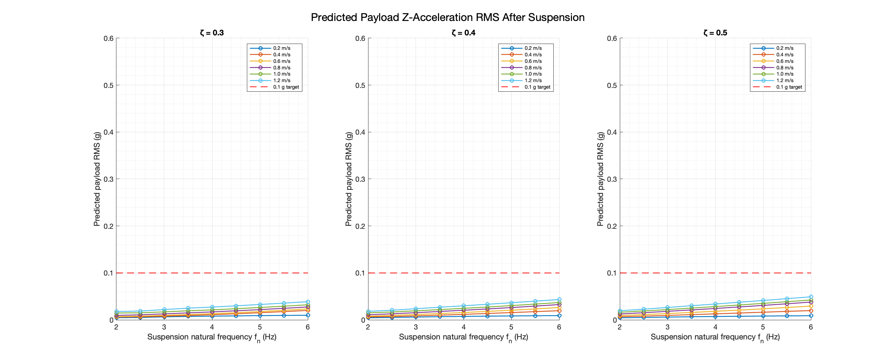
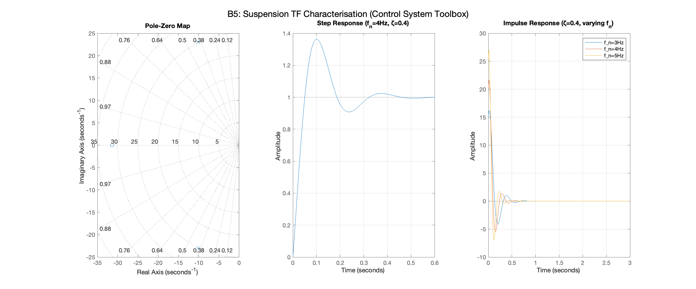

# Omni-Wheel Chassis Passive Suspension Design — Summary Report
# 全向轮底盘被动悬挂系统设计 — 总结报告

---

## 1. Background & Design Goals / 背景与设计目标

**EN:** Building on the vibration characterisation study (see `vibration_analysis_summary.md`), a passive spring-damper suspension was designed for the 4-wheel omni-wheel chassis. The actual system mass is **25 kg total**, with a **5.2 kg unsprung mass** (4 × 1.3 kg motor+wheel assemblies) and a **19.8 kg sprung mass** (everything above the suspension). The suspension spring and damper must be sized against the sprung mass only — for a rigid wheel on a hard floor there is no tyre compliance, so the unsprung mass does not appear in the transmissibility formula.

**The baseline vibration data used here was collected on an indoor smooth floor (confirmed by cross-comparison with four additional surface datasets — see `multi_surface_analysis_summary.md`). The fn = 4 Hz design meets < 0.1 g on indoor surfaces at all speeds. Outdoor cement and pavement require a different approach — see Section 9.**

**中文：** 在振动特性研究的基础上，为四轮全向轮底盘设计了被动弹簧-阻尼悬挂系统。系统实际总质量为 **25 kg**，其中**非簧载质量 5.2 kg**（4 × 1.3 kg 电机+车轮组件）、**簧载质量 19.8 kg**（悬挂以上的所有部件）。弹簧与阻尼器仅需针对簧载质量进行设计——刚性车轮在硬质地面上无轮胎弹性，非簧载质量不出现在传递率公式中。

**本设计所用基线振动数据采集于室内光滑地面（经与四组新增地面数据集交叉对比确认——见 `multi_surface_analysis_summary.md`）。fn = 4 Hz 设计在室内地面所有速度下满足 < 0.1 g 目标。室外水泥路和人行道需要不同方案——见第 9 节。**

| Parameter / 参数 | Value / 数值 |
|-----------------|-------------|
| Total system mass / 系统总质量 | **25 kg** |
| Unsprung mass (4 × motor+wheel) / 非簧载质量（4 × 电机+车轮） | **5.2 kg** (4 × 1.3 kg) |
| Sprung mass / 簧载质量 | **19.8 kg** |
| Number of suspensions / 悬挂数量 | 4 (one per corner / 每角一个) |
| Sprung mass per corner / 单角簧载质量 | **4.95 kg** |
| Payload RMS acceleration target / 载荷 RMS 加速度目标 | < 0.1 g |
| Suspension type / 悬挂类型 | Passive spring-damper / 被动弹簧-阻尼 |
| Note / 注意 | 25 kg excludes suspension hardware mass — recheck k, c once hardware is weighed / 25 kg 不含悬挂结构自重，硬件称重后需复核 k、c |

---

## 2. Modelling Approach / 建模方法

**EN:** A **1-DOF quarter-car base-excitation model** was used. The measured Z-axis acceleration (unsuspended chassis) serves as the ground input, and the suspended payload is the output. The acceleration transmissibility function is:

$$T(f) = \sqrt{\frac{1 + (2\zeta r)^2}{(1-r^2)^2 + (2\zeta r)^2}}, \quad r = f / f_n$$

where $f_n$ is the suspension natural frequency and $\zeta$ is the damping ratio. The predicted payload RMS is obtained by integrating the filtered PSD:

$$\text{RMS}_\text{out} = \sqrt{\int_0^\infty T^2(f)\, S_{xx}(f)\, df}$$

**中文：** 采用 **单自由度 (1-DOF) 四分之一车底部激励模型**。测量的 Z 轴加速度（无悬挂底盘）作为地面输入，悬挂后的载荷为输出。加速度传递率函数为上式，$f_n$ 为悬挂固有频率，$\zeta$ 为阻尼比。将传递率平方乘以输入功率谱密度后积分，即可预测载荷 RMS 加速度。

**Key assumption / 关键假设：** The accelerometer was mounted on the unsuspended chassis; the measured Z-acceleration equals the wheel input to the suspension. / 加速度计安装于无悬挂底盘上，因此测量的 Z 向加速度即等于悬挂的地面输入。

---

## 3. Design Space Sweep / 设计空间扫描

**EN:** A parametric sweep over natural frequency $f_n$ (2–6 Hz, step 0.5 Hz) and damping ratio $\zeta$ (0.2–0.6) was performed. For each combination, the predicted payload RMS was evaluated at all 6 measured speeds and the **worst-case (maximum) RMS across speeds** was used as the design criterion.

**中文：** 对固有频率 $f_n$（2–6 Hz，步长 0.5 Hz）和阻尼比 $\zeta$（0.2–0.6）进行参数化扫描。对每种组合，在全部六个测试速度下预测载荷 RMS，并以**各速度中的最大 RMS** 作为设计判据。

*Figure 1 – Predicted payload RMS acceleration vs suspension natural frequency $f_n$ at three damping ratios (ζ = 0.3, 0.4, 0.5). Each line represents one travel speed. / 图1 — 三种阻尼比（ζ = 0.3、0.4、0.5）下，载荷预测 RMS 加速度随悬挂固有频率的变化。每条曲线对应一个行驶速度。*

*Figure 2 – Left: worst-case predicted payload RMS (g) across all speeds as a function of (fn, ζ). Right: pass/fail map against the 0.1 g target. / 图2 — 左：全速度工况下最大预测载荷 RMS（g）随（fn, ζ）的分布热图；右：以 0.1 g 为目标的通过/失败区域图。*

**EN:** The heatmap shows that **the entire swept design space passes the 0.1 g target** — even the least aggressive design (fn = 6 Hz, ζ = 0.2) keeps payload below 0.1 g RMS. The dominant vibration sources (per-plate roller impacts at 15.6–23.4 Hz, motor cogging at 134–670 Hz) are all well above the 3–6 Hz suspension band, ensuring strong attenuation.

**中文：** 热图表明，**整个扫描设计空间均满足 0.1 g 目标**——即使最保守的设计（fn = 6 Hz，ζ = 0.2）也能将载荷保持在 0.1 g RMS 以下。主要振动源（15.6–23.4 Hz 的单板滚子通过激励和 134–670 Hz 的电机齿槽振动）均远高于 3–6 Hz 的悬挂频带，因此具有强衰减效果。

---

## 4. Transmissibility Characteristics / 传递率特性

*Figure 3 – Left: transmissibility vs frequency for fn = 3, 4, 5 Hz at ζ = 0.4. Right: effect of damping ratio at fn = 4 Hz. / 图3 — 左：ζ = 0.4 时，fn = 3、4、5 Hz 的传递率频率特性；右：fn = 4 Hz 时阻尼比的影响。*

**EN:** Above $f_n\sqrt{2}$ (the isolation onset), transmissibility falls as $1/r^2$ (−40 dB/decade). The wheel has **2 side plates × 11 rollers = 22 rollers total**, staggered by 16.4° so each plate's rollers fill the other's gaps. The chassis uses an **X-configuration** (wheel axes at 45° to chassis forward), so the effective wheel rolling speed is $v_\text{wheel} = v_\text{chassis}/\sqrt{2}$. Applying this correction, two frequency bands remain relevant:

| Vibration source | Frequency at 0.8–1.2 m/s chassis (corrected) | At fn = 4 Hz: r | T (approx) | Attenuation |
|-----------------|----------------------------------------------|-----------------|------------|-------------|
| Per-plate roller passage (N=11) — **dominant measured source** | **15.6–23.4 Hz** | 3.9–5.9 | ~0.06 | −24 dB |
| Combined dual-plate passage (N=22, stagger-suppressed) | **31.3–46.8 Hz** | 7.8–11.7 | ~0.012 | −38 dB |

The dominant measured peaks (16–23 Hz at 0.8–1.2 m/s) are confirmed as per-plate roller passage (N=11) with < 6 % error, once the 45° X-configuration geometry is accounted for. The staggered dual-plate design suppresses the N=22 combined polygon vibration. The suspension attenuates both bands effectively.

**中文：** 车轮为 **2 侧板 × 11 滚子 = 共 22 个滚子**，相位差 16.4°，两侧板滚子互填间隙。底盘采用 **X 形构型**（车轮轴线与底盘前向成 45°），因此实际车轮滚动速度为 $v_\text{wheel} = v_\text{chassis}/\sqrt{2}$。修正后，两个频带与悬挂设计相关：

- **单板滚子通过频率（N=11）**：在 0.8–1.2 m/s 底盘速度时为 **15.6–23.4 Hz**（已确认为主导实测峰，误差 < 6%），悬挂衰减约 −24 dB
- **双板合并通过频率（N=22，被错位设计抑制）**：**31.3–46.8 Hz**，悬挂衰减约 −38 dB

---

## 5. Recommended Design Point / 推荐设计点

**EN:** **fn = 4 Hz, ζ = 0.4** is selected as the recommended design. This choice balances:
- Good attenuation of the dominant 15.6–23.4 Hz per-plate roller-passage band (N=11, −24 dB) and even stronger attenuation of the combined dual-plate passage at 31.3–46.8 Hz (N=22, −38 dB)
- Modest static deflection (15.5 mm — practical for a compact chassis)
- Manageable stroke requirement (≥ 61 mm)
- Robust: all speeds pass with large margin, ζ = 0.4 provides good transient behaviour without excessive softness

**中文：** 推荐设计点为 **fn = 4 Hz，ζ = 0.4**。该选择在以下方面取得平衡：
- 对 15.6–23.4 Hz 主导 N=11 单板滚子通过频带的良好衰减（−24 dB），以及对 31.3–46.8 Hz 的 N=22 双板合并通过频率的更强衰减（−38 dB）
- 适中的静态下沉量（15.5 mm，对紧凑型底盘切实可行）
- 可接受的行程需求（≥ 61 mm）
- 鲁棒性强：所有速度均大幅满足目标，ζ = 0.4 兼顾动态响应与柔软性

| Design Parameter / 设计参数 | Value / 数值 |
|----------------------------|-------------|
| Natural frequency / 固有频率 | **4 Hz** |
| Damping ratio / 阻尼比 | **0.4** |
| Sprung mass per corner / 单角簧载质量 | **4.95 kg** (19.8 kg sprung / 4) |
| Spring stiffness k / 弹簧刚度 | **3,127 N/m** per corner |
| Damper coefficient c / 阻尼系数 | **99.5 N·s/m** per corner |
| Static deflection / 静态下沉量 | **15.5 mm** |
| Minimum stroke / 最小行程 | **≥ 46 mm** (15.5 mm sag + ±15 mm dynamic / 静态下沉 + ±15 mm 动态) |
| Isolation onset / 隔振起始频率 | 5.66 Hz ($f_n\sqrt{2}$) |

---

## 6. Spring & Damper Sizing / 弹簧与阻尼器参数

**EN:** Spring stiffness $k = m_s (2\pi f_n)^2$ and damper coefficient $c = 2\zeta\sqrt{km_s}$, where $m_s$ = **sprung mass per corner** = (total mass − unsprung mass) / 4. The unsprung mass (wheel-motor assemblies) is excluded because for a rigid wheel on a hard floor it does not affect the suspension transmissibility.

**中文：** 弹簧刚度 $k = m_s (2\pi f_n)^2$，阻尼系数 $c = 2\zeta\sqrt{km_s}$，其中 $m_s$ = **单角簧载质量** = （总质量 − 非簧载质量）/ 4。非簧载质量（车轮电机组件）已排除，因为刚性车轮在硬质地面上不影响悬挂传递率。

### Actual design point — 25 kg total, 5.2 kg unsprung / 实际设计点 — 总质量 25 kg，非簧载 5.2 kg

| Parameter / 参数 | Value / 数值 |
|-----------------|-------------|
| Total mass / 总质量 | 25.0 kg |
| Unsprung mass / 非簧载质量 | 5.2 kg (4 × 1.3 kg) |
| Sprung mass / 簧载质量 | **19.8 kg** |
| Sprung mass per corner / 单角簧载质量 | **4.95 kg** |
| Spring stiffness k / 弹簧刚度 | **3,127 N/m** |
| Damper coefficient c / 阻尼系数 | **99.5 N·s/m** |
| Static sag / 静态下沉量 | **15.5 mm** |
| Minimum stroke / 最小行程 | **≥ 46 mm** (15.5 mm sag + ±15 mm dynamic / 静态下沉 + ±15 mm 动态) |

> **Note / 注意:** The 25 kg figure does not yet include suspension hardware (lower frame, upper platform, springs, dampers). Each kilogram added to the sprung side increases k and c by ~160 N/m and ~5 N·s/m respectively while keeping fn and ζ unchanged. Recompute after weighing the hardware.
>
> 25 kg 不含悬挂结构自重（下框架、上平台、弹簧、阻尼器）。簧载侧每增加 1 kg，k 增加约 160 N/m，c 增加约 5 N·s/m，fn 和 ζ 保持不变。硬件称重后需重新计算。

### General sizing reference (sprung mass per corner) / 通用参数参考（单角簧载质量）

| Sprung mass per corner / 单角簧载质量 | k (N/m) | c (N·s/m) | Equiv. total mass (no unsprung) / 等效总质量 |
|--------------------------------------|---------|-----------|---------------------------------------------|
| 3.75 kg | 2,369 | 75.4 | ~15 kg total |
| 4.95 kg | **3,127** | **99.5** | **25 kg total, 5.2 kg unsprung ← actual** |
| 5.00 kg | 3,159 | 100.5 | ~20 kg total (no unsprung) |
| 6.25 kg | 3,948 | 125.7 | ~25 kg total (no unsprung correction) |
| 7.50 kg | 4,737 | 150.8 | ~30 kg total (no unsprung) |

**EN:** These spring stiffness values correspond to common light-duty coil springs or rubber-in-shear isolators. The damper coefficients are in the range of small hydraulic or elastomer dampers.

**中文：** 上述弹簧刚度对应常见轻型螺旋弹簧或橡胶剪切隔振元件。阻尼系数在小型液压或弹性体阻尼器的典型范围内。

---

## 7. Predicted Performance / 预测性能

*Figure 4 – Measured input PSD (blue) vs predicted output PSD (red) after suspension at fn = 4 Hz, ζ = 0.4, for all 6 travel speeds. / 图4 — fn = 4 Hz、ζ = 0.4 悬挂前（蓝）与悬挂后（红）预测 PSD 对比，全部六个速度。*

**EN:** With the recommended suspension, the roller-impact peak and all higher-frequency components are strongly attenuated. The payload PSD above ~6 Hz drops by more than 20 dB.

**中文：** 采用推荐悬挂后，滚子冲击峰及所有高频分量均得到强烈衰减。约 6 Hz 以上的载荷 PSD 下降超过 20 dB。

**Indoor smooth floor (original baseline, validated against white/black tile datasets):**

| Speed | Input RMS | Output RMS | Reduction | Meets < 0.1 g |
|---|---|---|---|---|
| 0.2 m/s | 0.069 g | 0.0074 g | −89 % | ✓ |
| 0.4 m/s | 0.239 g | 0.0118 g | −95 % | ✓ |
| 0.6 m/s | 0.303 g | 0.0157 g | −95 % | ✓ |
| 0.8 m/s | 0.397 g | 0.0205 g | −95 % | ✓ |
| 1.0 m/s | 0.500 g | 0.0245 g | −95 % | ✓ |
| 1.2 m/s | 0.500 g | 0.0300 g | −94 % | ✓ |

**Worst-case indoor output: 0.030 g RMS @ 1.2 m/s — 70 % below the 0.1 g target.**
**室内最恶劣工况输出：1.2 m/s 时 0.030 g RMS——低于 0.1 g 目标 70%。**

**Outdoor surfaces — predicted output with same fn = 4 Hz suspension (T at N=11 frequency):**

| Surface | Speed | Input RMS | T | Predicted output | Meets < 0.1 g |
|---|---|---|---|---|---|
| Pavement | 1.2 m/s | 1.068 g | 0.143 | 0.153 g | ✗ |
| Pavement | 1.5 m/s | 1.306 g | 0.112 | 0.147 g | ✗ |
| Cement | 1.2 m/s | 3.257 g | 0.143 | 0.466 g | ✗ |
| Cement | 1.5 m/s | 3.575 g | 0.112 | 0.401 g | ✗ |

> Note: T values above are at the N=11 roller frequency (dominant source on smooth surfaces). On cement, broadband road noise dominates — the actual output may differ from this single-frequency estimate. Measured PSD integration would give a more accurate prediction.
>
> 注意：上表 T 值取自 N=11 滚子频率处（光滑地面的主导激励源）。水泥路以宽频路面噪声为主，实际输出可能与单频估计有差异，需对实测 PSD 积分获得更精确预测。

---

## 8. Independent Verification / 独立验证

All conclusions were independently verified using MATLAB toolbox functions.
所有结论均使用 MATLAB 工具箱函数进行了独立验证。

### 8.1 Transmissibility — tf/bode vs Manual Formula / 传递率验证

*Figure 5 – Control System Toolbox `tf`/`bode` result (blue) vs manual transmissibility formula (red dashed), and their difference. / 图5 — Control System Toolbox `tf`/`bode` 结果（蓝）与手动传递率公式（红虚线）对比及差值。*

**EN:** Maximum discrepancy between the Control System Toolbox `tf`/`bode` result and the manual formula: **1.42 × 10⁻¹⁴ dB** (machine-precision zero). The transmissibility formula used throughout this study is analytically exact.

**中文：** Control System Toolbox `tf`/`bode` 与手动公式之间的最大差异为 **1.42 × 10⁻¹⁴ dB**（机器精度零）。本研究使用的传递率公式解析上完全正确。

### 8.2 PSD Method vs Time-Domain Simulation (lsim) / PSD 法与时域仿真对比

*Figure 6 – Left: PSD-method vs lsim predicted output RMS at each speed. Right: time-domain input/output waveform at 1.2 m/s (first 1 s). / 图6 — 左：各速度下 PSD 法与 lsim 预测输出 RMS 对比；右：1.2 m/s 时前 1 秒输入/输出时域波形。*

| Speed / 速度 | PSD method / PSD 法 | lsim (Control System Toolbox) | Difference / 差异 |
|-------------|--------------------|-----------------------------|------------------|
| 0.2 m/s | 0.00739 g | 0.00753 g | 1.87 % |
| 0.4 m/s | 0.01176 g | 0.01121 g | 4.72 % |
| 0.6 m/s | 0.01566 g | 0.01544 g | 1.40 % |
| 0.8 m/s | 0.02049 g | 0.02036 g | 0.65 % |
| 1.0 m/s | 0.02453 g | 0.02429 g | 0.99 % |
| 1.2 m/s | 0.03003 g | 0.03002 g | 0.04 % |

**EN:** Maximum difference < 5 % at all speeds. The PSD-based sizing approach is validated by direct time-domain simulation using `lsim`.

**中文：** 所有速度下最大差异 < 5%。PSD 法设计结果已通过 `lsim` 直接时域仿真验证。

### 8.3 Transfer Function Pole Analysis / 传递函数极点分析

*Figure 7 – Left: pole-zero map. Centre: step response. Right: impulse responses for fn = 3, 4, 5 Hz. / 图7 — 左：零极点图；中：阶跃响应；右：fn = 3、4、5 Hz 时的脉冲响应。*

| Quantity / 参数 | From poles / 极点计算 | Design intent / 设计目标 |
|---------------|---------------------|------------------------|
| Undamped natural frequency $f_n$ / 无阻尼固有频率 | **4.000 Hz** | 4.000 Hz |
| Damping ratio ζ / 阻尼比 | **0.4000** | 0.4000 |
| Damped natural frequency $f_d$ / 有阻尼固有频率 | 3.666 Hz | — |

**EN:** Pole analysis confirms the transfer function exactly realises the intended fn and ζ.

**中文：** 极点分析确认传递函数精确实现了目标 fn 和 ζ。

---

## 9. Design Recommendations & Next Steps / 设计建议与后续步骤

### 9.1 Surface-specific suspension parameters / 各地面悬挂参数

| Operating scenario | fn | ζ | k (N/m) | c (N·s/m) | Sag | Stroke |
|---|---|---|---|---|---|---|
| **Indoor smooth only** | **4 Hz** | **0.4** | **3,127** | **99.5** | 15.5 mm | ≥ 46 mm |
| Indoor + pavement | 3 Hz | 0.4 | 1,758 | 75 | 27.6 mm | ≥ 82 mm |
| All surfaces incl. cement | 2 Hz | 0.4 | 781 | 50 | 62 mm | ≥ 180 mm |

> The fn = 4 Hz design is **validated** for indoor use (< 0.030 g worst-case).
> For outdoor pavement and cement, lower fn is required — hardware choices and packaging must be revisited.
>
> fn = 4 Hz 设计已针对室内使用进行验证（最恶劣工况 < 0.030 g）。室外人行道和水泥路需降低 fn——硬件选型和安装空间需重新评估。

### 9.2 Low-speed resonance warning / 低速共振预警

At **0.2 m/s**, the N=11 roller frequency (3.9 Hz) is almost equal to fn (4 Hz) → suspension **amplifies** by ×1.62 rather than attenuating. Avoid sustained operation at ≤ 0.3 m/s when vibration isolation is critical. This issue is less severe with fn = 2–3 Hz (the resonance point shifts below 0.2 m/s).

**在 0.2 m/s 时，N=11 滚子频率（3.9 Hz）约等于 fn（4 Hz），悬挂会对该频率放大 ×1.62 而非衰减。** 对振动隔离要求严格时应避免在 ≤ 0.3 m/s 下长时间运行。采用 fn = 2–3 Hz 时共振点移至 0.2 m/s 以下，该问题有所缓解。

### 9.3 Hardware and re-measurement / 硬件与重新测量

**EN:**
1. **Correct tool inputs before building**: Input payload = **19.8 kg** (sprung only) in the suspension designer — current Case 2 inputs 25 kg which double-counts the wheel mass and gives k = 4,946 N/m (too stiff; would give fn ≈ 5 Hz for actual sprung mass). See `suspension_case_review.md`.
2. **Adopt Case 3 geometry**: Lu = L_lower = 150 mm (equal-length arms), spring mount a = 140 mm. Kinematically superior to Case 1/2 (less camber change through travel).
3. **Weigh suspension hardware** and recompute k, c — 25 kg does not include wishbone arms, hub carriers, fasteners. Each kg on sprung side adds ~160 N/m to k and ~5 N·s/m to c.
4. **Build prototype and retest on all 4 surfaces** — reference vibration data now exists for all surfaces (see `surface_comparison.m` figures). Compare measured output RMS against predictions.
5. **Investigate 79 Hz chassis structural resonance** — excited on cement, speed-independent. Assess whether frame stiffening or damping treatment is needed before finalising the chassis design.
6. **Motor cogging**: 134–1,007 Hz at 0.2–1.5 m/s — attenuated > 30 dB by any fn ≤ 4 Hz suspension. Not a design driver but may require motor controller tuning if audible.

**中文：**
1. **建造前修正工具输入**：悬挂设计器中有效负载应输入 **19.8 kg**（仅簧载质量）。当前方案二输入 25 kg 重复计入车轮质量，得到 k = 4,946 N/m（过硬；对实际簧载质量将导致 fn ≈ 5 Hz）。详见 `suspension_case_review.md`。
2. **采用方案三几何参数**：Lu = L_lower = 150 mm（等长叉臂），弹簧安装点 a = 140 mm。运动学特性优于方案一/二（行程内外倾变化更小）。
3. **称量悬挂硬件**，重新计算 k、c — 25 kg 不含叉臂、轮毂载体、紧固件。簧载侧每增加 1 kg，k 增加约 160 N/m，c 增加约 5 N·s/m。
4. **建样机并在全部四种地面实测** — 四种地面振动数据均已就绪（见 `surface_comparison.m` 图表）。将实测输出 RMS 与预测值对比。
5. **调查 79 Hz 底盘结构共振** — 在水泥路激励下出现，与速度无关。在最终确定底盘设计前，评估是否需要加强框架刚度或增加阻尼处理。
6. **电机齿槽**：0.2–1.5 m/s 范围内为 134–1,007 Hz——任何 fn ≤ 4 Hz 悬挂均衰减 > 30 dB，不构成设计约束，但若有可闻噪声，可考虑电机控制器调优。

---

*Analysis and design performed with MATLAB R2024a. Verification toolboxes: Signal Processing, Control System, System Identification, Wavelet.*
*分析与设计工具：MATLAB R2024a。验证工具箱：Signal Processing、Control System、System Identification、Wavelet。*

*See also: `vibration_analysis_summary.md` for the upstream vibration characterisation study.*
*另见：`vibration_analysis_summary.md`，包含上游振动特性分析报告。*
