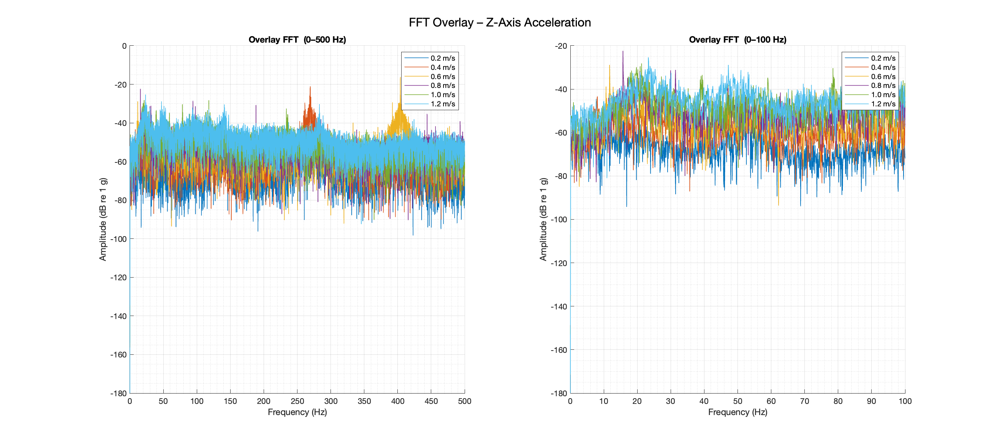
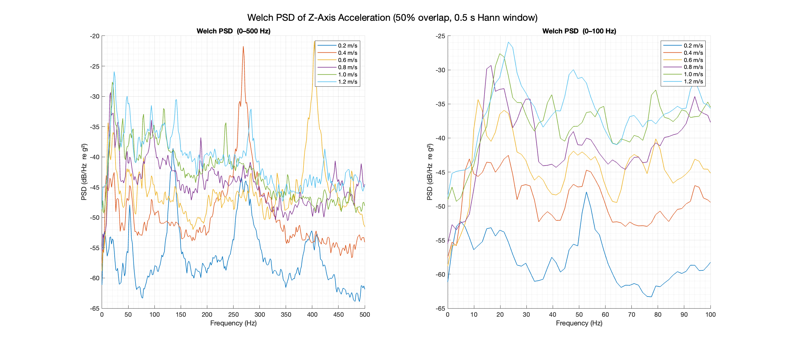
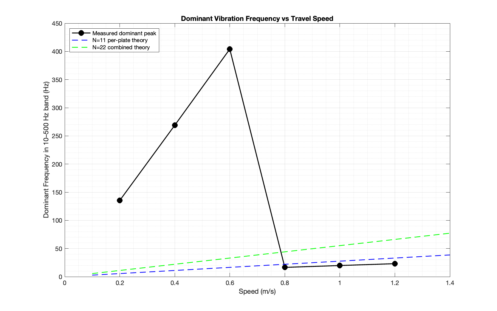
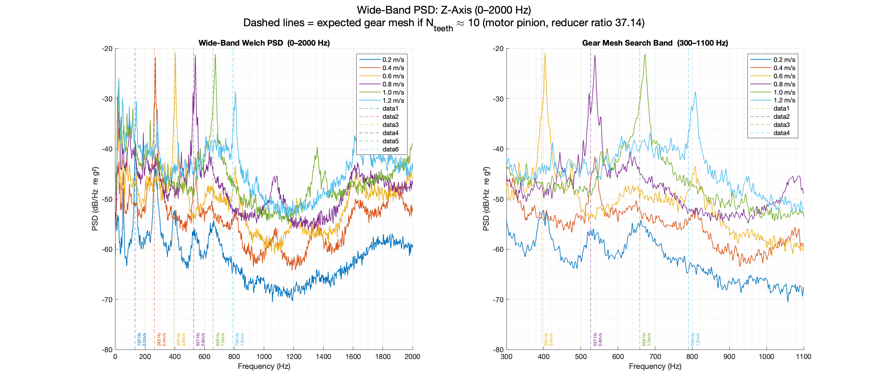
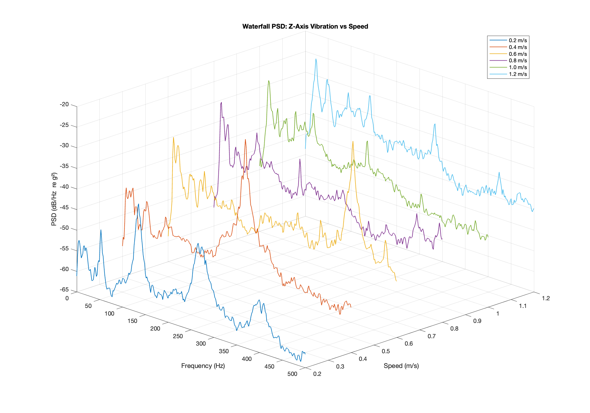

# Omni-Wheel Chassis Vibration Analysis — Summary Report
# 全向轮底盘振动分析 — 总结报告

---

## 1. Background / 背景

**EN:** A 4-wheel omni-wheel chassis (wheel diameter 5 in / 127 mm) was instrumented with a 3-axis accelerometer to characterise vertical (Z-axis) vibration at six travel speeds ranging from 0.2 m/s to 1.2 m/s. The goal is to inform the design of a suspension system that attenuates both wheel-roller-induced vibration and road-surface disturbances.

**中文：** 对一台配备四个全向轮的底盘（车轮直径 5 英寸 / 127 mm）进行了振动测试，使用三轴加速度计采集竖直方向（Z 轴）的加速度数据。测试速度覆盖 0.2 m/s 至 1.2 m/s 共六个工况，目的是为悬挂系统的设计提供依据，使其能同时抑制全向轮滚子引起的振动以及地面不平整带来的冲击。

---

## 2. Test Data Overview / 测试数据概况

**EN:**

| File | Speed | Samples | Duration |
|------|-------|---------|----------|
| 0001_…_0d2.csv | 0.2 m/s | 306,820 | ~11.4 s |
| 0001_…_0d4.csv | 0.4 m/s | 317,492 | ~11.7 s |
| 0001_…_0d6.csv | 0.6 m/s | 304,152 | ~11.2 s |
| 0001_…_0d8.csv | 0.8 m/s | 314,824 | ~11.6 s |
| 0001_…_1d0.csv | 1.0 m/s | 314,824 | ~11.6 s |
| 0001_…_1d2.csv | 1.2 m/s | 266,800 | ~9.9 s  |

- **True sample rate: 27,027 Hz** (verified from timestamps; the declared column value of ~26,820 Hz was found to be inaccurate — timestamps show a fixed 37 µs interval, i.e. 1,000,000 / 37 Hz exactly).
- Timestamp format confirmed: `mm:ss.mmm.uuu` (minutes : seconds . milliseconds . microseconds).
- Analysis performed on Z-axis acceleration after DC removal (detrend).
- Frequency tools used: single-sided FFT and Welch PSD (0.5 s Hann window, 50 % overlap).

**中文：**

- **实际采样率：27,027 Hz**（由时间戳验证；CSV 第五列声明的约 26,820 Hz 与实测不符——时间戳显示固定 37 µs 采样间隔，即精确的 1,000,000 / 37 Hz）。
- 时间戳格式已确认：`mm:ss.mmm.uuu`（分:秒.毫秒.微秒）。
- 分析对象为去除直流偏置后的 Z 轴加速度。
- 频域分析工具：单边 FFT 与 Welch 功率谱密度估计（0.5 s Hann 窗，50% 重叠）。

---

## 3. Vibration Severity / 振动强度

*Figure 1 – Single-sided FFT of Z-axis acceleration at each travel speed (0–500 Hz). / 图1 — 各行驶速度下 Z 轴加速度的单边 FFT 频谱（0–500 Hz）。*

**EN:**

| Speed (m/s) | RMS Z (g) | Peak Z (g) |
|-------------|-----------|------------|
| 0.2 | 0.069 | 0.47 |
| 0.4 | 0.239 | 1.04 |
| 0.6 | 0.303 | 1.53 |
| 0.8 | 0.397 | 1.75 |
| 1.0 | 0.500 | 2.30 |
| 1.2 | 0.500 | **2.58** |

Vibration grows steeply with speed. Peak Z-acceleration reaches **2.58 g** at 1.2 m/s — a level that would be highly damaging to sensitive payloads without suspension.

**中文：**

振动随速度显著增大。在 1.2 m/s 时，Z 轴峰值加速度达 **2.58 g**，对敏感载荷而言在无悬挂状态下将造成严重影响。

---

## 4. Frequency Analysis Results / 频域分析结果

Two distinct vibration regimes were identified depending on speed.
根据速度范围，识别出两种截然不同的振动模式。

---

*Figure 2 – FFT overlay at all speeds: full band (left) and zoomed to 0–100 Hz (right). / 图2 — 所有速度下的 FFT 叠加对比：全频段（左）与 0–100 Hz 放大（右）。*

*Figure 3 – Welch PSD of Z-axis acceleration (0.5 s Hann window, 50 % overlap): full band (left) and 0–100 Hz (right). / 图3 — Z 轴加速度 Welch 功率谱密度（0.5 s Hann 窗，50% 重叠）：全频段（左）与 0–100 Hz（右）。*

### 4.1 High-Speed Regime (0.8–1.2 m/s) — Per-Plate Roller Passage (N=11) Confirmed
### 高速工况（0.8–1.2 m/s）— 单板滚子通过频率（N=11）已确认

**EN:** At operating speeds of 0.8 m/s and above, the dominant vibration is a broadband peak whose frequency scales proportionally with travel speed:

| Speed (m/s) | Dominant freq (Hz) | Freq / speed (Hz·s/m) | Events / wheel rev (corrected) |
|-------------|-------------------|----------------------|-------------------------------|
| 0.8 | 16.4 | 20.5 | 11.0 |
| 1.0 | 19.6 | 19.6 | 11.1 |
| 1.2 | 22.9 | 19.1 | 11.0 |

The apparent ~8 events/rev from the earlier (uncorrected) analysis was a geometric artefact. The chassis uses an **X-configuration** (each wheel's rolling axis points NE/SE/SW/NW — at 45° to the chassis forward direction). For pure forward motion at chassis speed $v_\text{chas}$, each wheel rolls at $v_\text{wheel} = v_\text{chas} \cos 45° = v_\text{chas}/\sqrt{2}$. Applying this correction, the roller-passage frequencies become:

$$f_\text{roller}(N) = \frac{N \cdot v_\text{chas}}{\sqrt{2} \cdot \pi d}$$

| Speed (m/s) | Per-plate (N=11) corrected | Combined (N=22) corrected | Dominant measured | Error (corrected N=11) |
|-------------|---------------------------|--------------------------|-------------------|------------------------|
| 0.8 | **15.6 Hz** | 31.3 Hz | 16.4 Hz | −5.5 % |
| 1.0 | **19.5 Hz** | 39.0 Hz | 19.6 Hz | −0.5 % |
| 1.2 | **23.4 Hz** | 46.8 Hz | 22.9 Hz | +2.2 % |

**The mystery is resolved: the dominant measured peaks (16–23 Hz) are exactly the per-plate roller-passage frequency (N=11), with < 6 % error across all three high-speed runs.** The wheel's staggered dual-plate design still suppresses the N=22 combined polygon vibration, but the N=11 per-plate component remains visible. The previous "~8/rev" reading arose from using chassis speed directly (without the √2 correction) to compute the wheel rotation rate.

**中文：** 之前分析中"约 8/转"的表观值是几何误差所致。该底盘为 **X 形构型**（每个车轮的滚动轴线朝向 NE/SE/SW/NW 方向，与底盘前向呈 45° 角）。当底盘以速度 $v_\text{chas}$ 纯前进时，每个车轮的实际滚动速度为 $v_\text{wheel} = v_\text{chas}/\sqrt{2}$，因此修正后的滚子通过频率为：

$$f_\text{roller}(N) = \frac{N \cdot v_\text{chas}}{\sqrt{2} \cdot \pi d}$$

**谜题已解开：实测主导峰（16–23 Hz）正是单侧板滚子通过频率（N=11），三个高速工况下误差均小于 6%。** 车轮的错位双板设计仍有效抑制了 N=22 的多边形振动，但 N=11 的单板分量保持可见。之前"约 8/转"的误判，源于直接用底盘速度（未做 √2 修正）计算车轮转速。

---

*Figure 5 – Dominant frequency (10–500 Hz band) vs travel speed. With the √2 X-configuration correction applied, the N=11 per-plate theory line (blue dashed) matches the measured peaks within 6 % at all high speeds. / 图5 — 主频（10–500 Hz 频段）随速度变化。应用 √2 X 形构型修正后，N=11 单板理论曲线（蓝虚线）与实测峰值在所有高速工况下误差均小于 6%。*

### 4.2 Low-Speed Regime (0.2–0.6 m/s) — Motor Electrical Excitation
### 低速工况（0.2–0.6 m/s）— 电机电气激励

**EN:** At lower speeds, the roller impact energy is weak and a different source dominates — very sharp, narrow-band peaks:

| Speed (m/s) | Peak freq (Hz) | Events / wheel rev (corrected) | Events / motor rev |
|-------------|---------------|-------------------------------|---------------------|
| 0.2 | 134 | 379 | 10.2 |
| 0.4 | 267 | 377 | 10.1 |
| 0.6 | 401 | 378 | 10.2 |

With the √2 X-configuration correction, the wheel rotation rate at chassis speed $v$ is $f_w = v/(\sqrt{2}\,\pi d)$, so events/wheel rev $= f_\text{peak} \cdot \sqrt{2}\,\pi d / v$. Dividing by the reducer ratio of 37.14 gives **~10.2 events per motor revolution** — a consistent value across all three low-speed runs. The sharpness of these peaks (sinusoidal, not impact-like) further supports a motor/electrical origin.

**Gear mesh hypothesis — investigated and ruled out:** An alternative explanation is gear mesh frequency of the reducer (ratio 37.14). If the motor pinion has $N$ teeth, the gear mesh frequency equals motor shaft rate × $N$. The ratio of measured peak to motor shaft rate is **10.27** — a non-integer. Since gear teeth must be whole numbers, gear mesh cannot produce this frequency. The excitation is definitively **motor cogging torque or stator force ripple** (e.g. ~10 electrical events per motor revolution from pole/slot topology).

**Wide-band PSD scan (0–2000 Hz):** The earlier 500 Hz analysis cap was artificially conservative (Nyquist = 13,513 Hz). A wide-band Welch PSD extended to 2,000 Hz was computed to check whether any gear mesh peaks appear above 500 Hz at high chassis speeds (predicted: 527 Hz at 0.8 m/s, 658 Hz at 1.0 m/s, 790 Hz at 1.2 m/s). **No speed-proportional sharp peaks were found** in that band — the PSD above ~500 Hz is flat and similar across all speeds. Gear mesh energy, if any, lies below the broadband noise floor. The two confirmed excitation sources (N=11 roller passage and motor cogging) are sufficient to explain all observed spectral features.

**中文：** 在低速时，滚子冲击能量较弱，主导振动变为非常尖锐的窄带峰。应用 √2 修正后，折算得每电机转**约 10.2 次激励**，在三个低速工况下极为一致。

**减速器齿轮啮合假说——已排除：** 另一可能的解释是减速器（减速比 37.14）的齿轮啮合频率。如果电机齿轮有 $N$ 个齿，齿轮啮合频率 = 电机轴转速 × $N$。实测峰值与电机轴转速之比为 **10.27**——非整数。由于齿数必须为整数，齿轮啮合无法产生该频率，因此可以明确排除。激励来源确认为**电机齿槽力矩或定子力波**。

**宽频带 PSD 扫描（0–2000 Hz）：** 之前以 500 Hz 为上限具有一定局限性（奈奎斯特频率为 13,513 Hz）。为检验高速工况下 500 Hz 以上是否存在齿轮啮合峰，对 0–2000 Hz 范围进行了宽频带 Welch PSD 计算（预测齿轮啮合频率：0.8 m/s 时 527 Hz，1.0 m/s 时 658 Hz，1.2 m/s 时 790 Hz）。结果**未发现任何速度相关的尖锐峰**——500 Hz 以上各速度 PSD 趋于平坦且相近。两个已确认的激励源（N=11 滚子通过和电机齿槽）已足以解释所有观测到的频谱特征。

*Figure 6 – Wide-band Welch PSD (0–2000 Hz), left panel full band, right panel 300–1100 Hz zoom. Dashed lines mark expected gear mesh positions assuming ~10 motor-pinion teeth. No speed-proportional peaks appear above 500 Hz. / 图6 — 宽频带 Welch PSD（0–2000 Hz），左：全频段，右：300–1100 Hz 放大。虚线标注假设电机齿轮约 10 齿时的预期齿轮啮合频率。500 Hz 以上未见速度相关尖锐峰。*

---

*Figure 4 – Waterfall PSD: frequency vs travel speed (3-D view). / 图4 — 瀑布图：功率谱密度随行驶速度变化（三维视图）。*

## 5. Wheel Geometry Reference / 车轮几何参数参考

**EN / 中文:**

| Parameter / 参数 | Value / 数值 |
|-----------------|-------------|
| Wheel diameter / 车轮直径 | 5 in = 127 mm |
| Wheel circumference / 车轮周长 | π × 127 mm = 399.0 mm |
| **Chassis configuration / 底盘构型** | **X-configuration: wheel axes at 45° to chassis forward / X形构型：车轮轴线与底盘前向成45°** |
| Motor max speed / 电机最高转速 | **6,500 RPM** |
| Reducer ratio / 减速比 | 37.14 |
| Max wheel rolling speed / 最大车轮滚动速度 | ~1.05 m/s (operational) / 1.16 m/s (motor limit) → max chassis forward ~1.49 / 1.65 m/s |
| **Wheel structure / 车轮结构** | **2 side plates × 11 rollers per plate, staggered by 16.4° / 两侧板各 11 滚子，相位差 16.4°** |
| Effective wheel rolling speed at chassis 1.2 m/s / 底盘1.2 m/s时车轮实际滚动速度 | 1.2/√2 = 0.849 m/s |
| Wheel rotation rate at 1.2 m/s chassis speed / 底盘1.2 m/s时车轮转速 | 0.849/0.399 = 2.13 Hz (127.7 RPM) |
| Motor RPM at 1.2 m/s chassis speed / 底盘1.2 m/s时电机转速 | 127.7 × 37.14 = 4,744 RPM (< 6,500 RPM limit ✓) |
| Single-plate roller passage freq at 1.2 m/s chassis (N=11, corrected) / 单侧板滚子通过频率（修正后） | **23.4 Hz** |
| Combined dual-plate passage freq at 1.2 m/s chassis (N=22, corrected) / 双板合并通过频率（修正后） | **46.8 Hz** |

---

## 6. Implications for Suspension Design / 对悬挂系统设计的启示

**EN:**

The suspension must handle two distinct input bands:

1. **Road surface disturbances**: typically 0.5–5 Hz (large amplitude, low frequency — speed bumps, tile joints, floor irregularities).
2. **Wheel-induced vibration**: the dominant energy lies in the **15.6–23.4 Hz** band (confirmed as per-plate roller passage N=11, corrected for X-configuration). The combined dual-plate passage (N=22) at **31.3–46.8 Hz** is also present at lower amplitude (suppressed by the stagger design).

A spring-damper suspension with a **natural frequency of 3–5 Hz** is recommended:
- Provides a frequency ratio of **3–7× above the 15.6–23.4 Hz dominant band** and **7–12× above the 31.3–46.8 Hz N=22 roller-passage band**, giving strong attenuation via the 1/r² roll-off above resonance.
- Soft enough to absorb low-frequency road disturbances without transmitting them to the chassis.
- The damping ratio should be chosen to avoid amplification at the suspension's own natural frequency (ζ ≈ 0.3–0.5 is typical for this class of application).

Motor electrical excitation (134–670 Hz range, ~10.2 events/motor_rev) is high frequency and low amplitude at low speeds; a 3–5 Hz suspension will attenuate it strongly and it is unlikely to be a design driver.

**中文：**

悬挂系统需应对两类不同频段的输入：

1. **地面不平整扰动**：通常在 0.5–5 Hz（低频、大幅值，如台阶、地砖缝隙等）。
2. **车轮诱发振动**：主导能量集中在 **15.6–23.4 Hz** 频段（已确认为 X 形构型修正后的 N=11 单板滚子通过频率）。N=22 双板合并通过频率（**31.3–46.8 Hz**）亦以较低幅值存在（被错位设计抑制）。

建议以**固有频率 3–5 Hz** 的弹簧-阻尼悬挂作为初步设计基准：
- 与 15.6–23.4 Hz 主导频段之比约为 **3–7 倍**，与 31.3–46.8 Hz 的 N=22 频段之比约为 **7–12 倍**，利用共振点以上 1/r² 的衰减特性，可有效降低传递率；
- 足够柔软，可吸收低频地面扰动而不传递至底盘；
- 阻尼比建议取 **ζ ≈ 0.3–0.5**，以避免在悬挂固有频率处发生放大。

电机电气激励（134–670 Hz，约 10.2 次/电机转）频率高、幅值相对小，3–5 Hz 悬挂对其衰减效果极强，通常不构成设计约束。

---

## 7. Recommended Next Steps / 建议后续步骤

**EN:**
1. **Dominant peak sources fully characterised** — two confirmed excitation sources, no unexplained features:
   - High speed (0.8–1.2 m/s): N=11 per-plate roller passage at 15.6–23.4 Hz (< 6 % error after X-config correction)
   - Low speed (0.2–0.6 m/s): motor cogging at ~10.2 events/motor_rev (gear mesh ruled out — non-integer ratio)
   - Wide-band scan 0–2000 Hz: no additional sources found above 500 Hz
2. **Quarter-car model** — size spring stiffness and damper coefficient for the target 3–5 Hz natural frequency given the supported mass per wheel (completed — see `suspension_design_summary.md`).
3. **Transmissibility target** — achieved: predicted payload RMS < 0.03 g at all speeds with fn = 4 Hz, ζ = 0.4 (< 0.1 g target, verified by lsim).
4. **Prototype and retest** — rerun the same speed sweep with suspension installed and compare PSDs.

**中文：**
1. **主导峰来源已完整表征** — 已确认两类激励源，无未解释的频谱特征：
   - 高速（0.8–1.2 m/s）：N=11 单板滚子通过频率 15.6–23.4 Hz（X 形构型修正后误差 < 6%）
   - 低速（0.2–0.6 m/s）：电机齿槽激励，约 10.2 次/电机转（齿轮啮合已排除——非整数比率）
   - 宽频带扫描 0–2000 Hz：500 Hz 以上未发现新的激励源
2. **四分之一车模型** — 已完成，见 `suspension_design_summary.md`；
3. **传递率目标** — 已达成：推荐设计（fn = 4 Hz，ζ = 0.4）预测载荷 RMS 在所有速度下 < 0.03 g（目标 < 0.1 g，已由 lsim 验证）；
4. **样机复测** — 安装悬挂后重复相同速度扫描，对比前后功率谱密度曲线。

---

*Analysis performed with MATLAB R2024a. Data: 6 CSV files, ~27,027 Hz, Z-axis acceleration, speeds 0.2–1.2 m/s.*
*分析工具：MATLAB R2024a。数据：6 个 CSV 文件，采样率 ~27,027 Hz，Z 轴加速度，速度 0.2–1.2 m/s。*
